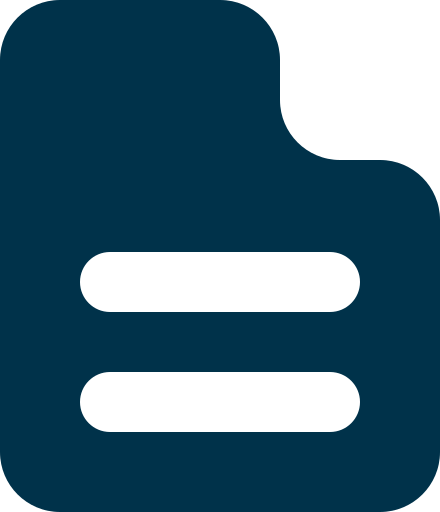
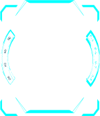
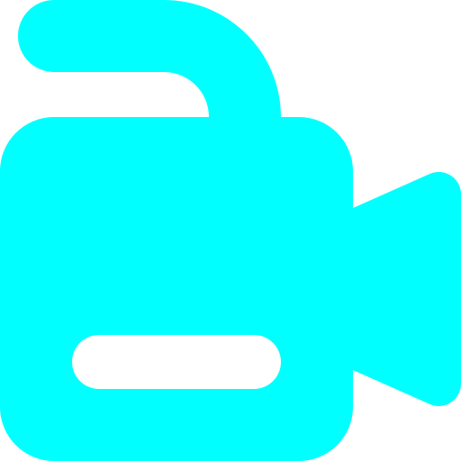
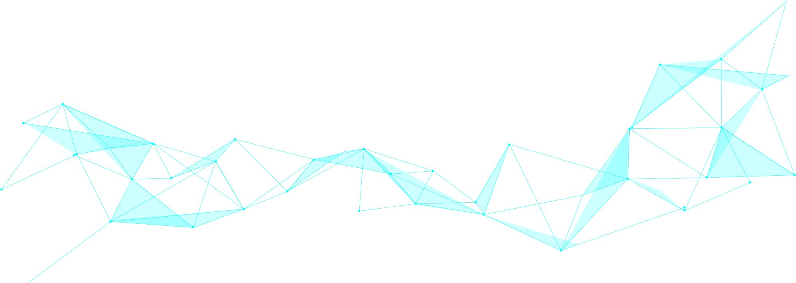

# 00 网络安全社体验课 正式

**English title:** Cybersecurity Club Trial Lesson

**作者 / Author:** 2023届 Simon Li / Class of 2023 Simon Li

**原 PPT 日期 / Original PPT date:** 2025-09-11

**关键词 / Keywords:** #Cybersecurity #Turing-Club #Club-Intro #CTF #Ethics #Linux #Python

> 本文由社团课程 PPT 整理为阅读版讲义：保留原课件图片，并补充课堂讲解、学习目标和练习方向。
>
> This article turns the original slides into readable course notes while preserving slide images and adding presenter-style explanations.

## 导读 / Overview

这节体验课不是单纯展示工具，而是把图灵社的学习路线摊开：从网页、后端、文件读取、内存读取，到虚拟机实验和摸底测试。读者可以把它当作加入网络安全方向前的路线图。

> English overview: This trial lesson is a roadmap for the club: web pages, backend ideas, file and memory reading, virtual machines, and a baseline challenge.

## 学习目标 / Learning Goals

- 了解社团的学习节奏与实践方式
- 知道网页、后端和系统实验之间的关系
- 建立合法、可控、可复现的实验意识

## 1. 社团学习路线 / Club learning path

网络安全不是只会“攻击”的技术，而是理解系统如何工作、如何出错、如何被保护的综合能力。体验课先把学习范围展示出来，让新成员知道后续会同时接触编程、网络、操作系统和安全伦理。

讲者补充：初学时不要急着追求复杂工具，先能解释一个网页请求如何到达服务器、服务器如何读写文件、系统如何限制权限，这些基础会决定后面能走多远。

> English recap: The first goal is orientation. Before tools, learners need a mental map of web, backend, operating system, and ethics.

### 相关课件图片 / Related Slide Images

### 第 1 页配图 / Slide 1 Images

### 第 2 页配图 / Slide 2 Images

### 第 3 页配图 / Slide 3 Images

### 第 4 页配图 / Slide 4 Images

### 第 5 页配图 / Slide 5 Images

## 2. 从网页到后端 / From webpage to backend

幻灯片中的主页上传、后端部分、文件读取和内存读取，可以串成一条完整链路：用户在前端提交内容，后端接收并处理，系统再根据权限访问文件或内存资源。

讲者补充：安全问题往往出现在边界处，例如上传内容是否可信、路径是否被限制、后端是否把用户输入直接当作文件名或代码执行。阅读时可以尝试把每一步都问成“这里信任了谁？”

> English recap: The web-to-backend path is a chain of trust. Many vulnerabilities come from trusting input at the wrong boundary.

### 相关课件图片 / Related Slide Images

### 第 6 页配图 / Slide 6 Images

### 第 7 页配图 / Slide 7 Images

### 第 8 页配图 / Slide 8 Images

### 第 9 页配图 / Slide 9 Images

### 第 10 页配图 / Slide 10 Images

### 第 11 页配图 / Slide 11 Images

### 第 12 页配图 / Slide 12 Images

## 3. 实验环境与自测 / Lab environment and self-check

虚拟机的意义在于隔离：把练习环境和日常电脑隔开，出错时可以回滚，实验也不会影响真实系统。摸底测试则用于判断大家对系统、网络和编程基础的掌握情况。

讲者补充：所有练习都应在授权环境中完成。真正的安全学习不是越界，而是在可控范围内把原理想清楚、把证据记录清楚。

> English recap: Virtual machines keep practice safe and repeatable. A baseline test helps learners choose the right starting point.

### 相关课件图片 / Related Slide Images

### 第 13 页配图 / Slide 13 Images

### 第 14 页配图 / Slide 14 Images

### 第 15 页配图 / Slide 15 Images

### 第 16 页配图 / Slide 16 Images

### 第 17 页配图 / Slide 17 Images

### 第 18 页配图 / Slide 18 Images

## 课堂练习 / Practice

- 安装一个虚拟机并记录快照步骤
- 画出一次网页上传到后端处理的流程图
- 写下三个你认为最容易出错的信任边界
