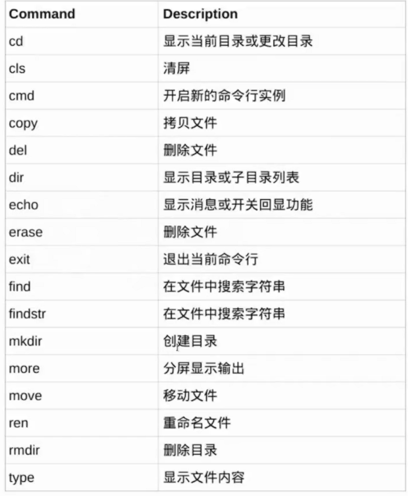
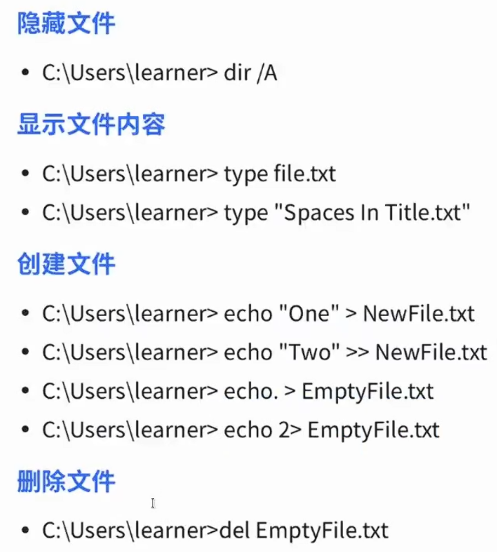
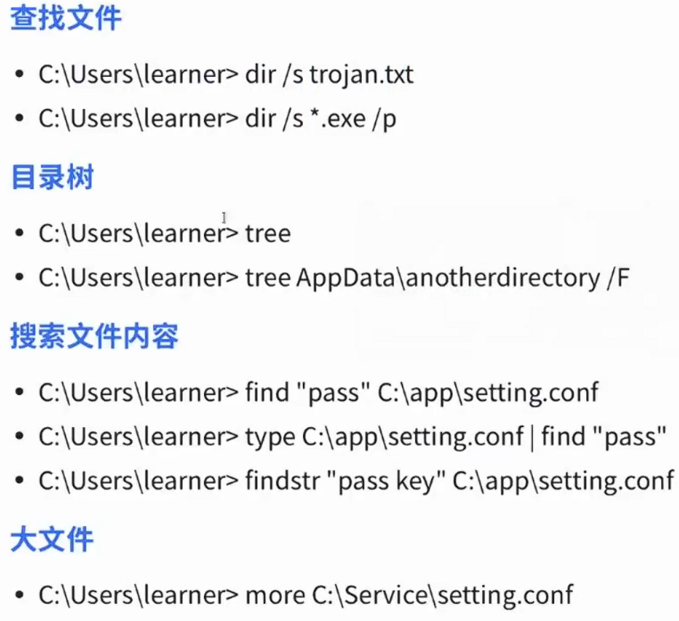
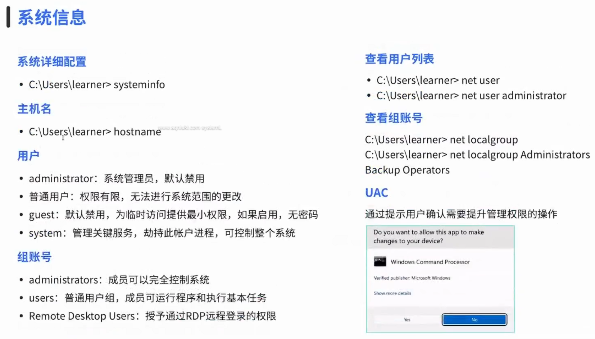
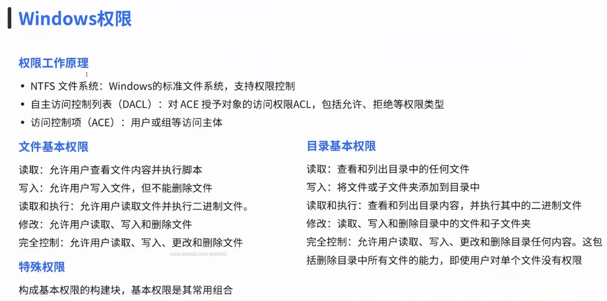
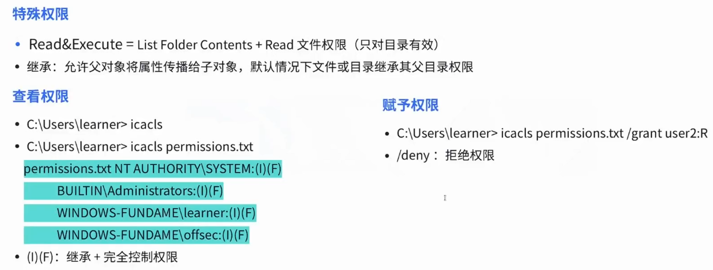
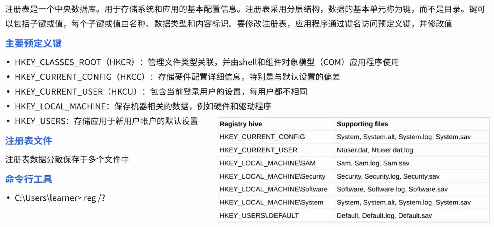

# 01-Windows基础

**English title:** Windows Basics

**作者 / Author:** 2023届 Simon Li / Class of 2023 Simon Li

**原 PPT 日期 / Original PPT date:** 2025-09-17

> 本文由社团课程 PPT 转换而来，保留原幻灯片文字与图片，便于网页阅读。
>
> This article was converted from the club course PowerPoint. Original slide text and images are preserved for web reading.

## 第 1 页 / Slide 1: 公众号：陈西设计之家。微信搜索即可

### 原文 / Original Text

- 01-W
- indows
- 基础
- 01-Windows fundamental
- 2025
- 网络安全社

### 图片 / Images

## 第 2 页 / Slide 2: 公众号

### 原文 / Original Text

- 陈西设计之家
- 微信搜索即可
- 公众号：陈西设计之家。微信搜索即可
- 01
- 02
- 03
- 是一个什么样的操作系统
- Windows
- 简介
- 文件操作
- 基础命令行
- W
- indows
- 的文件夹权限分布
- 系统信息
- 权限问题
- 目录
- C
- ontent

### 图片 / Images

## 第 3 页 / Slide 3: 公众号 陈西设计之家 微信搜索即可

### 原文 / Original Text

- 公众号：陈西设计之家。微信搜索即可
- Windows
- 是一个闭源，付费的操作系统
- W
- indows
- 的最高管理员是
- Administrator (SYSTEM)
- Wi
- ndows
- 使用驱动器概念，每个驱动器包含自己的文件结构目录
- W
- indows
- 的路径分割是“
- \\
- ”，不区分大小写
- W
- indows
- 使用注册表集中管理系统配置和应用
- W
- indows
- 更加注重兼容性，因此可能导致更多的安全问题
- W
- indows
- 主要基于操作界面，而不是命令行
- Windows
- 简介
- Introduction

### 图片 / Images

## 第 4 页 / Slide 4: 公众号

### 原文 / Original Text

- 陈西设计之家
- 微信搜索即可
- 公众号：陈西设计之家。微信搜索即可
- 文件管理基础
- CMD L
- ine
- Program Files,
- Program Files(×86)
- 64
- 位
- /32
- 位程序的目录
- U
- sers
- ：用户主目录
- System32:
- 核心系统库和可执行文件
- SysWOW64: 64
- 位系统独有，存储
- 32
- 位的
- DLL
- 目录结构
- c
- d \\
- cd ..
- c
- d
- 指定目录
- 变更目录
- help
- h
- elp
- 某个主命令
- /?
- 帮助

### 图片 / Images

## 第 5 页 / Slide 5: 公众号 陈西设计之家 微信搜索即可

### 原文 / Original Text

- 公众号：陈西设计之家。微信搜索即可
- 文件系统
- F
- ile system
- 基础命令
- Fundamental command

### 图片 / Images

## 第 6 页 / Slide 6: 公众号 陈西设计之家 微信搜索即可

### 原文 / Original Text

- 公众号：陈西设计之家。微信搜索即可
- /S
- 除目录本身外，还将删除指定目录下的所有子目录和
- 文件。用于删除目录树。
- /Q
- 安静模式，带
- /S
- 删除目录树时不要求确认
- rmdir
- 文件系统
- FILE SYSTEM
- 第二个命令有问题，不要用
- rename
- 这种问题是你没有开管理员权限
- A
- ccess is denied

### 图片 / Images

## 第 7 页 / Slide 7: 公众号 陈西设计之家 微信搜索即可

### 原文 / Original Text

- 公众号：陈西设计之家。微信搜索即可
- 文件系统

### 图片 / Images

## 第 8 页 / Slide 8: 公众号 陈西设计之家 微信搜索即可

### 原文 / Original Text

- 公众号：陈西设计之家。微信搜索即可
- 系统信息
- SYSTEM INFO

### 图片 / Images

## 第 9 页 / Slide 9: 公众号 陈西设计之家 微信搜索即可

### 原文 / Original Text

- 公众号：陈西设计之家。微信搜索即可
- W
- indows
- 权限

### 图片 / Images

## 第 10 页 / Slide 10: 公众号 陈西设计之家 微信搜索即可

### 原文 / Original Text

- 公众号：陈西设计之家。微信搜索即可
- Wi
- ndows
- 权限
- N/F, M/RX/R/W/D

### 图片 / Images

## 第 11 页 / Slide 11: 公众号 陈西设计之家 微信搜索即可

### 原文 / Original Text

- 公众号：陈西设计之家。微信搜索即可
- 注册表
- REGEDIT
- 上节课的
- mimikatz
- 就是利用了
- SAM
- 和
- SYSTEM
- 注册表读取到了密码！

### 图片 / Images

## 第 12 页 / Slide 12: 公众号：陈西设计之家。微信搜索即可

### 原文 / Original Text

- 公众号 陈西设计之家 微信搜索即可
- 公众号：陈西设计之家。微信搜索即可
- 讲完啦！
- O
- ver!
- 网络安全社

### 图片 / Images

