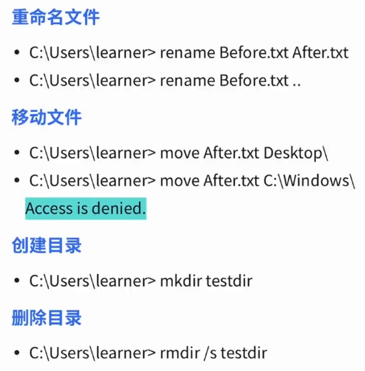

:::section{.lang-zh}

**作者：** 2023届 Simon Li

**原 PPT 日期：** 2025-09-17

> 本文由社团课程 PPT 整理为阅读版讲义，只保留与正文知识点相关的截图、命令行画面、表格或结构图，并补充课堂讲解、学习目标和练习方向。

## 导读

Windows 基础课关注的是日常系统如何成为安全实验对象：文件、用户、权限、进程、命令行和网络配置都不是孤立知识，它们共同决定一台主机是否可管理、可审计、可防护。

## 学习目标

- 熟悉 Windows 文件与账户体系
- 理解权限、进程和服务的基本含义
- 会用命令行观察系统状态

## 1. 把 Windows 当作一台主机来理解

学习 Windows 安全时，第一步不是背菜单位置，而是建立主机视角：系统里有哪些用户，文件放在哪里，程序以什么权限运行，哪些服务正在监听网络。

讲者补充：图形界面适合操作，命令行适合记录和复现。安全排查时，能把操作转换成命令，才方便向同伴解释和复盘。

### 相关图片

## 2. 文件、账户与权限

权限决定谁能读取、修改或执行某个资源。对初学者来说，管理员账户、普通账户、系统账户之间的区别非常重要，因为许多风险都来自不必要的高权限运行。

讲者补充：遇到“权限不足”不要立刻切管理员，而要先判断这个操作是否真的需要高权限。最小权限原则是防御的基本习惯。

### 相关图片

## 3. 命令行观察与安全排查

CMD、PowerShell 和系统管理工具可以帮助我们查看进程、网络连接、环境变量、文件权限和服务状态。它们是后续学习取证、应急和漏洞复现的入口。

讲者补充：每次练习建议记录命令、输出和结论。能留下复现记录，比“我刚才点过某个按钮”更有价值。

## 课堂练习

- 查看当前用户权限并解释结果
- 列出一个目录的权限信息
- 观察当前网络连接并判断哪些属于浏览器或系统服务

:::

:::section{.lang-en}

**Author:** Class of 2023 Simon Li

**Original PPT date:** 2025-09-17

> This article turns the original slides into readable course notes. It keeps only content-related screenshots, terminal captures, tables, or diagrams, and adds presenter-style explanations.

## Overview

This lesson treats Windows as a security target: files, users, permissions, processes, shells, and networking form the base of host security.

## Learning Goals

- Understand the core ideas of Windows Basics.
- Connect Windows, PowerShell, CMD to practical security work.
- Practice only in authorized, repeatable lab environments.

## 1. Windows as a host

Think of Windows as a host with identities, files, processes, and network services.

Read this section as a workflow, not as a tool list. Identify the input, the system boundary, the command or protocol involved, and the evidence that proves the result.

### Related Images

## 2. Files, accounts, and permissions

Least privilege is the core habit: do not run with more permission than the task requires.

Read this section as a workflow, not as a tool list. Identify the input, the system boundary, the command or protocol involved, and the evidence that proves the result.

### Related Images

## 3. Command-line observation

Command-line tools turn system operations into repeatable evidence.

Read this section as a workflow, not as a tool list. Identify the input, the system boundary, the command or protocol involved, and the evidence that proves the result.

## Practice

- Summarize the main workflow of Windows Basics in your own words.
- Reproduce one safe observation step and record the evidence.
- Explain one likely risk and one matching defense.

:::
