# 02 Linux基础

**English title:** Linux Basics

**作者 / Author:** 2023届 Simon Li / Class of 2023 Simon Li

**原 PPT 日期 / Original PPT date:** 2025-09-24

**关键词 / Keywords:** #Linux #Bash #Shell #SSH #File-System #Users #Permissions

> 本文由社团课程 PPT 整理为阅读版讲义：保留原课件图片，并补充课堂讲解、学习目标和练习方向。
>
> This article turns the original slides into readable course notes while preserving slide images and adding presenter-style explanations.

## 导读 / Overview

Linux 基础课把发行版、Shell、文件系统、SSH、用户和权限串起来。它的重点不是记住某个命令，而是理解命令为什么能控制系统资源。

> English overview: Linux basics connect distributions, shell, filesystems, SSH, users, and permissions. The point is to understand why commands control resources.

## 学习目标 / Learning Goals

- 理解 Linux 发行版与 Shell 的关系
- 掌握常见文件和目录操作
- 理解 SSH、用户、组和权限的安全意义

## 1. Linux 与发行版 / Linux and distributions

Linux 严格来说是内核，日常使用的 Ubuntu、Debian、Arch 等是围绕内核打包出的发行版。发行版差异会影响包管理、默认配置和使用习惯，但文件、权限、进程这些核心概念是相通的。

讲者补充：选择发行版时不用纠结“最强”，先选资料多、容易恢复、适合课堂环境的版本。能稳定练习比追求新奇更重要。

> English recap: A distribution is a usable system built around the Linux kernel. Core security concepts remain similar across distributions.

### 相关课件图片 / Related Slide Images

### 第 1 页配图 / Slide 1 Images

### 第 2 页配图 / Slide 2 Images

### 第 3 页配图 / Slide 3 Images

### 第 4 页配图 / Slide 4 Images

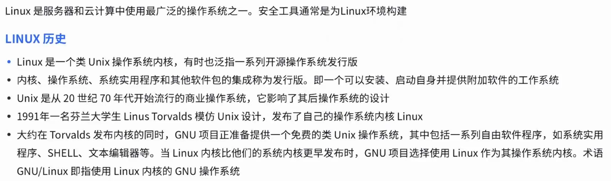

### 第 5 页配图 / Slide 5 Images

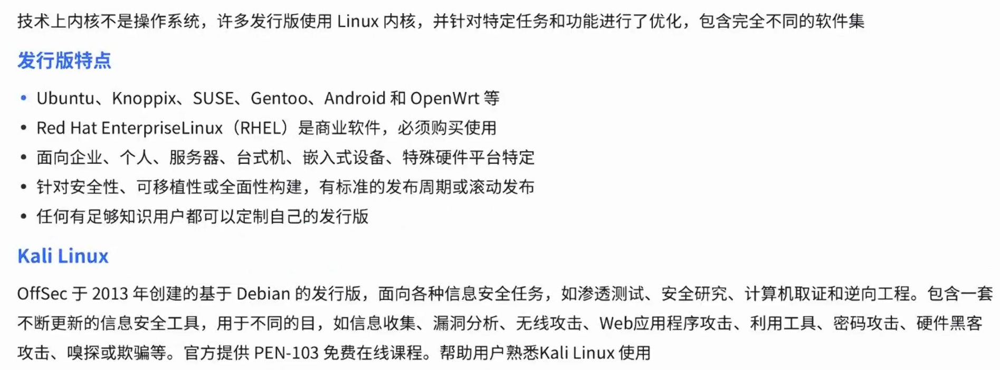

## 2. Shell 与命令行 / Shell and command line

Shell 是人与系统对话的接口。`echo $SHELL`、`chsh`、`cd`、`ls` 等命令看似简单，却覆盖了查看环境、切换目录、列出文件、调整默认 Shell 等基础动作。

讲者补充：命令行学习要养成读提示符、读路径、读错误信息的习惯。很多错误不是命令不会，而是当前目录、权限或参数没有看清。

> English recap: The shell is the interface between the user and the operating system. Small commands build reliable habits.

### 相关课件图片 / Related Slide Images

### 第 6 页配图 / Slide 6 Images

### 第 7 页配图 / Slide 7 Images

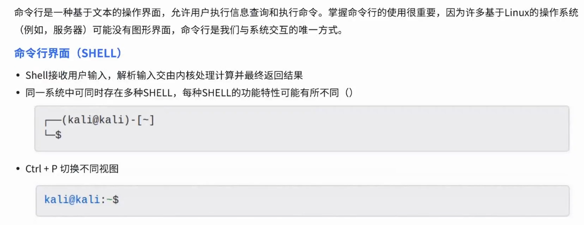

### 第 8 页配图 / Slide 8 Images

### 第 9 页配图 / Slide 9 Images

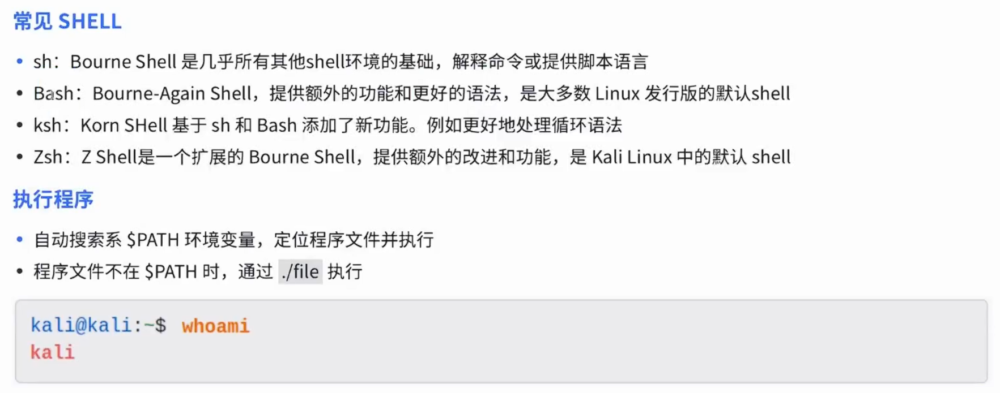

### 第 10 页配图 / Slide 10 Images

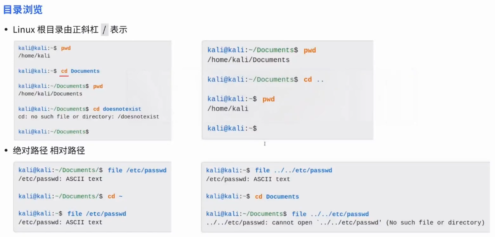

### 第 11 页配图 / Slide 11 Images

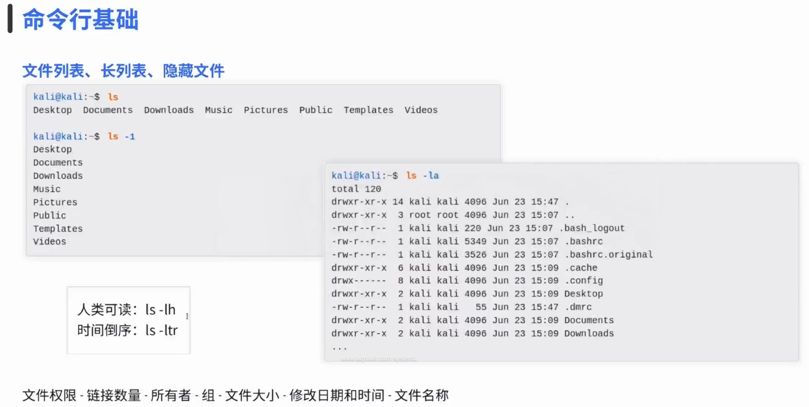

## 3. SSH 与远程连接 / SSH and remote access

SSH 是远程管理 Linux 主机的常用协议，它用加密连接替代明文登录。连接时要明确用户名、主机地址、端口和认证方式。

讲者补充：不要把 SSH 当成“能连上就行”。安全配置还包括禁用弱密码、限制登录用户、使用密钥、查看监听端口和日志。

> English recap: SSH provides encrypted remote access, but secure configuration matters as much as the connection command.

### 相关课件图片 / Related Slide Images

### 第 12 页配图 / Slide 12 Images

## 4. 文件系统、用户与权限 / Filesystem, users, and permissions

Linux 中“一切皆文件”的思想，让设备、配置、日志和普通文本都能用统一方式管理。用户、组和权限则决定谁能读、写、执行这些文件。

讲者补充：`rwx` 不只是三个字母。读权限影响查看，写权限影响修改，执行权限影响运行或进入目录。理解目录权限尤其重要。

> English recap: Files, users, groups, and permissions are the foundation of Linux security.

### 相关课件图片 / Related Slide Images

### 第 13 页配图 / Slide 13 Images

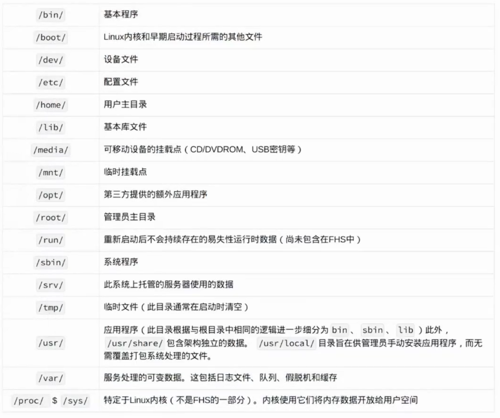

### 第 14 页配图 / Slide 14 Images

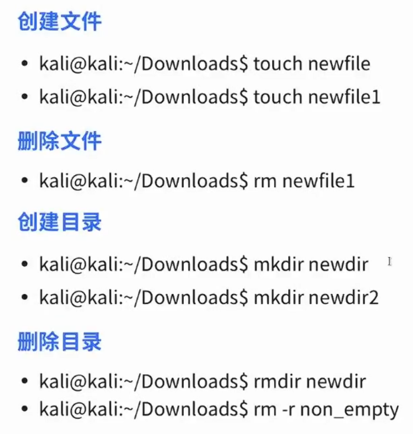

### 第 15 页配图 / Slide 15 Images

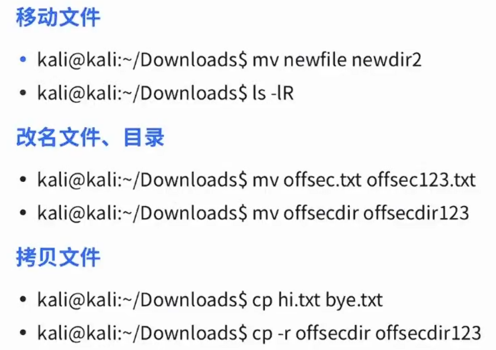

### 第 16 页配图 / Slide 16 Images

### 第 17 页配图 / Slide 17 Images

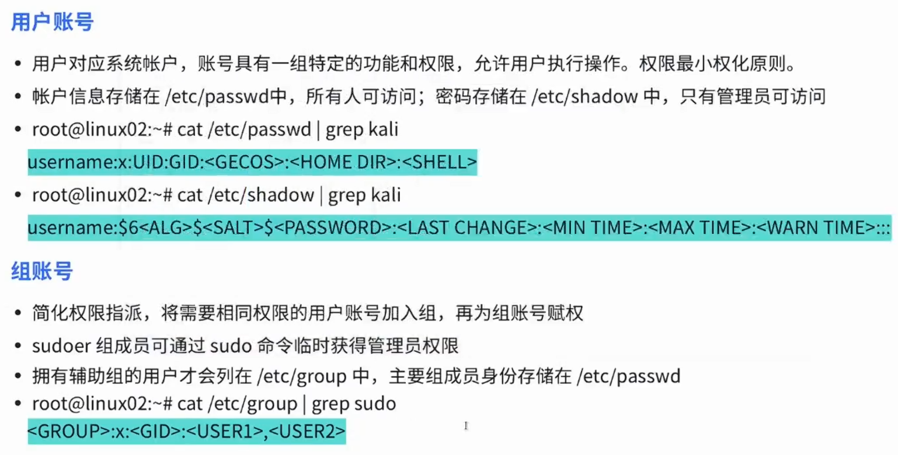

### 第 18 页配图 / Slide 18 Images

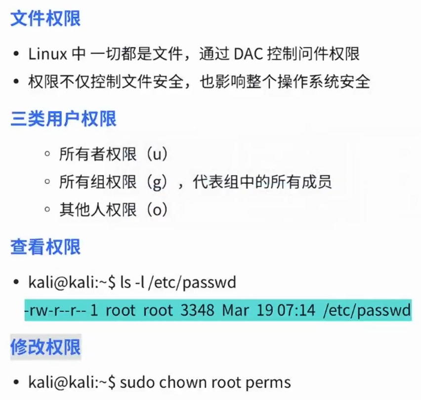
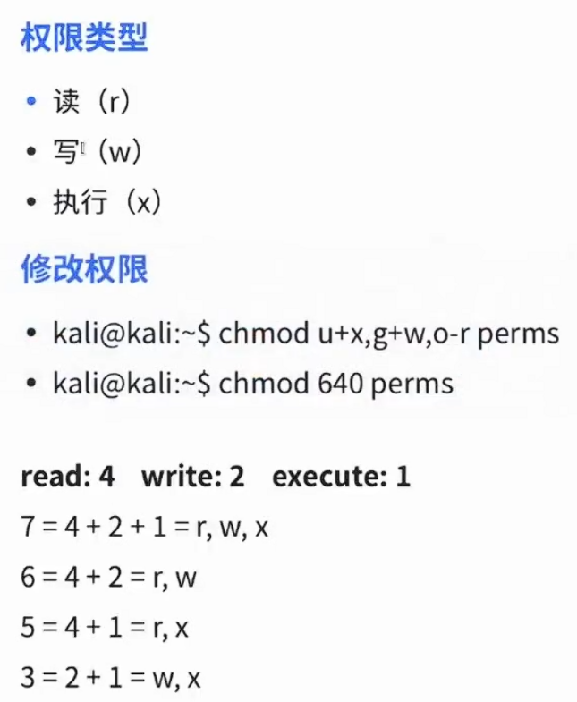

### 第 19 页配图 / Slide 19 Images

### 第 20 页配图 / Slide 20 Images

### 第 21 页配图 / Slide 21 Images

## 课堂练习 / Practice

- 用命令查看当前 Shell 和当前目录
- 创建一个文件并修改权限
- 尝试用 SSH 连接实验机并记录认证方式
