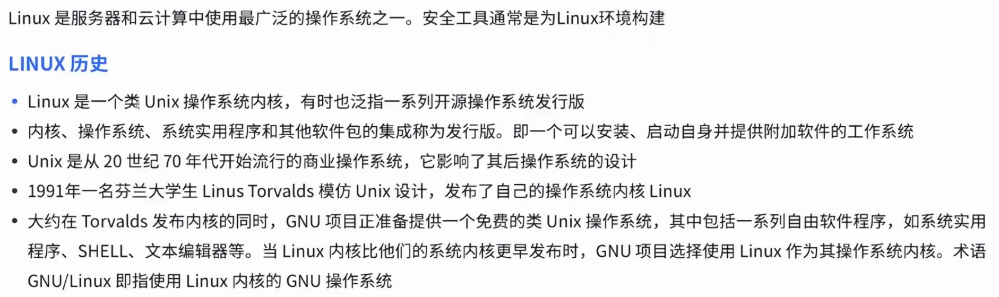

:::section{.lang-zh}

**原 PPT 日期：** 2025-09-24

> 此文为codex改编往年课件而成

## 课程简介

课程介绍发行版、Shell、文件系统、SSH、用户和权限，并说明命令如何访问系统资源。

## 你会学到

- 理解 Linux 发行版与 Shell 的关系
- 掌握常见文件和目录操作
- 理解 SSH、用户、组和权限的安全意义

## 1. Linux 与发行版

Linux 严格来说是内核，日常使用的 Ubuntu、Debian、Arch 等是围绕内核打包出的发行版。发行版差异会影响包管理、默认配置和使用习惯，但文件、权限、进程这些核心概念是相通的。

选择发行版时不用纠结“最强”，先选资料多、容易恢复、适合课堂环境的版本。能稳定练习比追求新奇更重要。

## 2. Shell 与命令行

Shell 是人与系统对话的接口。`echo $SHELL`、`chsh`、`cd`、`ls` 等命令看似简单，却覆盖了查看环境、切换目录、列出文件、调整默认 Shell 等基础动作。

使用命令行时要检查提示符、当前路径、权限、参数和错误信息。这些信息通常能直接定位问题。

## 3. SSH 与远程连接

SSH 是远程管理 Linux 主机的常用协议，它用加密连接替代明文登录。连接时要明确用户名、主机地址、端口和认证方式。

不要把 SSH 当成“能连上就行”。安全配置还包括禁用弱密码、限制登录用户、使用密钥、查看监听端口和日志。

## 4. 文件系统、用户与权限

Linux 中“一切皆文件”的思想，让设备、配置、日志和普通文本都能用统一方式管理。用户、组和权限则决定谁能读、写、执行这些文件。

`rwx` 不只是三个字母。读权限影响查看，写权限影响修改，执行权限影响运行或进入目录。理解目录权限尤其重要。

## 动手小任务

- 用命令查看当前 Shell 和当前目录
- 创建一个文件并修改权限
- 尝试用 SSH 连接实验机并记录认证方式

:::

:::section{.lang-en}

**Original PPT date:** 2025-09-24

> This article was adapted by Codex from previous course slides.

## Overview

Linux basics connect distributions, shell, filesystems, SSH, users, and permissions. The point is to understand why commands control resources.

## 1. Linux and distributions

A distribution is a usable system built around the Linux kernel. Core security concepts remain similar across distributions.

## 2. Shell and command line

The shell is the interface between the user and the operating system. Small commands build reliable habits.

## 3. SSH and remote access

SSH provides encrypted remote access, but secure configuration matters as much as the connection command.

## 4. Filesystem, users, and permissions

Files, users, groups, and permissions are the foundation of Linux security.

:::
