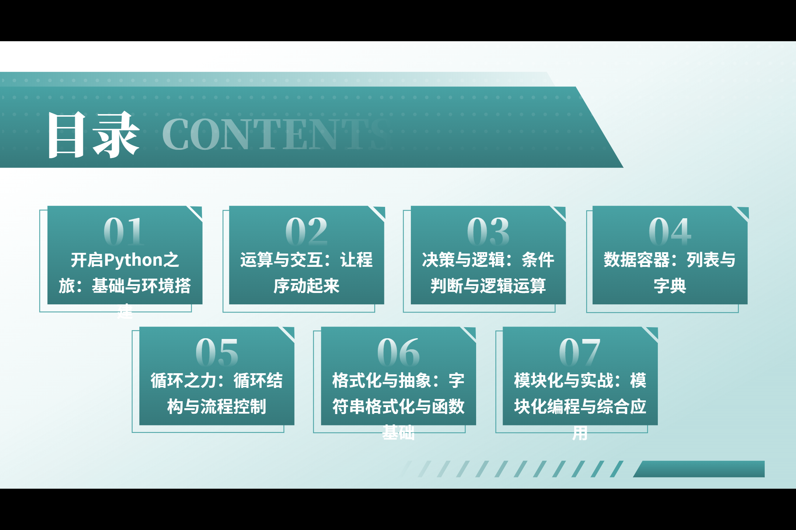
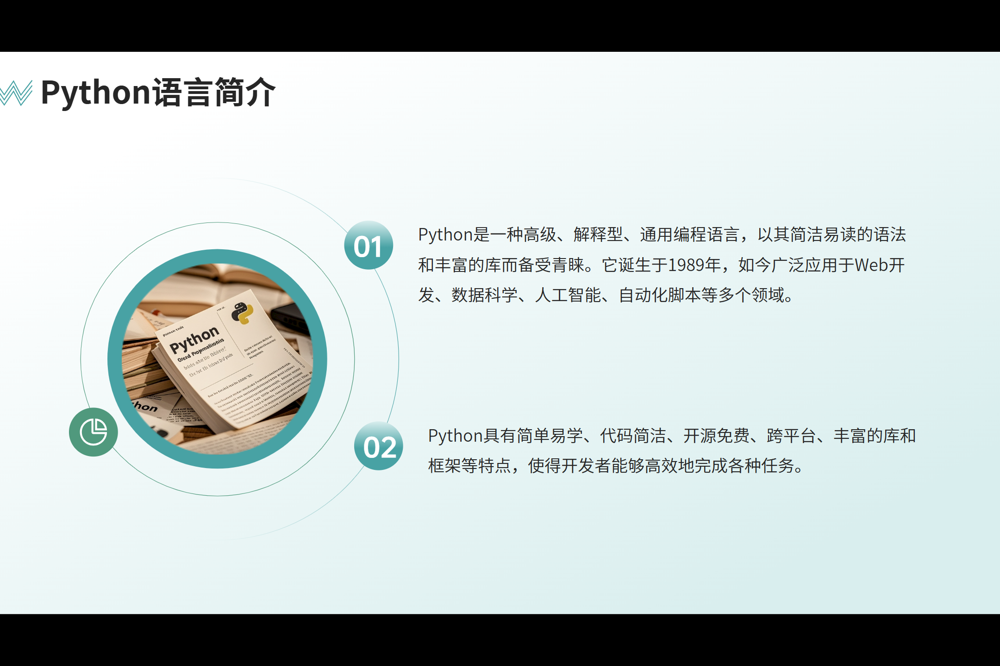
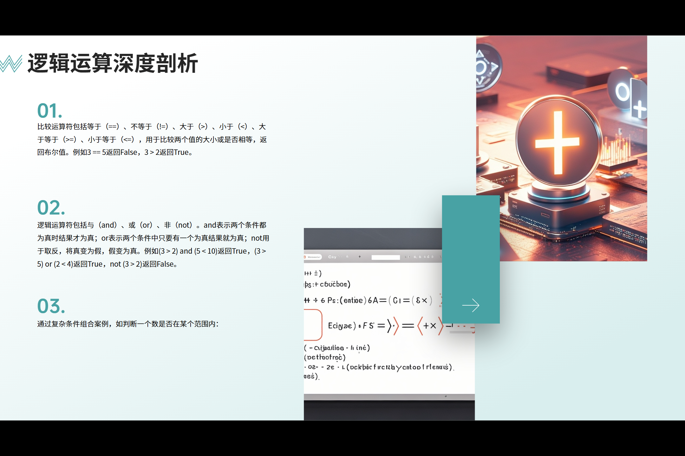
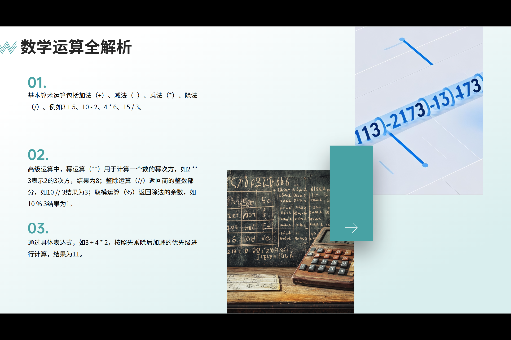
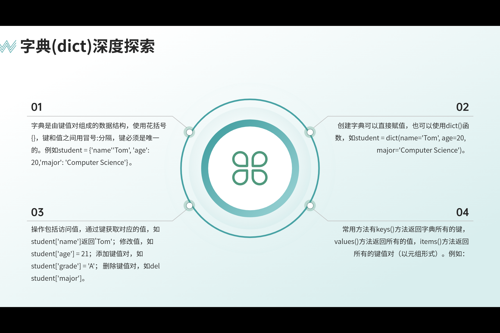
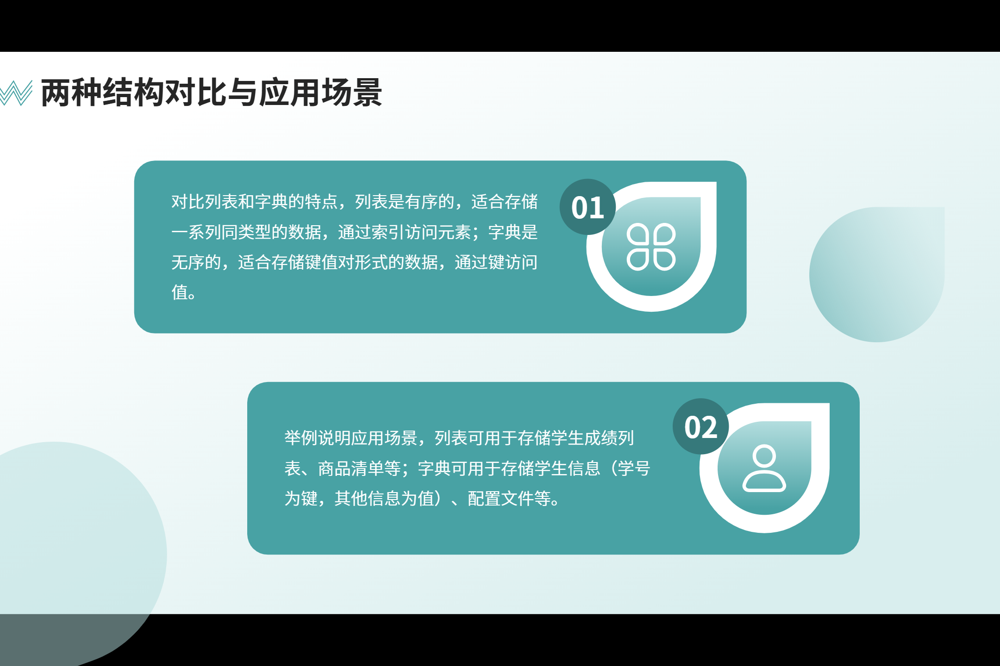
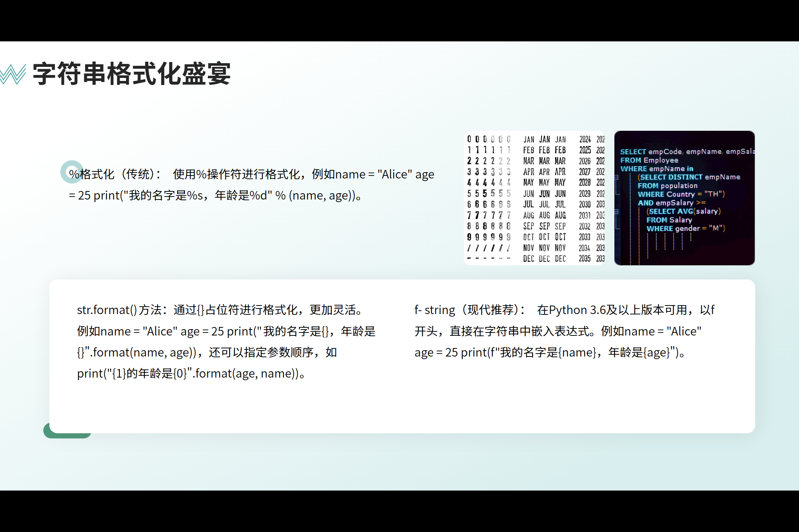

:::section{.lang-zh}

**原 PPT 日期：** 2025-10-15

> 此文为codex改编往年课件而成

## 课程简介

Python 基础课服务于后续自动化、安全脚本和数据处理，内容包括变量、流程控制、函数和调试。

## 你会学到

- 理解 Python 程序的基本结构
- 能用变量、条件和循环表达简单逻辑
- 为后续安全自动化打基础

## 1. 从脚本开始

Python 适合作为第一门安全自动化语言，因为语法清晰，能快速处理文本、文件、网络请求和数据格式。学习时可以先把脚本看作“可重复执行的操作记录”。

除了检查代码能否运行，还要记录输入、输出和异常情况。

## 2. 变量、判断与循环

变量负责保存状态，条件判断负责选择路径，循环负责重复动作。这三件事足以表达大多数入门任务，例如批量检查文件名、统计日志行、过滤可疑字符串。

安全脚本常常处理脏数据，写判断时要考虑空值、格式错误和异常输入。

## 3. 函数与模块化

函数把一段逻辑命名并复用。对安全学习来说，函数能把扫描、解析、输出、保存结果这些步骤分开，降低调试难度。

函数名要表达意图，例如 `parse_log_line` 比 `do_thing` 更适合复盘和协作。

## 4. 练习与调试

调试是编程过程的一部分。打印中间结果、缩小输入范围和阅读报错堆栈都有助于定位问题。

写安全脚本时先在小样本上验证，再扩大到真实数据，避免错误脚本批量破坏文件或输出误判。

## 动手小任务

- 写一个脚本统计文本中某个关键词出现次数
- 用函数封装一次日志行解析
- 故意制造一个错误并解释报错位置

:::

:::section{.lang-en}

**Original PPT date:** 2025-10-15

> This article was adapted by Codex from previous course slides.

## Overview

Python basics support automation, security scripting, and data processing. Variables, control flow, functions, and debugging come first.

## 1. Starting from scripts

A script is a repeatable record of operations. Clear input and output matter.

## 2. Variables, branches, and loops

Variables store state, branches choose paths, and loops repeat work.

## 3. Functions and modularity

Functions name reusable logic and make scripts easier to test.

## 4. Practice and debugging

Debugging is part of programming. Test with small samples before scaling up.

:::
