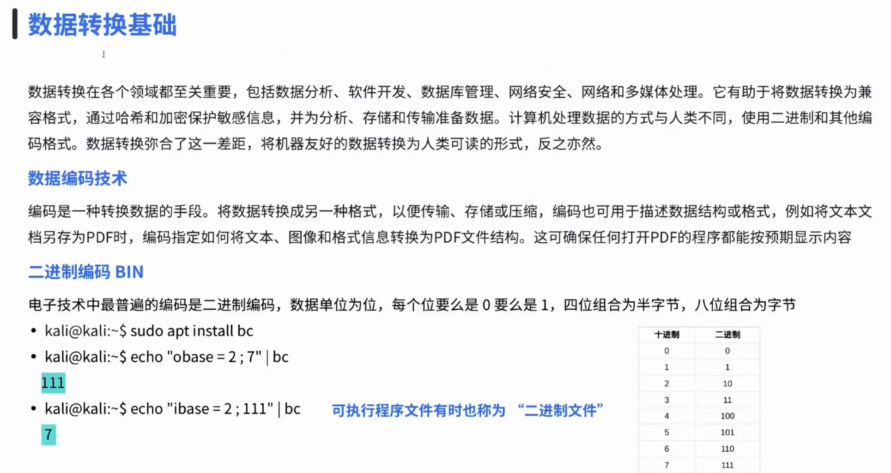
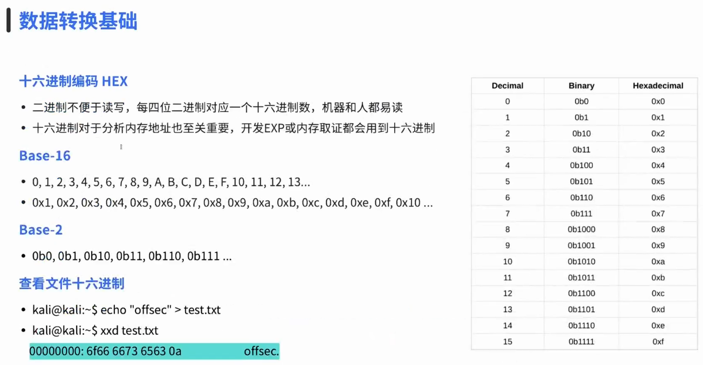
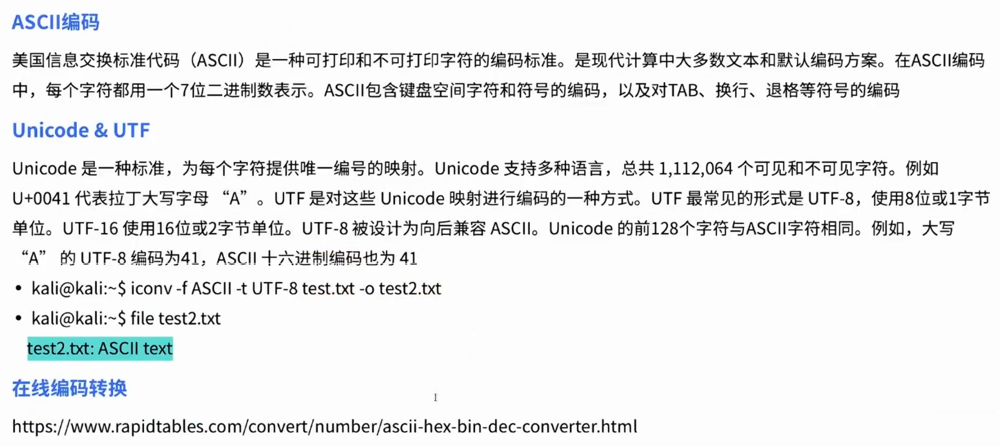
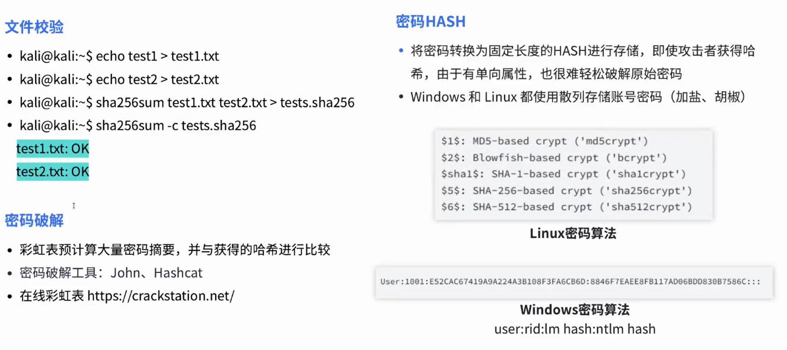

# 04-数据转换基础

**English title:** Data Conversion Basics

**作者 / Author:** 2023届 Simon Li / Class of 2023 Simon Li

**原 PPT 日期 / Original PPT date:** 2025-10-15

> 本文由社团课程 PPT 转换而来，保留原幻灯片文字与图片，便于网页阅读。
>
> This article was converted from the club course PowerPoint. Original slide text and images are preserved for web reading.

## 第 1 页 / Slide 1: 网络安全社

### 原文 / Original Text

- -04
- 天一网络安全社
- TY
- c
- ybersec
- 数据转换基础
- S
- imon
- 时间：2025.10.15

### 图片 / Images

## 第 2 页 / Slide 2: 2

### 原文 / Original Text

- 进制
- ,8
- 进制
- ,16
- 进制编码
- CONTENT
- 哈希与密码破解
- ASCII vs UTF(Unicode)
- 作业
- 01
- 02
- 03
- 04
- TYcybersec

### 图片 / Images

## 第 3 页 / Slide 3: WORK SUMMARY REPORT· WORK SUMMARY REPORT ·WORK SUMMARY REPORT · WORK SUMMARY REPORT

### 原文 / Original Text

- 01
- 2
- 进制
- ,8
- 进制
- ,16
- 进制编码
- TYcybersec

### 图片 / Images

## 第 4 页 / Slide 4: WORK SUMMARY REPORT· WORK SUMMARY REPORT ·WORK SUMMARY REPORT · WORK SUMMARY REPORT

### 原文 / Original Text

- TYcybersec
- 二进制

### 图片 / Images

## 第 5 页 / Slide 5: WORK SUMMARY REPORT· WORK SUMMARY REPORT ·WORK SUMMARY REPORT · WORK SUMMARY REPORT

### 原文 / Original Text

- TYcybersec
- 十六进制

### 图片 / Images

## 第 6 页 / Slide 6: WORK SUMMARY REPORT· WORK SUMMARY REPORT ·WORK SUMMARY REPORT · WORK SUMMARY REPORT

### 原文 / Original Text

- 02
- ASCII vs UTF(Unicode)
- TYcybersec

### 图片 / Images

## 第 7 页 / Slide 7: WORK SUMMARY REPORT· WORK SUMMARY REPORT ·WORK SUMMARY REPORT · WORK SUMMARY REPORT

### 原文 / Original Text

- TYcybersec

### 图片 / Images

## 第 8 页 / Slide 8: WORK SUMMARY REPORT· WORK SUMMARY REPORT ·WORK SUMMARY REPORT · WORK SUMMARY REPORT

### 原文 / Original Text

- 03
- 哈希与密码破解
- TYcybersec

### 图片 / Images

## 第 9 页 / Slide 9: WORK SUMMARY REPORT· WORK SUMMARY REPORT ·WORK SUMMARY REPORT · WORK SUMMARY REPORT

### 原文 / Original Text

- TYcybersec
- 哈希
- HASH
- 是什么
- 优点
- 2
- 优点
- 1
- 将可变大小的输入转换成固定长度的十六进制输出，也称为摘要
- 输入数据的微小变化会导致摘要的巨大变化，通常用于完整性检验
- 速度很快，极难碰撞
- 生成散列很容易，但是将散列逆向还原为原始数据很困难，也就是“单向”属性

### 图片 / Images

## 第 10 页 / Slide 10: WORK SUMMARY REPORT· WORK SUMMARY REPORT ·WORK SUMMARY REPORT · WORK SUMMARY REPORT

### 原文 / Original Text

- TYcybersec

### 图片 / Images

## 第 11 页 / Slide 11: WORK SUMMARY REPORT· WORK SUMMARY REPORT ·WORK SUMMARY REPORT · WORK SUMMARY REPORT

### 原文 / Original Text

- 04
- H
- omework self-quiz
- TYcybersec

### 图片 / Images

## 第 12 页 / Slide 12: WORK SUMMARY REPORT· WORK SUMMARY REPORT ·WORK SUMMARY REPORT · WORK SUMMARY REPORT

### 原文 / Original Text

- TYcybersec
- DDL:
- 本周六
- 写一个
- python
- 代码，要求如下：
- 现在公司有
- 3
- 个小明，对应的电话号码分别为：
- 12345
- ，
- 56789
- ，
- 13579
- 请让程序找出电话号码数值大于
- 50000
- 的电话号码
- (
- 不可以：
- print([“
- 小明
- ”
- ，
- 2]))
- 然后把这个文件编译成
- txt
- 和
- python
- 文件并转换为
- sha256
- ，最后将代码和
- 16
- 进制数值发送给社长。
- 作业

### 图片 / Images

## 第 13 页 / Slide 13: 网络安全社

### 原文 / Original Text

- -04
- 天一网络安全社
- WORK SUMMARY REPORT· WORK SUMMARY REPORT ·WORK SUMMARY REPORT · WORK SUMMARY REPORT
- O
- ver!
- S
- imon
- 时间：2025.10.15
- TYcybersec

### 图片 / Images

