# 05-密码学基础

**English title:** Cryptography Basics

**作者 / Author:** 2023届 Simon Li / Class of 2023 Simon Li

**原 PPT 日期 / Original PPT date:** 2025-11-03

> 本文由社团课程 PPT 转换而来，保留原幻灯片文字与图片，便于网页阅读。
>
> This article was converted from the club course PowerPoint. Original slide text and images are preserved for web reading.

## 第 1 页 / Slide 1: 密码学基础

### 原文 / Original Text

- S
- imon
- 05-
- 网络安全社

### 图片 / Images

## 第 2 页 / Slide 2: 基础的

### 原文 / Original Text

- base
- 万恶之源
- 01
- 对称加密
- VS
- 非对称加密
- AL_1S
- &lt;-&gt; Alice
- VS AL_1S
- -&gt; Key; Key -&gt;
- 王女
- 对称加密                       非对称加密
- 02
- V
- igenere
- 加密
- Qqmiaiii
- 加？密！
- 03
- XOR
- 加密与基础的逻辑运算
- 与，或，非，同或，异或
- 04
- 目录

### 图片 / Images

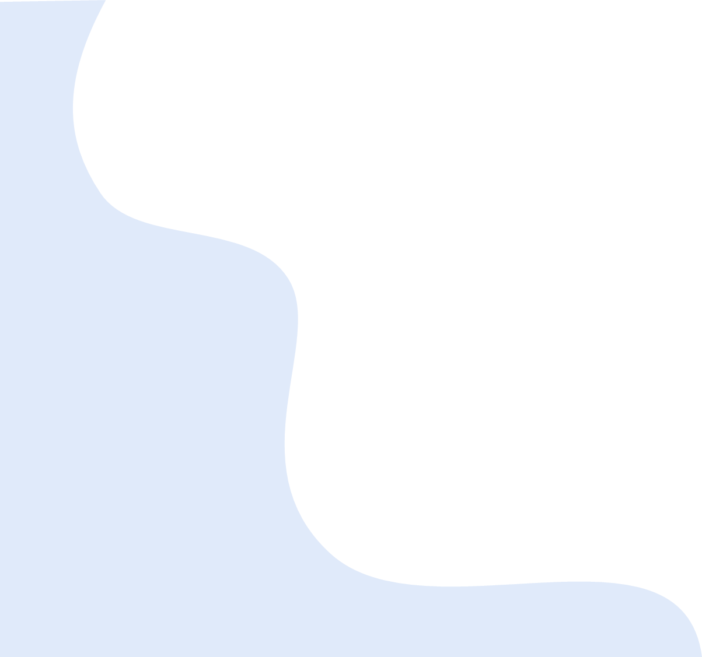

## 第 3 页 / Slide 3: 基础的

### 原文 / Original Text

- base
- PART  01
- 准备：
- https://cyberchef.io/

### 图片 / Images

## 第 4 页 / Slide 4: 基础的

### 原文 / Original Text

- base
- I
- ntroduction

### 图片 / Images

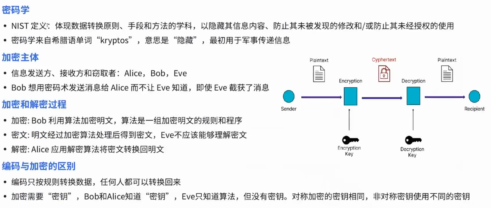

## 第 5 页 / Slide 5: 对称加密

### 原文 / Original Text

- VS
- 非对称加密
- PART  02

### 图片 / Images

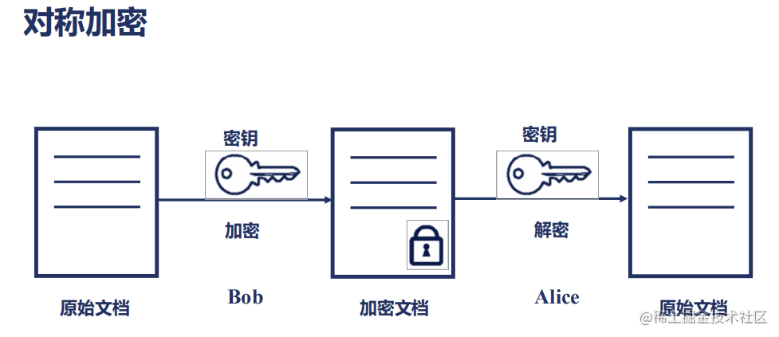
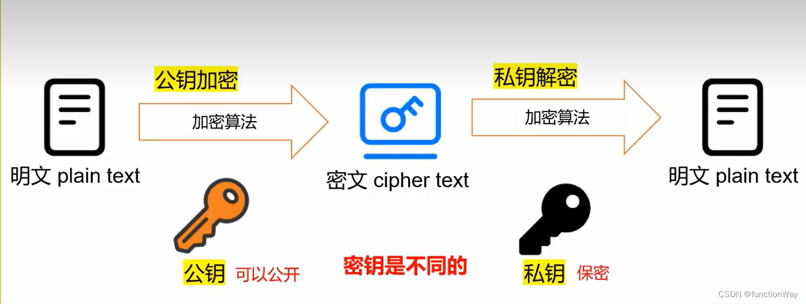

## 第 6 页 / Slide 6: 对称加密

### 原文 / Original Text

- 镜

### 图片 / Images

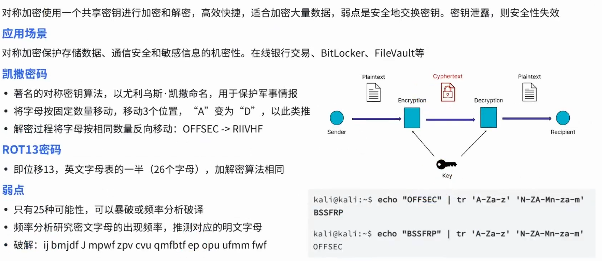

## 第 7 页 / Slide 7: 非对称加密

### 图片 / Images

## 第 8 页 / Slide 8: Vigenere

### 原文 / Original Text

- 加密
- Qqmiaiii
- 请根据此密文还原原文
- (
- 答案在今天的社团课上出现过
- )
- Note
- ：这是一个对称加密
- PART  03

### 图片 / Images

## 第 9 页 / Slide 9: Vigenere

### 原文 / Original Text

- 加密
- Vigenere
- encode

### 图片 / Images

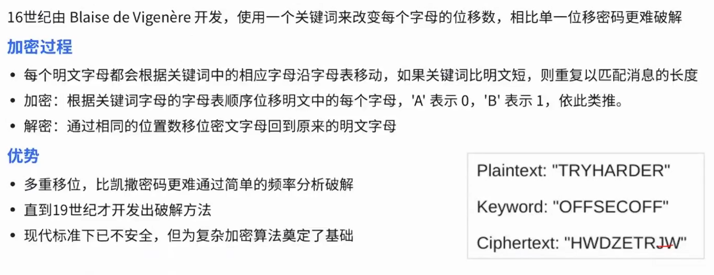

## 第 10 页 / Slide 10: 步骤

### 原文 / Original Text

- 2:
- 加密公式
- 加密公式为：
- C = (P + K) % 26
- 其中，
- P
- 是明文字母对应的数字，
- K
- 是密钥字母对应的数字，
- C
- 是密文字母对应的数字。
- 逐个计算：
- (7 + 23) % 26 = 4 (E)
- (4 + 19) % 26 = 23 (X)
- (11 + 6) % 26 = 17 (R)
- (11 + 1) % 26 = 12 (M)
- (14 + 23) % 26 = 11 (L)
- (22 + 19) % 26 = 15 (P)
- (14 + 6) % 26 = 20 (U)
- (17 + 1) % 26 = 18 (S)
- (3 + 23) % 26 = 0 (A)
- 分步解析
- 步骤
- 1:
- 字母转化为数字
- 将字母映射为数字（
- A=0, B=1, ..., Z=25
- ）：
- 明文
- m =
- helloword
- 转换为数字序列：
- h=7, e=4, l=11, l=11, o=14, w=22, o=14, r=17, d=3
- 密钥
- k =
- xtgb
- 转换为数字序列（重复使用密钥至与明文等长）：
- x=23, t=19, g=6, b=1
- Vigenere
- 加密
- 步骤
- 3:
- 转换为密文
- 将计算结果的数字序列转换回字母：
- 数字序列：
- 4, 23, 17, 12, 11, 15, 20, 18, 0
- 密文：
- EXRMLPUSA

### 图片 / Images

## 第 11 页 / Slide 11: XOR

### 原文 / Original Text

- 加密与基础的逻辑
- /
- 布尔运算
- 与，或，非，
- 同或，异或
- PART  04

### 图片 / Images

## 第 12 页 / Slide 12: XOR

### 原文 / Original Text

- 加密
- ^
- encoding
- Reference: https://zhuanlan.zhihu.com/p/651511134

### 图片 / Images

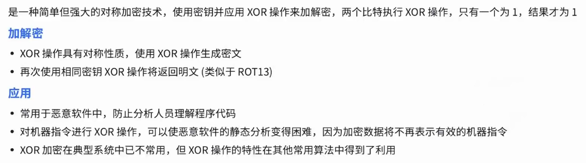

## 第 13 页 / Slide 13: && || ! ^ ⊙

### 原文 / Original Text

- 令
- 1 = true, 0 = false (
- 布尔运算
- )
- 1.
- 逻辑与运算
- (And)
- 可以用
- &
- 表示，在程序一般用
- &&
- ，如
- if(a&&b)
- 与运算的规则为：同时为
- 1
- ，结果为
- 1
- ，任意一方为
- 0
- 时，结果为
- 0
- 1
- &
- 1
- =
- 1
- &
- 0
- =
- 0
- &
- 1
- =
- 0
- &
- 0
- =
- 0
- 举个例子，
- 1010&1101
- 结果为
- 1000
- 。
- 2.
- 逻辑或运算
- (Or)
- 可以用
- |
- 表示，在程序一般用
- ||
- ，如
- if(a||b)
- 或运算的规则为：同时为
- 0
- ，结果为
- 0
- ，任意一方为
- 1
- 时，结果为
- 1
- |
- 1
- =
- 1
- |
- 0
- =
- 1
- 0
- |
- 1
- =
- 1
- 0
- |
- 0
- =
- 0
- 举个例子，
- 1010or1101
- 结果为
- 1111
- 。
- 3.
- 逻辑非运算
- (Not)
- 可以用
- !
- 表示，如
- !1=0
- 非运算的规则比较简单，
- !1=0
- ；
- !0=1
- 举个例子，
- !1001=0110
- 。

### 图片 / Images

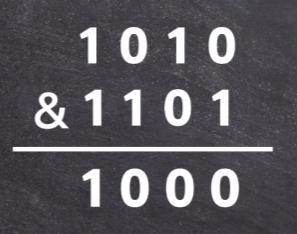
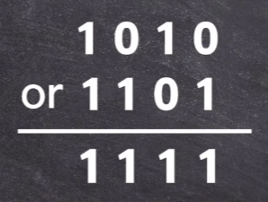
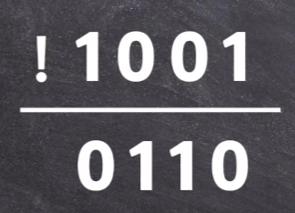

## 第 14 页 / Slide 14: && || ! ^ ⊙

### 原文 / Original Text

- XOR
- 例子
- 可以用
- XOR
- 或⊕表示，在程序中，一般使用
- ^
- 表示，如
- a^b
- 异或运算的规则为：不同则为
- 1
- ，相同则为
- 0
- 。
- 1010
- ^
- 1110
- =
- 0100
- 举个例子，
- 1010^1110=0100
- XOR
- 异或运算
- 可以用
- xnor
- 或⊙表示
- 同或运算的规则为：不同则为
- 0
- ，相同则为
- 1
- 。
- 1010
- xnor
- 1110
- =
- 1011
- 举个例子，
- 1010
- xnor
- 1110=1011
- 注意：
- 在程序中，一般没有同或运算符：
- 可以用两个数的异或结果再次异或
- 1
- ，即可得到两个数的同或结果。
- Xnor
- 同或运算
- Xnor
- 例子
- 令
- 1 =true, 0= false (
- 布尔运算
- )

### 图片 / Images

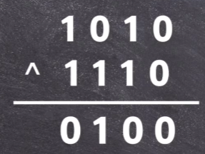
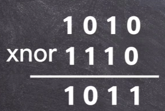
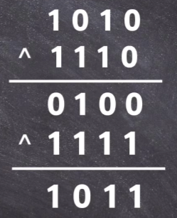

## 第 15 页 / Slide 15: 今日作业

### 原文 / Original Text

- PART  05

### 图片 / Images

## 第 16 页 / Slide 16: 今日作业：

### 原文 / Original Text

- 没有作业！

### 图片 / Images

## 第 17 页 / Slide 17: 准备你的期中考试

### 原文 / Original Text

- Simon
- THANK YOU
- Curve! Curve! Curve!

### 图片 / Images

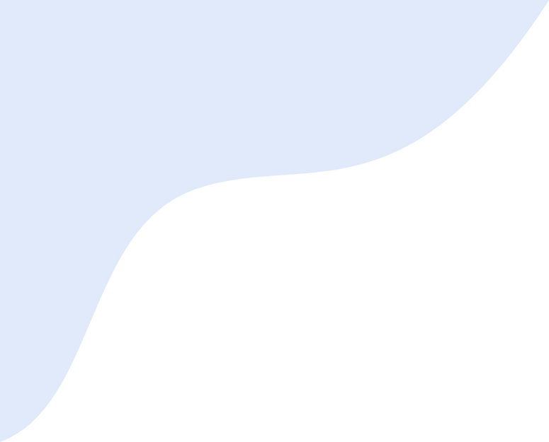

