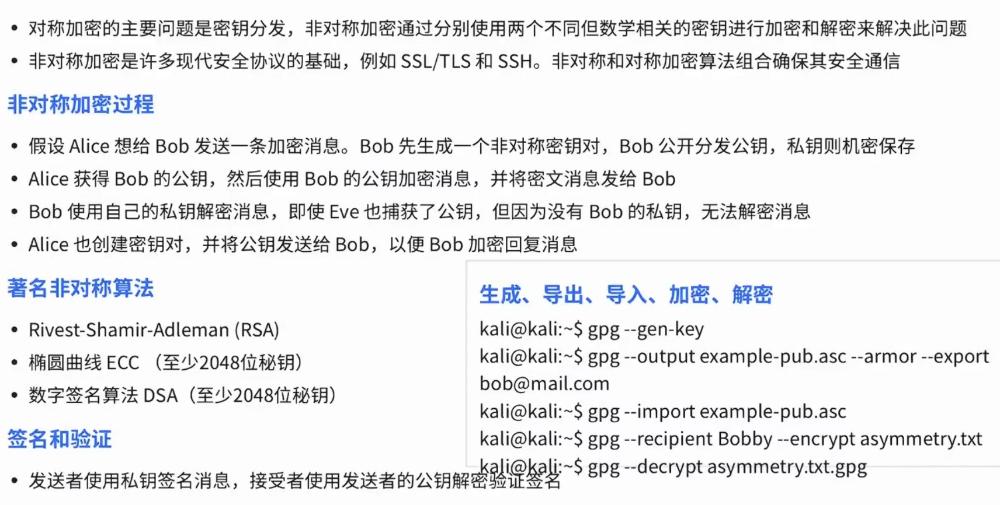

:::section{.lang-zh}

**原 PPT 日期：** 2025-11-03

> 此文为codex改编往年课件而成

## 先把地图点亮

如果你是第一次接触这个主题，不用先背一堆名词。先抓住一个小问题：它解决什么麻烦？输入从哪里来？最后能留下什么证据？

密码学基础课介绍从古典密码到现代加密的核心思想。课堂目标不是手写完整算法，而是知道不同密码机制解决什么问题、不能解决什么问题。

下面按“概念 -> 例子 -> 可操作的小任务”的顺序拆开。读完不一定立刻变成高手，但至少能知道下一步该点亮哪块地图。

## 你会学到

- 理解对称加密、非对称加密和哈希的区别
- 认识 Vigenere、XOR 等基础思想
- 建立不要自创密码算法的安全意识

## 1. 密码学解决什么问题

密码学常见目标包括保密性、完整性、身份认证和不可否认性。不同算法负责不同目标，把它们混用会导致错误的安全感。

加密不等于安全。密钥管理、随机数、协议设计和实现细节同样会决定结果。

> 小提示：看到命令别只复制，顺手问一句：它读了什么、改了什么、留下了什么证据？

## 2. 对称与非对称加密

对称加密速度快，但双方要共享同一把密钥；非对称加密便于密钥交换和签名，但计算成本更高。现代协议通常把两者组合使用。

TLS 等协议不是只用一种算法，而是把密钥交换、身份验证、对称加密和完整性校验组织成流程。

> 小提示：如果结论只能靠“感觉”，那还没通关；补一条可复现的命令、截图或日志。

## 3. Vigenere 与 XOR

Vigenere 展示了“密钥重复使用”带来的模式问题，XOR 展示了位运算在加密和编码中的基础作用。它们适合帮助初学者理解密钥与明文的关系。

在 CTF 中看到 XOR，不要只想爆破，也要观察明文格式、文件头和重复周期。

> 小提示：报错不是敌人，它通常是在很诚实地告诉你哪一层没对上。

## 4. 作业与复习

复习密码学时建议按问题分类：我要隐藏内容、验证完整性、确认身份，还是交换密钥。先确认目标，再选择机制。

不要在真实项目中自创加密方案。学习可以复现，生产要使用成熟库和成熟协议。

> 小提示：工具是技能栏，不是自动胜利按钮；真正的主角仍然是你的判断链。

## 动手小任务

- 用自己的话解释哈希和加密的区别
- 完成一个简单 XOR 还原练习
- 列出 TLS 中至少两个密码学机制

:::

:::section{.lang-en}

**Original PPT date:** 2025-11-03

> This article was adapted by Codex from previous course slides.

## Overview

If this topic is new to you, do not start by memorizing every term. First ask a smaller question: what problem does it solve, where does input enter, and what evidence can we observe?

Cryptography basics introduce classical and modern ideas: confidentiality, integrity, authentication, and their limits.

The article follows a simple path: idea, example, and a small task you can reproduce safely.

## Learning Goals

- Explain the main workflow behind Cryptography Basics.
- Use Cryptography, Hash, Symmetric Encryption to read commands, traffic, logs, or code with evidence.
- Stay inside authorized lab environments and document each step clearly.

## 1. What cryptography solves

Cryptography supports confidentiality, integrity, authentication, and non-repudiation, but only when used correctly.

Read it as a small investigation: what enters the system, what changes inside it, and what evidence proves the result?

> Side note: Do not just copy the command. Ask what it reads, what it changes, and what evidence it leaves.

## 2. Symmetric and asymmetric encryption

Modern protocols combine symmetric and asymmetric techniques.

Read it as a small investigation: what enters the system, what changes inside it, and what evidence proves the result?

> Side note: If a conclusion only feels right, it is not cleared yet. Add reproducible evidence.

## 3. Vigenere and XOR

Classical examples reveal how keys interact with plaintext and why patterns matter.

Read it as a small investigation: what enters the system, what changes inside it, and what evidence proves the result?

> Side note: Errors are not the villain; they usually point at the layer that does not match.

## 4. Homework and review

Choose cryptographic mechanisms by security goal, not by name recognition.

Read it as a small investigation: what enters the system, what changes inside it, and what evidence proves the result?

> Side note: Tools are skill slots, not an auto-win button. The real protagonist is your reasoning chain.

## Practice

- Summarize the main workflow of Cryptography Basics in your own words.
- Reproduce one safe observation step and record the evidence.
- Explain one likely risk and one matching defense.

:::
