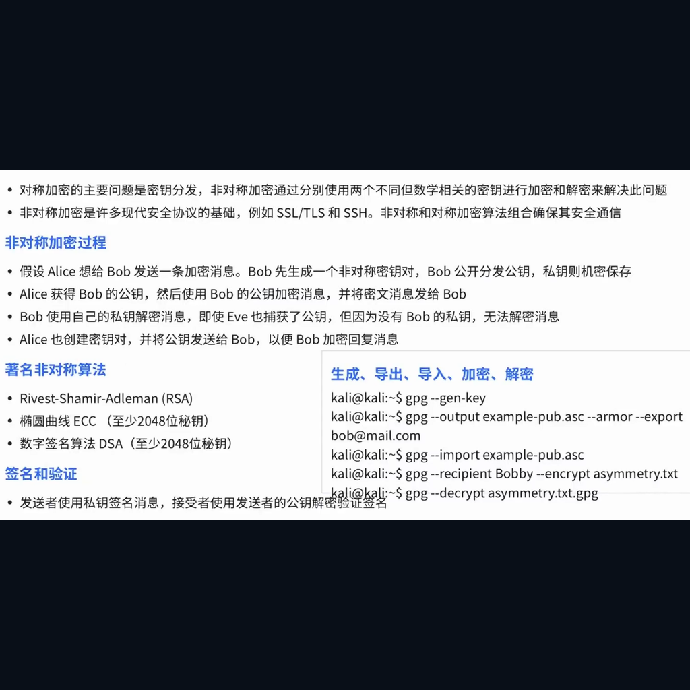

:::section{.lang-zh}

**原 PPT 日期：** 2025-11-03

> 这里不是 PPT 逐页搬运版，而是把课堂主线重新整理成阅读版讲义：能用文字讲清楚的就写成文字；图片只保留终端、结构图、代码、表格和关键截图。

## 导读

密码学基础课介绍从古典密码到现代加密的核心思想。课堂目标不是手写完整算法，而是知道不同密码机制解决什么问题、不能解决什么问题。

## 学习目标

- 理解对称加密、非对称加密和哈希的区别
- 认识 Vigenere、XOR 等基础思想
- 建立不要自创密码算法的安全意识

## 1. 密码学解决什么问题

密码学常见目标包括保密性、完整性、身份认证和不可否认性。不同算法负责不同目标，把它们混用会导致错误的安全感。

讲者补充：加密不等于安全。密钥管理、随机数、协议设计和实现细节同样会决定结果。

> 小旁白：看到命令别只复制，顺手问一句：它读了什么、改了什么、留下了什么证据？

### PPT 文字要点

> 下面是从原 PPT 可编辑文字层整理出的内容；能写成文字的，就不强行塞截图。

#### 第 2 页：基础的

- <-> Alice
- -> Key; Key ->
- 对称加密 非对称加密
- XOR 加密与基础的逻辑运算
- 与，或，非，同或，异或

## 2. 对称与非对称加密

对称加密速度快，但双方要共享同一把密钥；非对称加密便于密钥交换和签名，但计算成本更高。现代协议通常把两者组合使用。

讲者补充：TLS 等协议不是只用一种算法，而是把密钥交换、身份验证、对称加密和完整性校验组织成流程。

> 小旁白：如果结论只能靠“感觉”，那还没通关；补一条可复现的命令、截图或日志。

### 相关图解

> 这些图是为了辅助理解结构、命令输出或表格关系；装饰图已经尽量排除。

## 3. Vigenere 与 XOR

Vigenere 展示了“密钥重复使用”带来的模式问题，XOR 展示了位运算在加密和编码中的基础作用。它们适合帮助初学者理解密钥与明文的关系。

讲者补充：在 CTF 中看到 XOR，不要只想爆破，也要观察明文格式、文件头和重复周期。

> 小旁白：报错不是敌人，它通常是在很诚实地告诉你哪一层没对上。

### PPT 文字要点

> 下面是从原 PPT 可编辑文字层整理出的内容；能写成文字的，就不强行塞截图。

#### 第 8 页：Vigenere

- 请根据此密文还原原文
- 答案在今天的社团课上出现过
- ：这是一个对称加密

#### 第 10 页：步骤

- 是明文字母对应的数字，
- 是密钥字母对应的数字，
- 是密文字母对应的数字。
- (7 + 23) % 26 = 4 (E)
- (4 + 19) % 26 = 23 (X)
- (11 + 6) % 26 = 17 (R)
- (11 + 1) % 26 = 12 (M)
- (14 + 23) % 26 = 11 (L)

#### 第 13 页：&& || ! ^ ⊙

- 1 = true, 0 = false (
- 表示，在程序一般用
- 与运算的规则为：同时为
- 或运算的规则为：同时为
- 非运算的规则比较简单，

### 相关图解

> 这些图是为了辅助理解结构、命令输出或表格关系；装饰图已经尽量排除。

## 4. 作业与复习

复习密码学时建议按问题分类：我要隐藏内容、验证完整性、确认身份，还是交换密钥。先确认目标，再选择机制。

讲者补充：不要在真实项目中自创加密方案。学习可以复现，生产要使用成熟库和成熟协议。

> 小旁白：工具是技能栏，不是自动胜利按钮；真正的主角仍然是你的判断链。

## 课堂练习

- 用自己的话解释哈希和加密的区别
- 完成一个简单 XOR 还原练习
- 列出 TLS 中至少两个密码学机制

:::

:::section{.lang-en}

**Original PPT date:** 2025-11-03

> This is not a slide-by-slide dump. It rebuilds the lesson as readable notes: text whenever text is clearer, and visuals only when they explain terminals, diagrams, code, tables, or key evidence.

## Overview

Cryptography basics introduce classical and modern ideas: confidentiality, integrity, authentication, and their limits.

## Learning Goals

- Explain the main workflow behind Cryptography Basics.
- Use Cryptography, Hash, Symmetric Encryption to read commands, traffic, logs, or code with evidence.
- Stay inside authorized lab environments and document each step clearly.

## 1. What cryptography solves

Cryptography supports confidentiality, integrity, authentication, and non-repudiation, but only when used correctly.

Start with the problem, then trace the data, command, or protocol that proves the result. Keep the notes short enough that another club member can reproduce the step in a lab.

> Side note: Do not just copy the command. Ask what it reads, what it changes, and what evidence it leaves.

## 2. Symmetric and asymmetric encryption

Modern protocols combine symmetric and asymmetric techniques.

Start with the problem, then trace the data, command, or protocol that proves the result. Keep the notes short enough that another club member can reproduce the step in a lab.

> Side note: If a conclusion only feels right, it is not cleared yet. Add reproducible evidence.

### Related Visuals

> These visuals are kept for structure, command output, or tables; decorative images are intentionally filtered out.

## 3. Vigenere and XOR

Classical examples reveal how keys interact with plaintext and why patterns matter.

Start with the problem, then trace the data, command, or protocol that proves the result. Keep the notes short enough that another club member can reproduce the step in a lab.

> Side note: Errors are not the villain; they usually point at the layer that does not match.

### Related Visuals

> These visuals are kept for structure, command output, or tables; decorative images are intentionally filtered out.

## 4. Homework and review

Choose cryptographic mechanisms by security goal, not by name recognition.

Start with the problem, then trace the data, command, or protocol that proves the result. Keep the notes short enough that another club member can reproduce the step in a lab.

> Side note: Tools are skill slots, not an auto-win button. The real protagonist is your reasoning chain.

## Practice

- Summarize the main workflow of Cryptography Basics in your own words.
- Reproduce one safe observation step and record the evidence.
- Explain one likely risk and one matching defense.

:::
