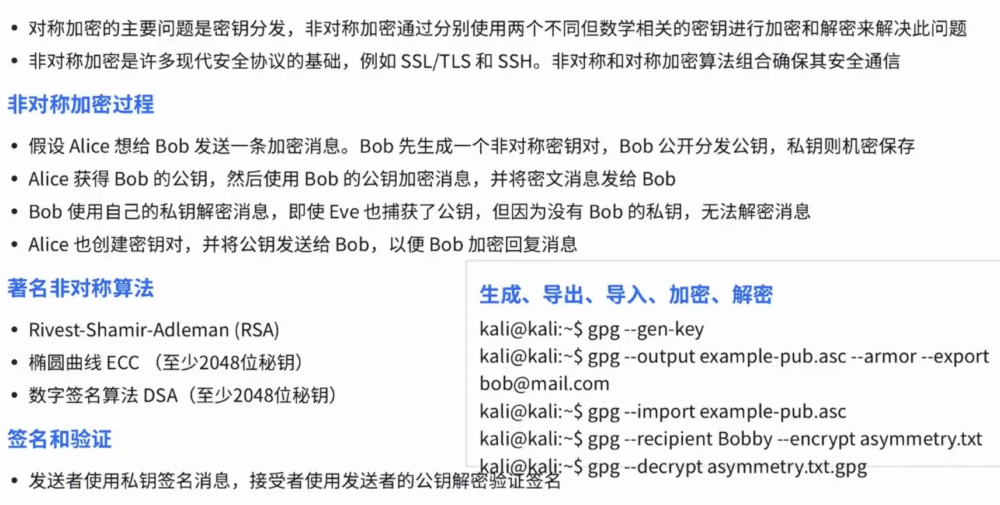

:::section{.lang-zh}

**原 PPT 日期：** 2025-11-03

> 此文为codex改编往年课件而成

## 课程简介

课程介绍古典密码和现代加密，并说明各类机制的用途和局限。

## 你会学到

- 理解对称加密、非对称加密和哈希的区别
- 认识 Vigenere、XOR 等基础思想
- 建立不要自创密码算法的安全意识

## 1. 密码学解决什么问题

密码学常见目标包括保密性、完整性、身份认证和不可否认性。不同算法负责不同目标，把它们混用会导致错误的安全感。

加密不等于安全。密钥管理、随机数、协议设计和实现细节同样会决定结果。

## 2. 对称与非对称加密

对称加密速度快，但双方要共享同一把密钥；非对称加密便于密钥交换和签名，但计算成本更高。现代协议通常把两者组合使用。

TLS 等协议会组合密钥交换、身份验证、对称加密和完整性校验。

## 3. Vigenere 与 XOR

Vigenere 展示了“密钥重复使用”带来的模式问题，XOR 展示了位运算在加密和编码中的基础作用。它们适合帮助初学者理解密钥与明文的关系。

在 CTF 中看到 XOR 时，可以检查明文格式、文件头和重复周期，再决定是否需要爆破。

## 4. 作业与复习

复习密码学时建议按问题分类：我要隐藏内容、验证完整性、确认身份，还是交换密钥。先确认目标，再选择机制。

不要在真实项目中自创加密方案。学习可以复现，生产要使用成熟库和成熟协议。

## 动手小任务

- 用自己的话解释哈希和加密的区别
- 完成一个简单 XOR 还原练习
- 列出 TLS 中至少两个密码学机制

:::

:::section{.lang-en}

**Original PPT date:** 2025-11-03

> This article was adapted by Codex from previous course slides.

## Overview

Cryptography basics introduce classical and modern ideas: confidentiality, integrity, authentication, and their limits.

## 1. What cryptography solves

Cryptography supports confidentiality, integrity, authentication, and non-repudiation, but only when used correctly.

## 2. Symmetric and asymmetric encryption

Modern protocols combine symmetric and asymmetric techniques.

## 3. Vigenere and XOR

Classical examples reveal how keys interact with plaintext and why patterns matter.

## 4. Homework and review

Choose cryptographic mechanisms by security goal, not by name recognition.

:::
