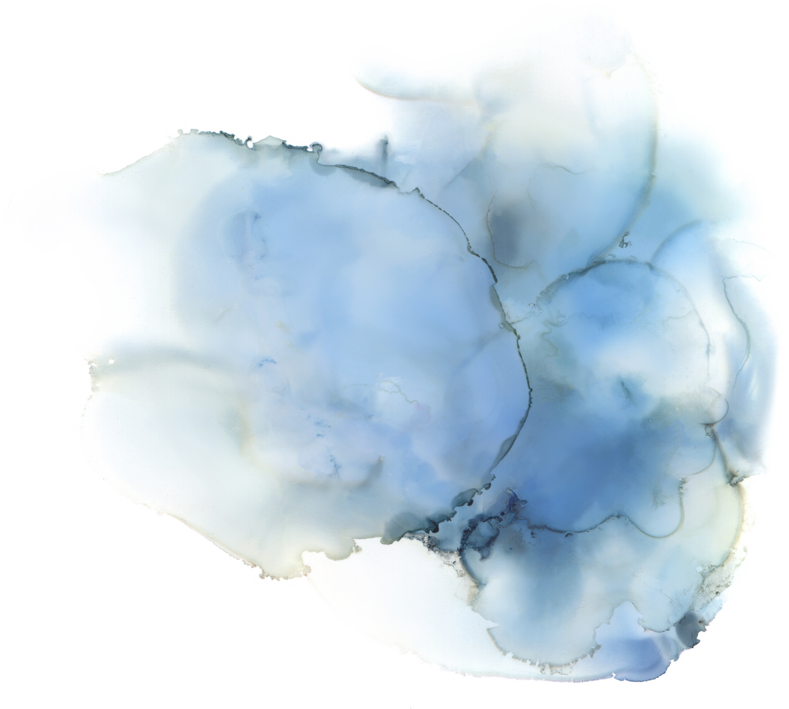
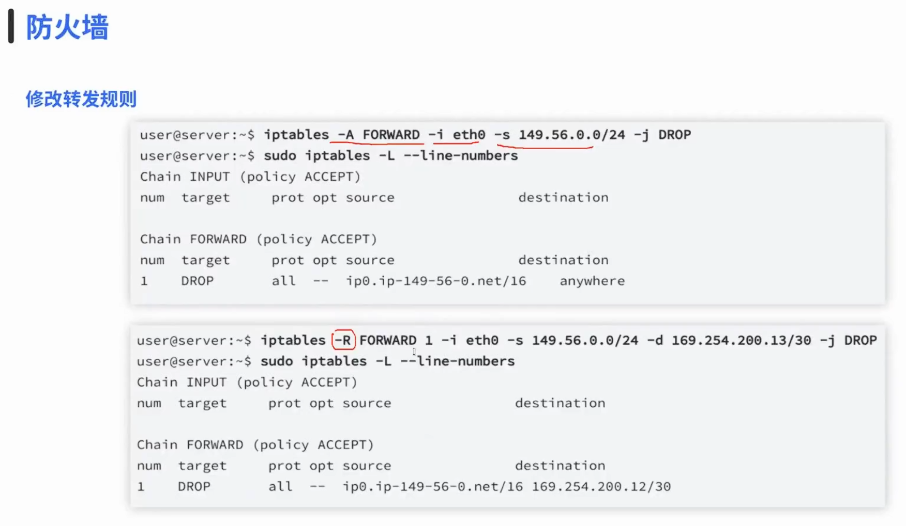

# 06 防火墙基础

**English title:** Firewall Basics

**作者 / Author:** 2023届 Simon Li / Class of 2023 Simon Li

**原 PPT 日期 / Original PPT date:** 2025-11-17

**关键词 / Keywords:** #Firewall #Network-Security #Access-Control #Ports #Traffic-Filtering #Defense

> 本文由社团课程 PPT 整理为阅读版讲义：保留原课件图片，并补充课堂讲解、学习目标和练习方向。
>
> This article turns the original slides into readable course notes while preserving slide images and adding presenter-style explanations.

## 导读 / Overview

防火墙基础课讨论流量如何被允许、拒绝、记录和分段。它不是一道万能墙，而是一套基于规则、场景和日志的访问控制方法。

> English overview: Firewall basics explain how traffic is allowed, denied, logged, and segmented through rules and policy.

## 学习目标 / Learning Goals

- 理解防火墙在网络防御中的位置
- 认识端口、协议、方向和规则顺序
- 能用日志复盘一次访问控制结果

## 1. 防火墙的角色 / Role of a firewall

防火墙的核心是访问控制：什么来源可以访问什么目标，使用什么协议和端口，是否需要记录。它不能替代系统加固，也不能修复应用漏洞。

讲者补充：防火墙规则要服务于资产边界。先知道要保护什么，再决定挡什么。

> English recap: A firewall is access control, not a replacement for secure systems and applications.

### 相关课件图片 / Related Slide Images

### 第 1 页配图 / Slide 1 Images

### 第 2 页配图 / Slide 2 Images

### 第 3 页配图 / Slide 3 Images

### 第 4 页配图 / Slide 4 Images

### 第 5 页配图 / Slide 5 Images

### 第 6 页配图 / Slide 6 Images

### 第 7 页配图 / Slide 7 Images

## 2. 规则、端口与方向 / Rules, ports, and direction

一条规则通常包含源地址、目的地址、协议、端口、动作和日志策略。规则顺序会影响命中结果，因此配置后必须测试。

讲者补充：默认拒绝、按需放行是常见防御思路。但在学习环境中要先确保不会把自己锁在机器外。

> English recap: Rules should be specific, ordered, tested, and logged.

### 相关课件图片 / Related Slide Images

### 第 8 页配图 / Slide 8 Images

### 第 9 页配图 / Slide 9 Images

### 第 10 页配图 / Slide 10 Images

### 第 11 页配图 / Slide 11 Images

### 第 12 页配图 / Slide 12 Images

## 3. 示例与作业 / Examples and homework

通过示例练习，可以把“允许 SSH”“阻止某端口”“记录异常访问”变成可观察结果。日志是判断规则是否有效的重要证据。

讲者补充：每次改规则前先备份，改完后记录预期结果和实际结果。

> English recap: Firewall work is evidence-driven: configure, test, and read logs.

### 相关课件图片 / Related Slide Images

### 第 13 页配图 / Slide 13 Images

### 第 14 页配图 / Slide 14 Images

### 第 15 页配图 / Slide 15 Images

### 第 16 页配图 / Slide 16 Images

### 第 17 页配图 / Slide 17 Images

### 第 18 页配图 / Slide 18 Images

## 课堂练习 / Practice

- 写出一条允许 SSH 的规则条件
- 解释入站和出站规则的区别
- 设计一个默认拒绝的最小开放策略
