:::section{.lang-zh}

**作者：** 2023届 Simon Li

**原 PPT 日期：** 2025-11-17

> 本文由社团课程 PPT 整理为阅读版讲义，只保留与正文知识点相关的截图、命令行画面、表格或结构图，并补充课堂讲解、学习目标和练习方向。

## 导读

防火墙基础课讨论流量如何被允许、拒绝、记录和分段。它不是一道万能墙，而是一套基于规则、场景和日志的访问控制方法。

## 学习目标

- 理解防火墙在网络防御中的位置
- 认识端口、协议、方向和规则顺序
- 能用日志复盘一次访问控制结果

## 1. 防火墙的角色

防火墙的核心是访问控制：什么来源可以访问什么目标，使用什么协议和端口，是否需要记录。它不能替代系统加固，也不能修复应用漏洞。

讲者补充：防火墙规则要服务于资产边界。先知道要保护什么，再决定挡什么。

### 相关图片

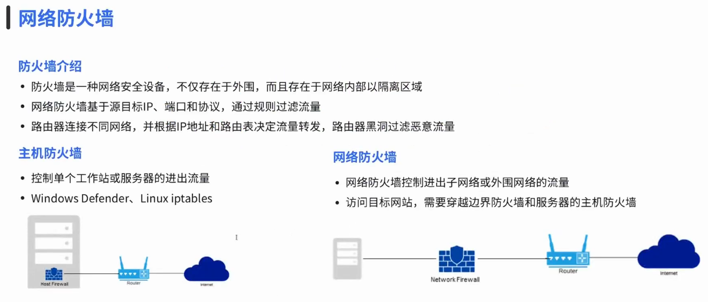
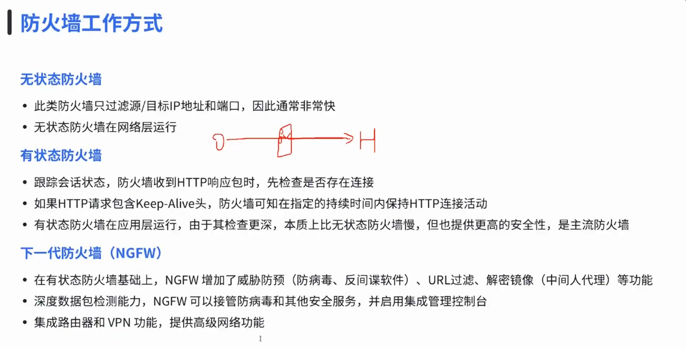
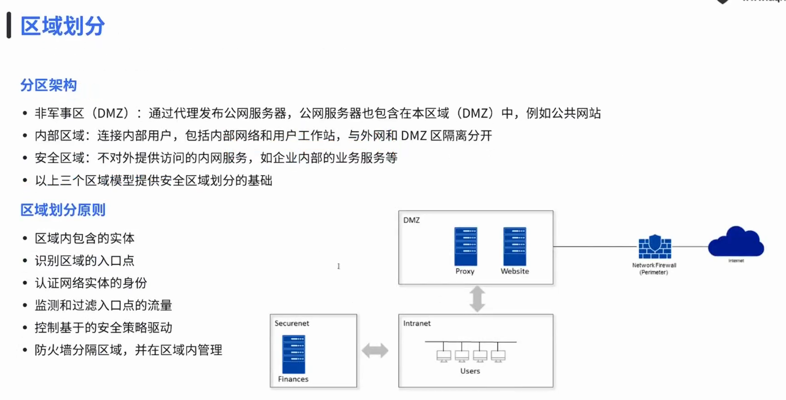
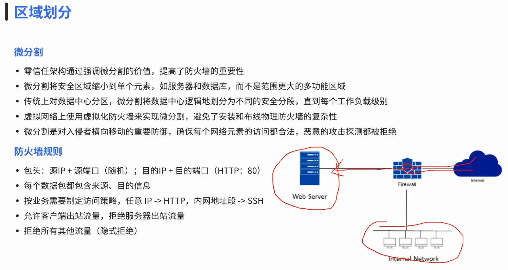

## 2. 规则、端口与方向

一条规则通常包含源地址、目的地址、协议、端口、动作和日志策略。规则顺序会影响命中结果，因此配置后必须测试。

讲者补充：默认拒绝、按需放行是常见防御思路。但在学习环境中要先确保不会把自己锁在机器外。

### 相关图片

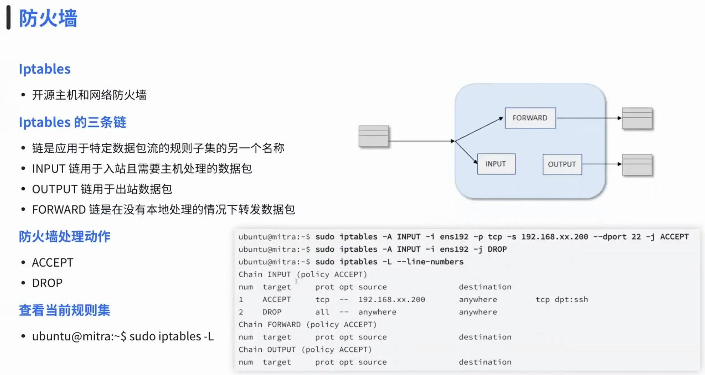
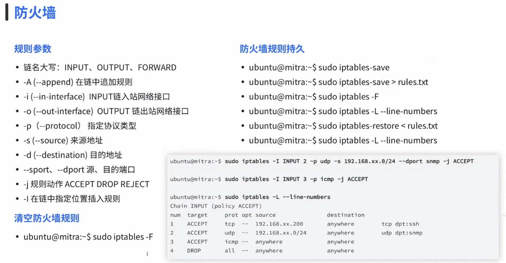
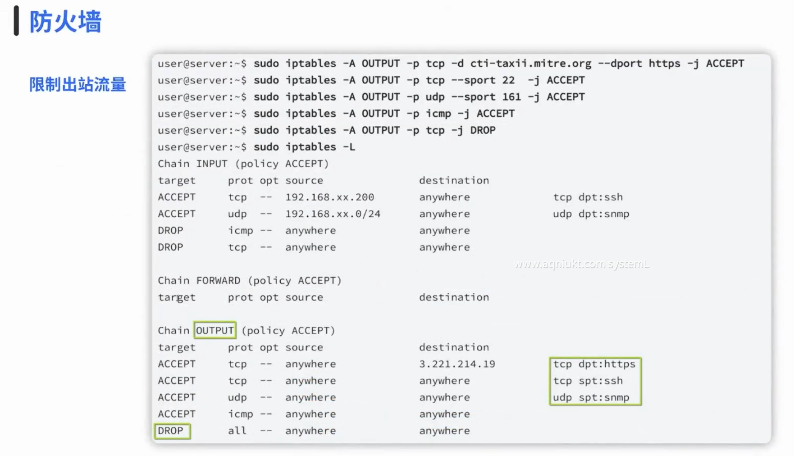
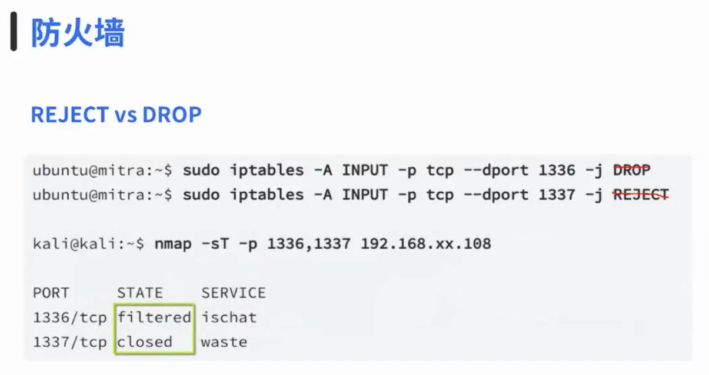

## 3. 示例与作业

通过示例练习，可以把“允许 SSH”“阻止某端口”“记录异常访问”变成可观察结果。日志是判断规则是否有效的重要证据。

讲者补充：每次改规则前先备份，改完后记录预期结果和实际结果。

### 相关图片

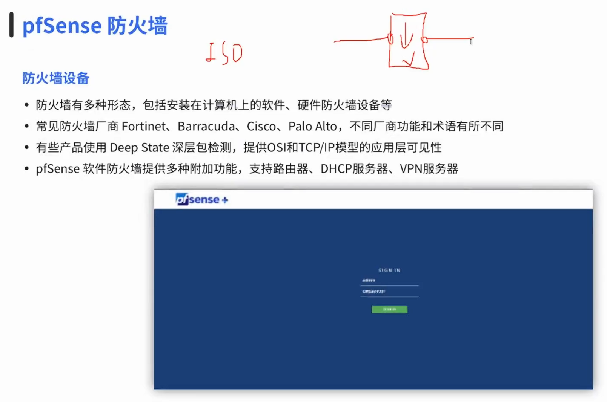
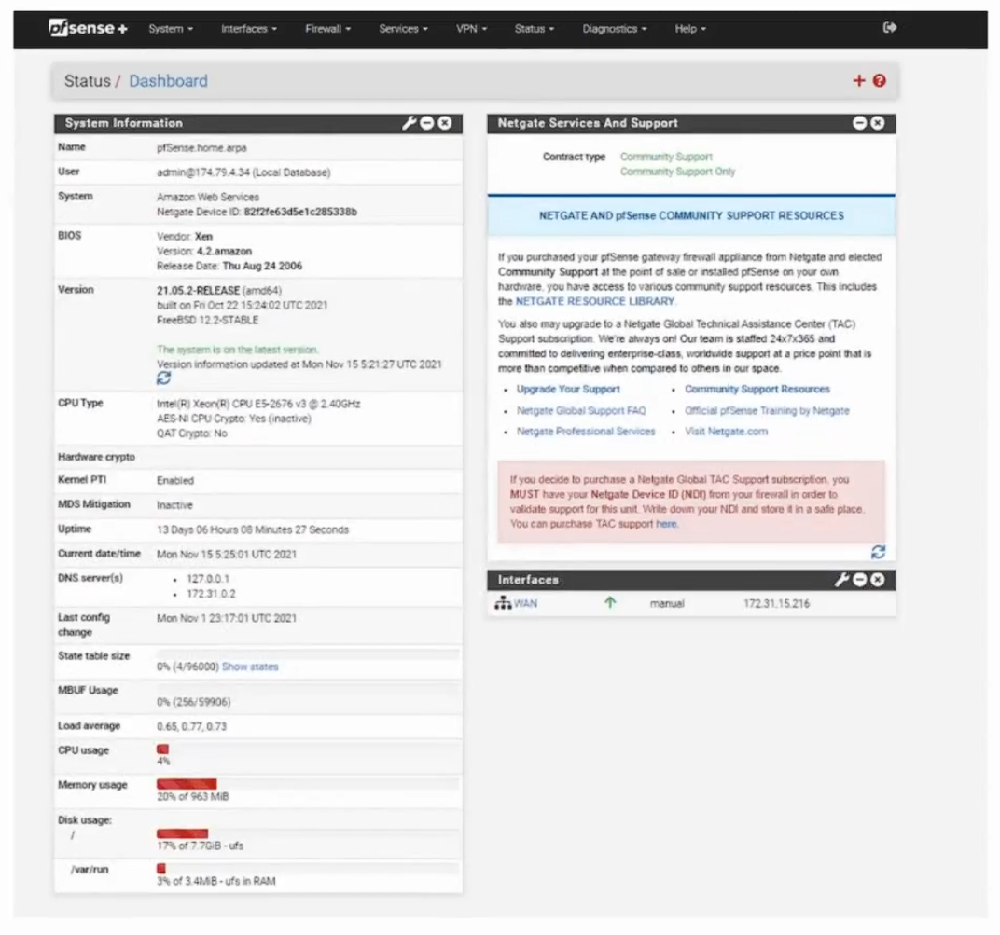
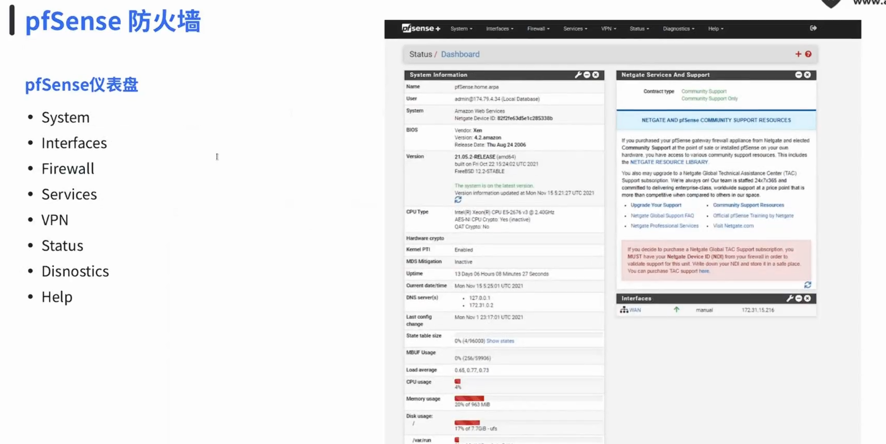

## 课堂练习

- 写出一条允许 SSH 的规则条件
- 解释入站和出站规则的区别
- 设计一个默认拒绝的最小开放策略

:::

:::section{.lang-en}

**Author:** Class of 2023 Simon Li

**Original PPT date:** 2025-11-17

> This article turns the original slides into readable course notes. It keeps only content-related screenshots, terminal captures, tables, or diagrams, and adds presenter-style explanations.

## Overview

Firewall basics explain how traffic is allowed, denied, logged, and segmented through rules and policy.

## Learning Goals

- Understand the core ideas of Firewall Basics.
- Connect Firewall, Network Security, Access Control to practical security work.
- Practice only in authorized, repeatable lab environments.

## 1. Role of a firewall

A firewall is access control, not a replacement for secure systems and applications.

Read this section as a workflow, not as a tool list. Identify the input, the system boundary, the command or protocol involved, and the evidence that proves the result.

### Related Images

## 2. Rules, ports, and direction

Rules should be specific, ordered, tested, and logged.

Read this section as a workflow, not as a tool list. Identify the input, the system boundary, the command or protocol involved, and the evidence that proves the result.

### Related Images

## 3. Examples and homework

Firewall work is evidence-driven: configure, test, and read logs.

Read this section as a workflow, not as a tool list. Identify the input, the system boundary, the command or protocol involved, and the evidence that proves the result.

### Related Images

## Practice

- Summarize the main workflow of Firewall Basics in your own words.
- Reproduce one safe observation step and record the evidence.
- Explain one likely risk and one matching defense.

:::
