# 07 网络基础

**English title:** Networking Basics

**作者 / Author:** 2023届 Simon Li / Class of 2023 Simon Li

**原 PPT 日期 / Original PPT date:** 2025-11-10

**关键词 / Keywords:** #Networking #TCP/IP #TCP #UDP #DNS #HTTP #Packet-Analysis

> 本文由社团课程 PPT 整理为阅读版讲义：保留原课件图片，并补充课堂讲解、学习目标和练习方向。
>
> This article turns the original slides into readable course notes while preserving slide images and adding presenter-style explanations.

## 导读 / Overview

网络基础课从“送快递”的比喻讲起，把 TCP/IP、常见协议、流量分析和 VPN 串成一张地图。安全学习离不开网络，因为攻击和防御都需要在流量中留下痕迹。

> English overview: Networking basics connect TCP/IP, protocols, traffic analysis, and VPN through the idea of delivering packets.

## 学习目标 / Learning Goals

- 理解分层模型和 TCP/IP 的基本作用
- 区分 TCP、UDP 与常见应用层协议
- 知道流量分析能观察到什么

## 1. 网络像送快递 / Networking as delivery

把数据包想成快递，有寄件人、收件人、路线和内容。IP 负责寻址，端口帮助找到应用，协议规定双方如何交流。

讲者补充：比喻不是为了取代细节，而是帮助你在看到抓包时知道每一层大概负责什么。

> English recap: Packets have addresses, routes, ports, and protocol rules.

### 相关课件图片 / Related Slide Images

### 第 4 页配图 / Slide 4 Images

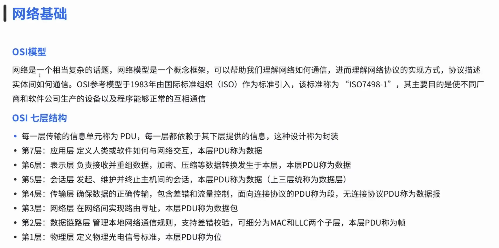

### 第 6 页配图 / Slide 6 Images

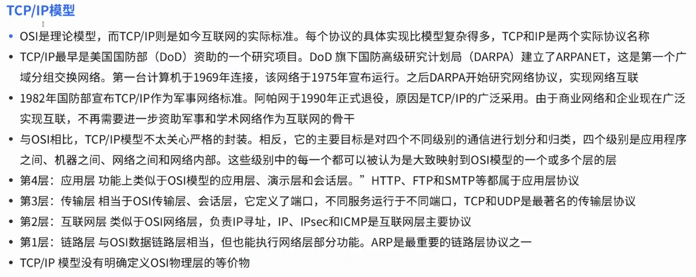

## 2. TCP、UDP 与应用层协议 / TCP, UDP, and application protocols

TCP 注重可靠连接，UDP 注重轻量快速。DNS、HTTP 等应用层协议建立在这些传输方式之上，决定具体业务如何表达请求和响应。

讲者补充：排查网络问题时先问“连得上吗”，再问“协议说得对吗”。这两个问题分别对应不同层次。

> English recap: Transport and application protocols answer different questions.

### 相关课件图片 / Related Slide Images

### 第 8 页配图 / Slide 8 Images

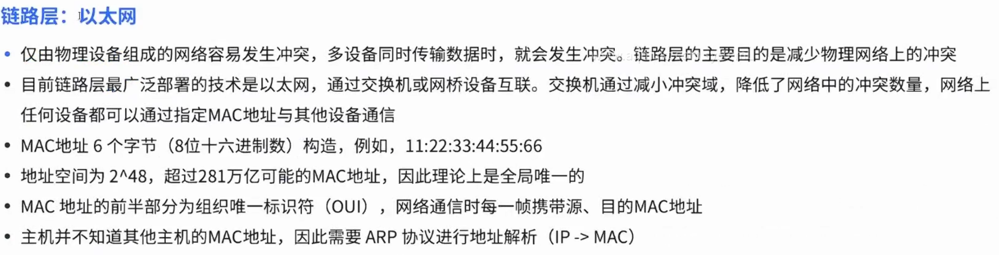
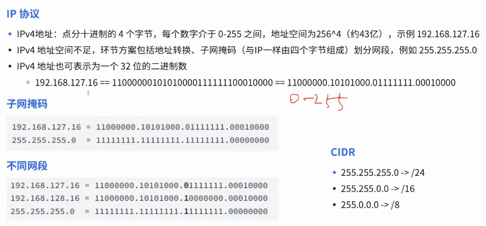

### 第 9 页配图 / Slide 9 Images

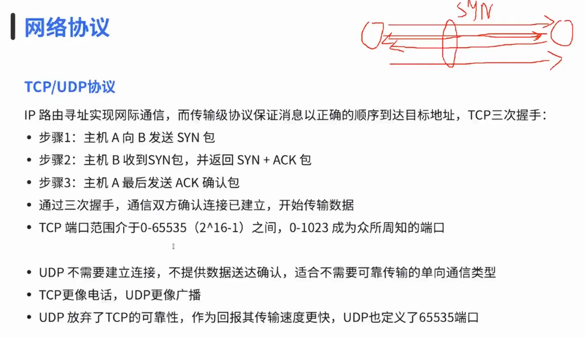

### 第 10 页配图 / Slide 10 Images

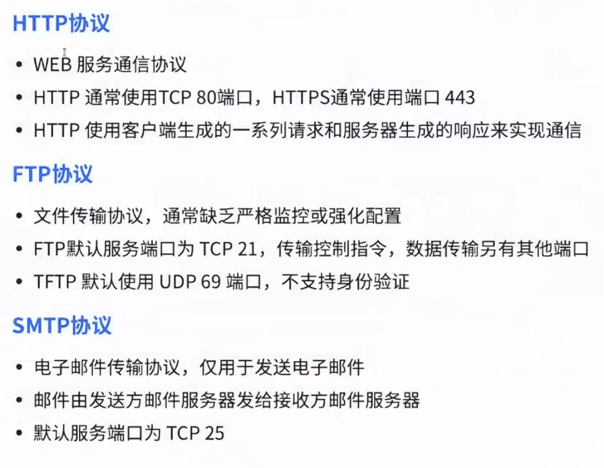

## 3. 流量分析与辅助技术 / Traffic analysis and supporting technologies

ARP、DHCP、ICMP、VPN 等技术常出现在排障和安全分析中。流量分析不是偷看内容，而是通过包结构、方向、频率和错误信息理解系统状态。

讲者补充：抓包时要在授权网络中进行，并尽量过滤范围，避免采集无关隐私数据。

> English recap: Traffic analysis turns packets into evidence while respecting authorization and privacy.

### 相关课件图片 / Related Slide Images

### 第 12 页配图 / Slide 12 Images

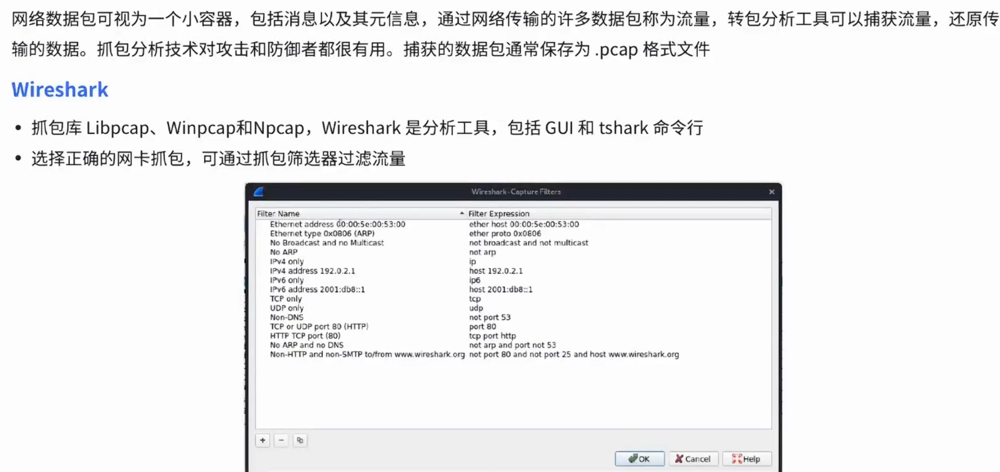

### 第 13 页配图 / Slide 13 Images

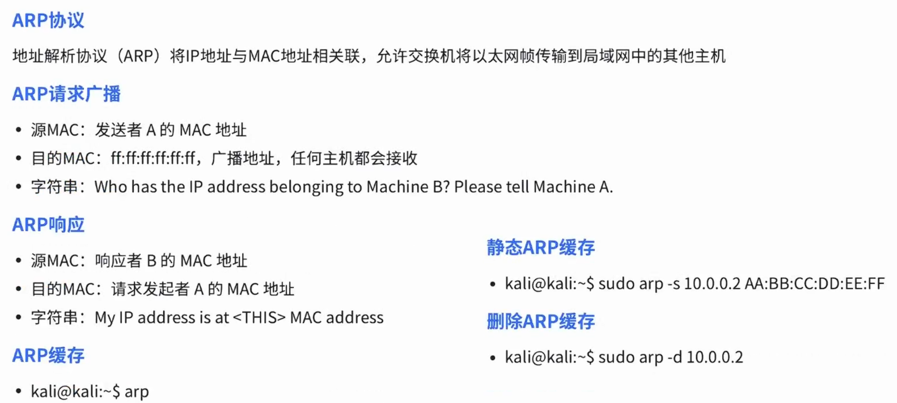
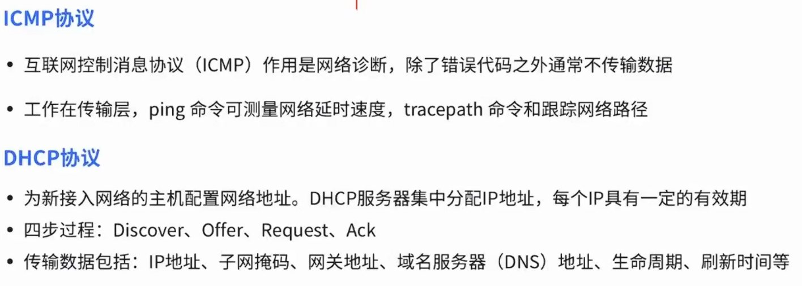

### 第 14 页配图 / Slide 14 Images

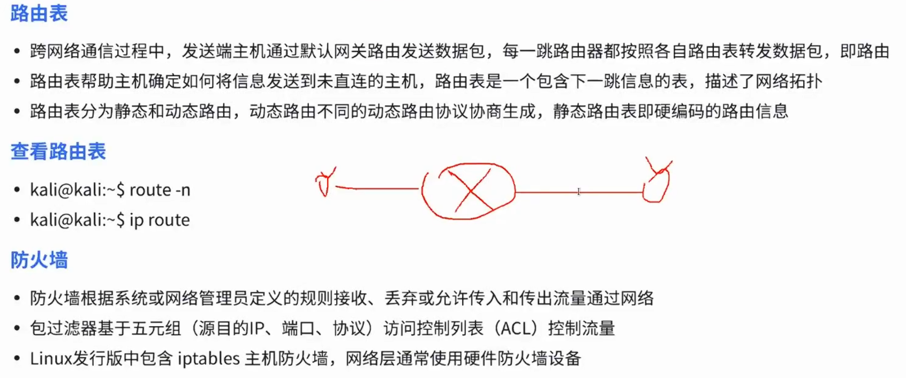
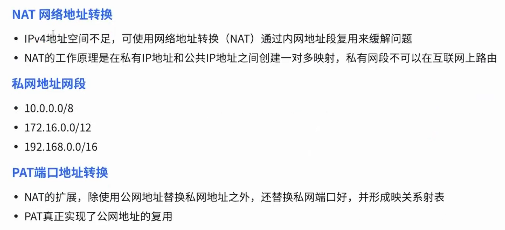

### 第 15 页配图 / Slide 15 Images

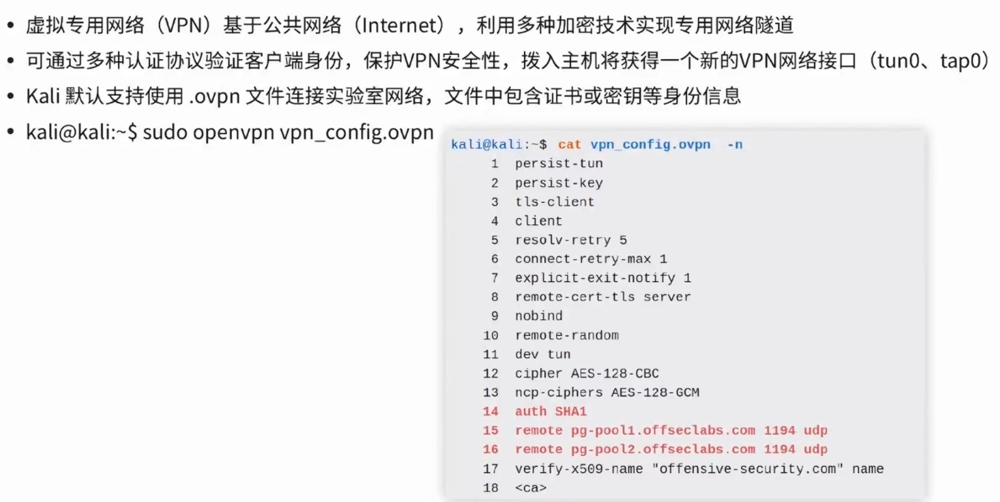

## 课堂练习 / Practice

- 解释 TCP 和 UDP 的差异
- 抓一次 DNS 查询并标出请求和响应
- 画出访问一个网站时可能经过的协议
