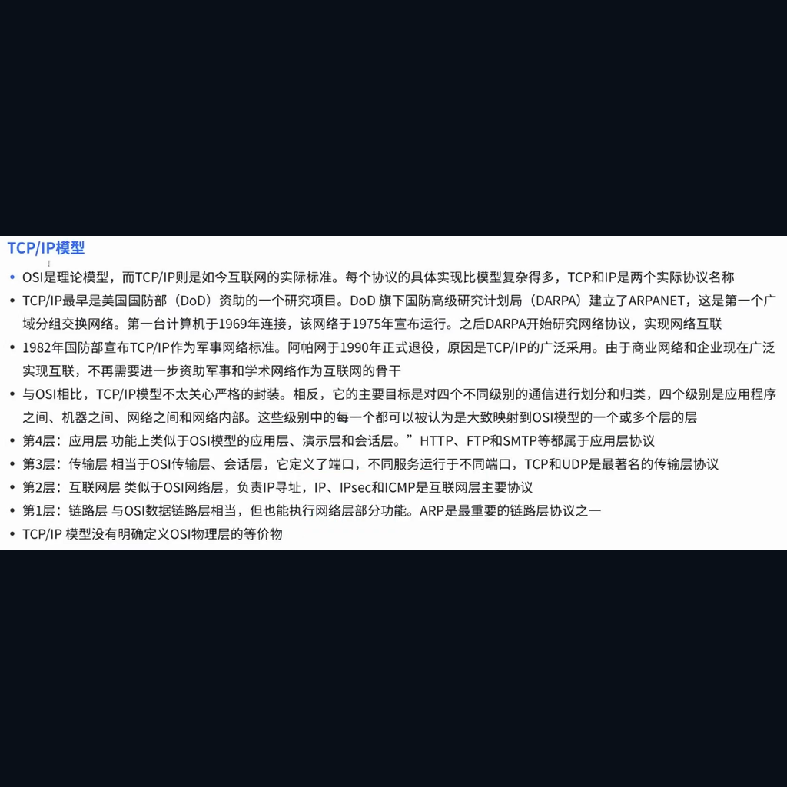
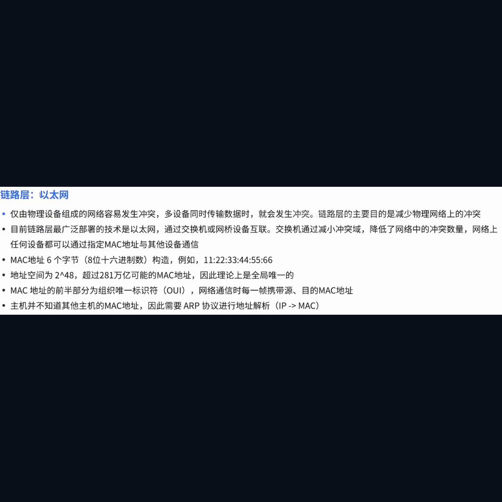

:::section{.lang-zh}

**原 PPT 日期：** 2025-11-10

> 这里不是 PPT 逐页搬运版，而是把课堂主线重新整理成阅读版讲义：能用文字讲清楚的就写成文字；图片只保留终端、结构图、代码、表格和关键截图。

## 导读

网络基础课从“送快递”的比喻讲起，把 TCP/IP、常见协议、流量分析和 VPN 串成一张地图。安全学习离不开网络，因为攻击和防御都需要在流量中留下痕迹。

## 学习目标

- 理解分层模型和 TCP/IP 的基本作用
- 区分 TCP、UDP 与常见应用层协议
- 知道流量分析能观察到什么

## 1. 网络像送快递

把数据包想成快递，有寄件人、收件人、路线和内容。IP 负责寻址，端口帮助找到应用，协议规定双方如何交流。

讲者补充：比喻不是为了取代细节，而是帮助你在看到抓包时知道每一层大概负责什么。

> 小旁白：报错不是敌人，它通常是在很诚实地告诉你哪一层没对上。

### PPT 文字要点

> 下面是从原 PPT 可编辑文字层整理出的内容；能写成文字的，就不强行塞截图。

#### 第 1 页：nternet essentials

- nternet essentials
- 汇报时间丨11/10

#### 第 5 页：送快递

- 寄件人与收件人的沟通与服务请求
- 快递场景：寄件人决定要寄东西，填写寄件信息、选择快递服务（如同使用某个应用：邮箱、浏览器、
- 等），向快递公司下单，收件人准备接收。
- 网络职责：为用户进程提供网络服务接口（
- DNS 等）。处理应用数据的生成与使用。
- 示例：你在浏览器中点击“发送表单”，这是应用层开始的请求。
- 打包与格式化、加密解密
- 快递场景：把物品按规则包装、标注易碎、压缩体积、写上说明或用保密箱封存（如果需要加密），确保收件人能读懂包装上的说明。

#### 第 6 页：TCP/IP

- 一文彻底搞懂
- TCP/IP

### 相关图解

> 这些图是为了辅助理解结构、命令输出或表格关系；装饰图已经尽量排除。

## 2. TCP、UDP 与应用层协议

TCP 注重可靠连接，UDP 注重轻量快速。DNS、HTTP 等应用层协议建立在这些传输方式之上，决定具体业务如何表达请求和响应。

讲者补充：排查网络问题时先问“连得上吗”，再问“协议说得对吗”。这两个问题分别对应不同层次。

> 小旁白：工具是技能栏，不是自动胜利按钮；真正的主角仍然是你的判断链。

### 相关图解

> 这些图是为了辅助理解结构、命令输出或表格关系；装饰图已经尽量排除。

## 3. 流量分析与辅助技术

ARP、DHCP、ICMP、VPN 等技术常出现在排障和安全分析中。流量分析不是偷看内容，而是通过包结构、方向、频率和错误信息理解系统状态。

讲者补充：抓包时要在授权网络中进行，并尽量过滤范围，避免采集无关隐私数据。

> 小旁白：先别急着开大招，把输入、处理、输出连成一条线，很多问题会自己露头。

## 课堂练习

- 解释 TCP 和 UDP 的差异
- 抓一次 DNS 查询并标出请求和响应
- 画出访问一个网站时可能经过的协议

:::

:::section{.lang-en}

**Original PPT date:** 2025-11-10

> This is not a slide-by-slide dump. It rebuilds the lesson as readable notes: text whenever text is clearer, and visuals only when they explain terminals, diagrams, code, tables, or key evidence.

## Overview

Networking basics connect TCP/IP, protocols, traffic analysis, and VPN through the idea of delivering packets.

## Learning Goals

- Explain the main workflow behind Networking Basics.
- Use Networking, TCP/IP, TCP to read commands, traffic, logs, or code with evidence.
- Stay inside authorized lab environments and document each step clearly.

## 1. Networking as delivery

Packets have addresses, routes, ports, and protocol rules.

Start with the problem, then trace the data, command, or protocol that proves the result. Keep the notes short enough that another club member can reproduce the step in a lab.

> Side note: Errors are not the villain; they usually point at the layer that does not match.

### Related Visuals

> These visuals are kept for structure, command output, or tables; decorative images are intentionally filtered out.

## 2. TCP, UDP, and application protocols

Transport and application protocols answer different questions.

Start with the problem, then trace the data, command, or protocol that proves the result. Keep the notes short enough that another club member can reproduce the step in a lab.

> Side note: Tools are skill slots, not an auto-win button. The real protagonist is your reasoning chain.

### Related Visuals

> These visuals are kept for structure, command output, or tables; decorative images are intentionally filtered out.

## 3. Traffic analysis and supporting technologies

Traffic analysis turns packets into evidence while respecting authorization and privacy.

Start with the problem, then trace the data, command, or protocol that proves the result. Keep the notes short enough that another club member can reproduce the step in a lab.

> Side note: Do not rush the special move: draw input, processing, and output first.

## Practice

- Summarize the main workflow of Networking Basics in your own words.
- Reproduce one safe observation step and record the evidence.
- Explain one likely risk and one matching defense.

:::
