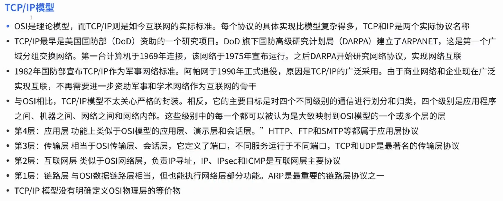
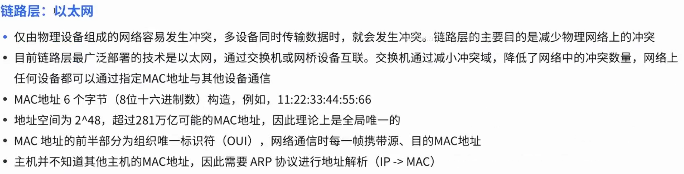

:::section{.lang-zh}

**原 PPT 日期：** 2025-11-17

> 此文为codex改编往年课件而成

## 课程简介

课程介绍 TCP/IP、常见协议、流量分析和 VPN，并结合抓包说明各层协议的职责及常见故障。

## 你会学到

- 理解分层模型和 TCP/IP 的基本作用
- 区分 TCP、UDP 与常见应用层协议
- 知道流量分析能观察到什么

## 1. 网络像送快递

把数据包想成快递，有寄件人、收件人、路线和内容。IP 负责寻址，端口帮助找到应用，协议规定双方如何交流。

抓包时可以按协议层次检查地址、端口、连接状态和应用数据。

## 2. TCP、UDP 与应用层协议

TCP 注重可靠连接，UDP 注重轻量快速。DNS、HTTP 等应用层协议建立在这些传输方式之上，决定具体业务如何表达请求和响应。

排查网络问题时先问“连得上吗”，再问“协议说得对吗”。这两个问题分别对应不同层次。

## 3. 流量分析与辅助技术

ARP、DHCP、ICMP、VPN 等技术常出现在排障和安全分析中。包结构、方向、频率和错误信息可以反映系统状态。

抓包时要在授权网络中进行，并尽量过滤范围，避免采集无关隐私数据。

## 动手小任务

- 解释 TCP 和 UDP 的差异
- 抓一次 DNS 查询并标出请求和响应
- 画出访问一个网站时可能经过的协议

:::

:::section{.lang-en}

**Original PPT date:** 2025-11-17

> This article was adapted by Codex from previous course slides.

## Overview

Networking basics connect TCP/IP, protocols, traffic analysis, and VPN through the idea of delivering packets.

## 1. Networking as delivery

Packets have addresses, routes, ports, and protocol rules.

## 2. TCP, UDP, and application protocols

Transport and application protocols answer different questions.

## 3. Traffic analysis and supporting technologies

Traffic analysis turns packets into evidence while respecting authorization and privacy.

:::
