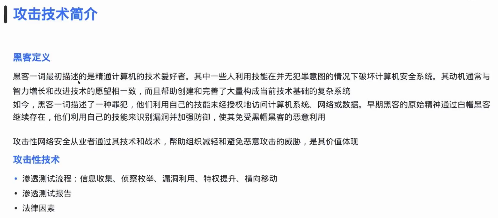
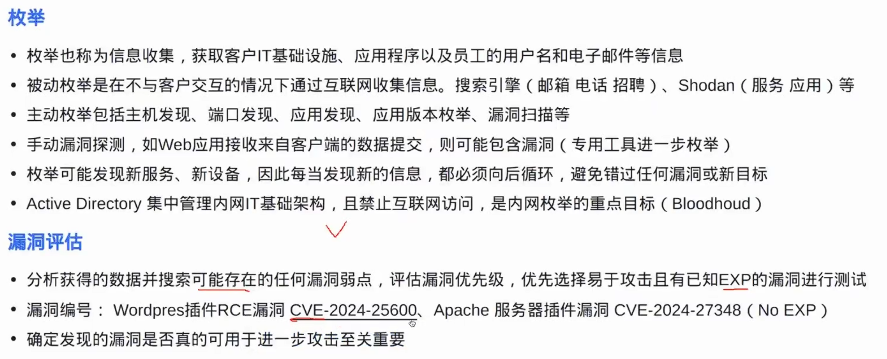
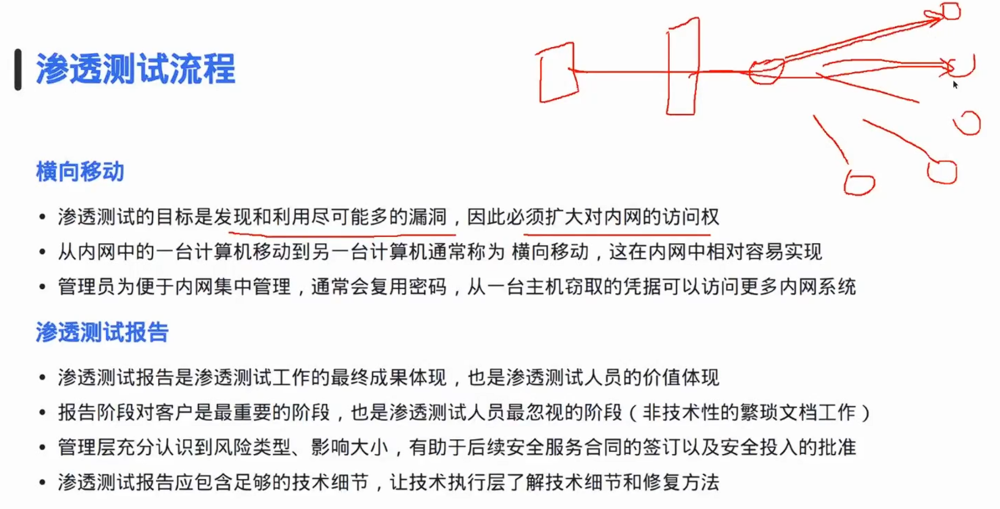

:::section{.lang-zh}

**作者：** 2023届 Simon Li

**原 PPT 日期：** 2025-12-02

**关键词：** #Attack-Techniques #Reconnaissance #Exploitation #Social-Engineering #Vulnerability #Defense

> 本文由社团课程 PPT 整理为阅读版讲义，只保留与正文知识点相关的截图、命令行画面、表格或结构图，并补充课堂讲解、学习目标和练习方向。

## 导读

攻击技术简介课用于建立攻防视角：攻击链通常包含信息收集、漏洞利用、权限扩大、维持访问和清理痕迹等环节。学习这些内容的目的，是更好地理解防御重点。

## 学习目标

- 认识常见攻击链阶段
- 理解攻击技术与防御措施的对应关系
- 强化授权实验和安全伦理

## 1. 攻击链不是一个按钮

真实攻击往往不是单个漏洞决定胜负，而是多个小失误被串联：资产暴露、弱口令、错误配置、过期组件和权限边界松动。

讲者补充：学习攻击技术时要同步问防御问题：这个阶段留下什么日志？管理员怎样更早发现？

### 相关图片

## 2. 从侦察到利用

侦察阶段关注目标信息，利用阶段验证某个弱点是否能造成影响。课堂中应强调验证范围，只在授权靶场或实验环境中操作。

讲者补充：不要把“能跑 payload”当作理解。真正要掌握的是前提条件、触发点、影响范围和修复方式。

### 相关图片

## 3. 权限、维持与防御

权限提升和持久化会把一次漏洞变成长期风险。防御侧需要最小权限、补丁管理、日志监控和异常行为检测共同配合。

讲者补充：攻防是同一件事的两面。越能理解攻击者需要什么条件，越能设计有效防护。

## 4. 收束与复盘

本课的重点不是学会越界攻击，而是形成结构化复盘能力：目标是什么、路径是什么、证据在哪里、防线如何改进。

讲者补充：任何实操都必须限定在社团靶场、个人虚拟机或明确授权范围内。

## 课堂练习

- 用表格列出攻击链每一步对应的防御措施
- 选择一个漏洞案例并写出前提条件
- 说明为什么授权范围比工具本身更重要

:::

:::section{.lang-en}

**Author:** Class of 2023 Simon Li

**Original PPT date:** 2025-12-02

**Keywords:** #Attack-Techniques #Reconnaissance #Exploitation #Social-Engineering #Vulnerability #Defense

> This article turns the original slides into readable course notes. It keeps only content-related screenshots, terminal captures, tables, or diagrams, and adds presenter-style explanations.

## Overview

This lesson introduces attack stages so learners can understand what defenders need to observe and prevent.

## Learning Goals

- Understand the core ideas of Introduction to Attack Techniques.
- Connect Attack Techniques, Reconnaissance, Exploitation to practical security work.
- Practice only in authorized, repeatable lab environments.

## 1. An attack chain is not one button

Attack chains combine small weaknesses. Defenders should map each stage to evidence.

Read this section as a workflow, not as a tool list. Identify the input, the system boundary, the command or protocol involved, and the evidence that proves the result.

### Related Images

## 2. From reconnaissance to exploitation

Exploitation must be scoped and authorized. Understand prerequisites and impact.

Read this section as a workflow, not as a tool list. Identify the input, the system boundary, the command or protocol involved, and the evidence that proves the result.

### Related Images

## 3. Privilege, persistence, and defense

Privilege and persistence turn incidents into long-term risk; defense needs layers.

Read this section as a workflow, not as a tool list. Identify the input, the system boundary, the command or protocol involved, and the evidence that proves the result.

## 4. Wrap-up

The ethical boundary is part of the technical lesson.

Read this section as a workflow, not as a tool list. Identify the input, the system boundary, the command or protocol involved, and the evidence that proves the result.

## Practice

- Summarize the main workflow of Introduction to Attack Techniques in your own words.
- Reproduce one safe observation step and record the evidence.
- Explain one likely risk and one matching defense.

:::
