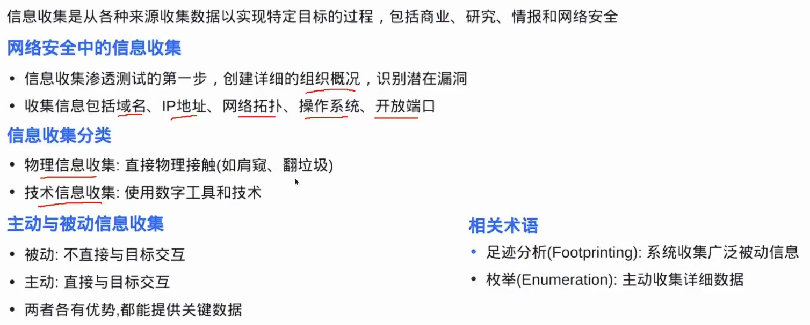
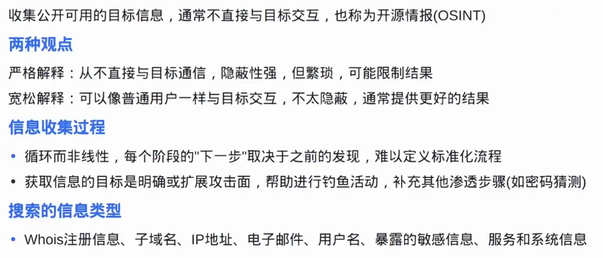
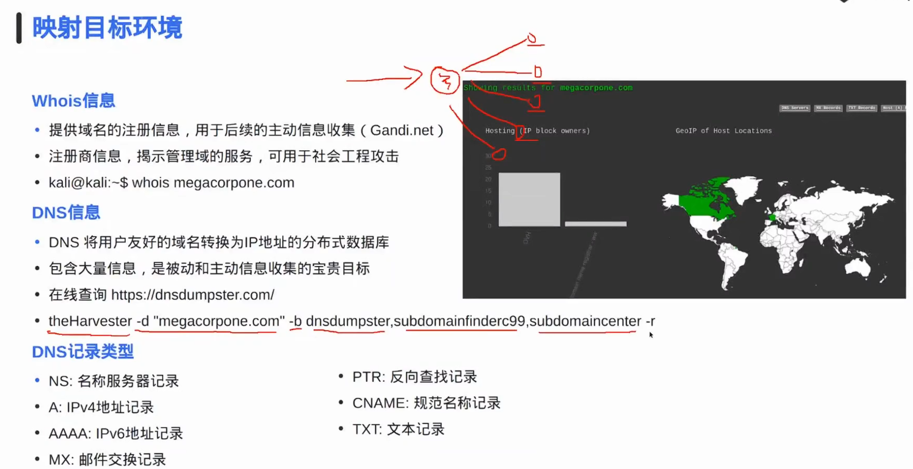
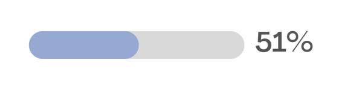
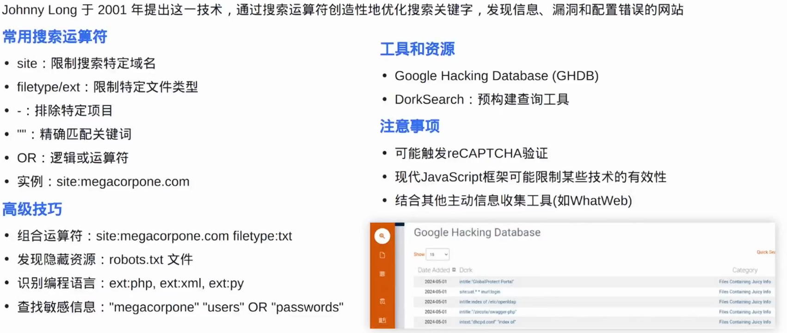
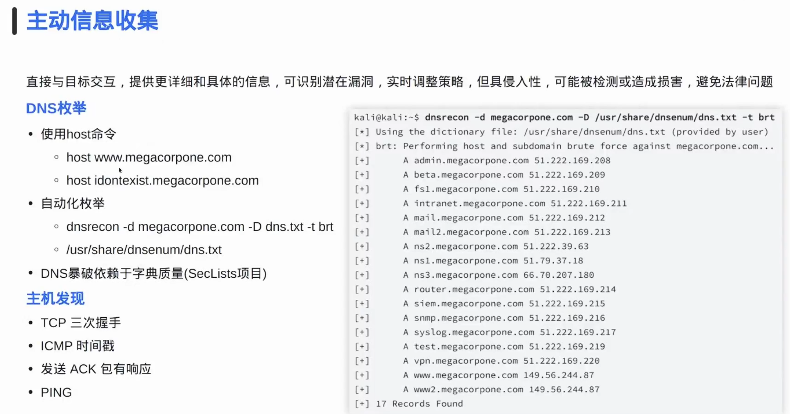
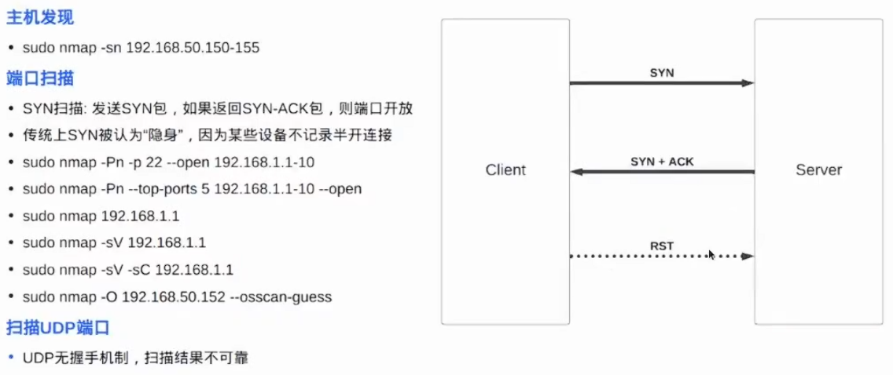
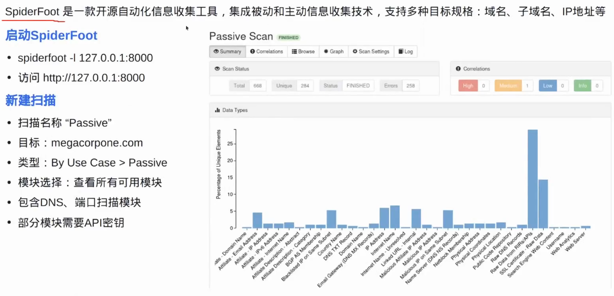
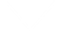

# 09-信息收集与枚举

**English title:** Information Gathering and Enumeration

**作者 / Author:** 2023届 Simon Li / Class of 2023 Simon Li

**原 PPT 日期 / Original PPT date:** 2025-12-09

> 本文由社团课程 PPT 转换而来，保留原幻灯片文字与图片，便于网页阅读。
>
> This article was converted from the club course PowerPoint. Original slide text and images are preserved for web reading.

## 第 1 页 / Slide 1: 12月

### 原文 / Original Text

- 2
- 日
- S
- imon Li
- 信息收集与枚举
- TY
- cybersec
- 09

### 图片 / Images

## 第 2 页 / Slide 2: CONTENTS

### 原文 / Original Text

- 目录
- 信息收集
- Collect information
- 01
- 被动信息收集
- Passive information collection
- 02
- T
- o be continued
- Proactive information collection
- 03
- 未完待续
- Next work direction
- 04

### 图片 / Images

## 第 3 页 / Slide 3: 信息收集

### 原文 / Original Text

- C
- ollect information
- 01

### 图片 / Images

## 第 4 页 / Slide 4: 信息收集

### 图片 / Images

## 第 5 页 / Slide 5: 被动信息收集

### 原文 / Original Text

- Passive information collection
- 02

### 图片 / Images

## 第 6 页 / Slide 6: 被动信息收集

### 图片 / Images

## 第 7 页 / Slide 7: 被动信息收集

### 图片 / Images

## 第 8 页 / Slide 8: 被动信息收集

### 原文 / Original Text

- 产品A
- 产品C
- 产品B
- 产品D
- 演示文稿是一种实用的工具，可以是演示，演讲，报告等。大部分时间，它们都是在为观众服务

### 图片 / Images

## 第 9 页 / Slide 9: G

### 原文 / Original Text

- oogle
- 黑客

### 图片 / Images

## 第 10 页 / Slide 10: 被动信息收集

### 图片 / Images

## 第 11 页 / Slide 11: 主动信息收集

### 原文 / Original Text

- Proactive information collection
- 03

### 图片 / Images

## 第 12 页 / Slide 12: 主动信息收集

### 图片 / Images

## 第 13 页 / Slide 13: N

### 原文 / Original Text

- map

### 图片 / Images

## 第 14 页 / Slide 14: 自动化

### 图片 / Images

## 第 15 页 / Slide 15: 作业

### 原文 / Original Text

- Homework
- 04

### 图片 / Images

## 第 16 页 / Slide 16: 作业三选一

### 原文 / Original Text

- 被动信息收集关于
- www.bilibili.com
- 的信息
- 主动收集关于
- TYAP/TYZX
- 网段下
- 10.1.1.220
- 的信息
- 主动信息收集
- +
- 被动信息收集关于
- www.bing.com
- 的信息
- Tips:
- 如果选择此选项，将获得双倍得分

### 图片 / Images

## 第 17 页 / Slide 17: 12月

### 原文 / Original Text

- 2
- 日
- Si
- mon Li
- 感谢您的观看
- THANK YOU FOR WATCHING
- TY
- cybersec

### 图片 / Images

