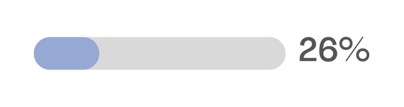
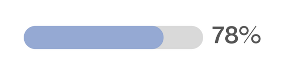
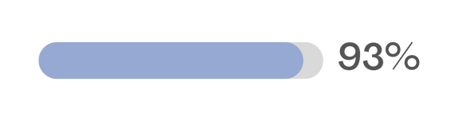
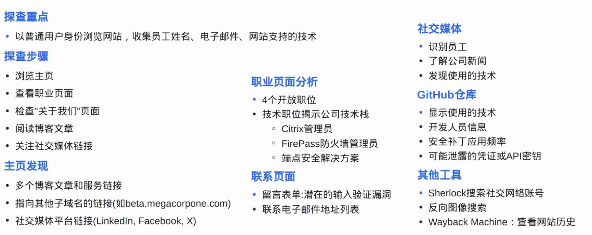
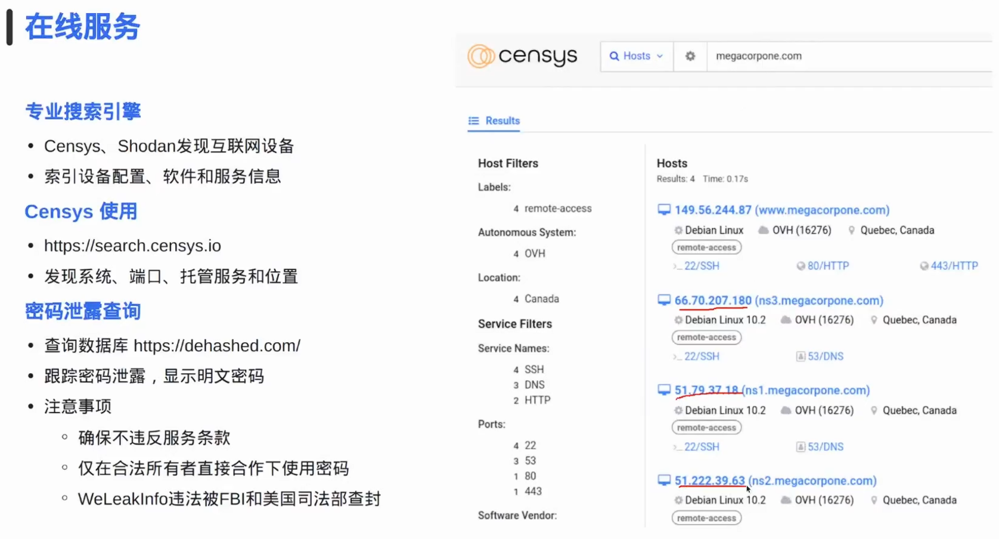
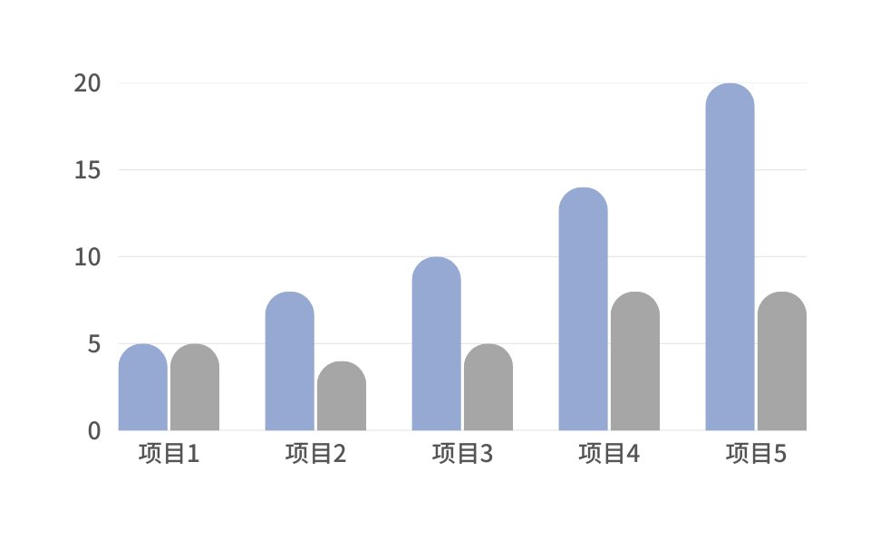

# 09 信息收集与枚举（一半）

**English title:** Information Gathering and Enumeration, Part 1

**作者 / Author:** 2023届 Simon Li / Class of 2023 Simon Li

**原 PPT 日期 / Original PPT date:** 2025-12-02

**关键词 / Keywords:** #OSINT #Reconnaissance #Information-Gathering #Search-Engines #Domains #Passive-Reconnaissance

> 本文由社团课程 PPT 整理为阅读版讲义：保留原课件图片，并补充课堂讲解、学习目标和练习方向。
>
> This article turns the original slides into readable course notes while preserving slide images and adding presenter-style explanations.

## 导读 / Overview

信息收集与枚举上半部分先讲被动信息收集：尽量不直接接触目标系统，通过公开资料、搜索引擎、域名和网页痕迹建立目标画像。

> English overview: Part 1 focuses on passive reconnaissance: building a target profile from public information before touching the target.

## 学习目标 / Learning Goals

- 理解信息收集的目的和边界
- 掌握被动收集的常见来源
- 知道如何记录证据和不足

## 1. 信息收集的意义 / Purpose of reconnaissance

信息收集不是八卦，而是为了减少盲目操作。知道目标资产、技术栈、公开入口和历史暴露信息，才能制定更稳妥的测试计划。

讲者补充：收集阶段最重要的是记录来源。没有来源的信息很难复核，也不适合写进报告。

> English recap: Reconnaissance reduces guessing. Evidence and sources matter.

### 相关课件图片 / Related Slide Images

### 第 1 页配图 / Slide 1 Images

### 第 2 页配图 / Slide 2 Images

### 第 3 页配图 / Slide 3 Images

### 第 4 页配图 / Slide 4 Images

## 2. 被动信息收集 / Passive reconnaissance

被动收集包括搜索引擎、公开页面、域名记录、代码仓库、公告和历史快照等。它的优点是低噪声、低影响，适合作为第一步。

讲者补充：Google hacking 的重点是查询思路，不是复制语法。先明确想找什么，再设计搜索语句。

> English recap: Passive reconnaissance uses public sources with minimal target interaction.

### 相关课件图片 / Related Slide Images

### 第 5 页配图 / Slide 5 Images

### 第 6 页配图 / Slide 6 Images

### 第 7 页配图 / Slide 7 Images

### 第 8 页配图 / Slide 8 Images

### 第 9 页配图 / Slide 9 Images

### 第 10 页配图 / Slide 10 Images

## 3. 不足与下一步 / Limitations and next steps

被动收集会受公开资料质量影响，可能过时、不完整或存在误导。因此后续需要主动枚举和验证，但主动操作必须遵守授权范围。

讲者补充：把“不确定”写出来是专业表现。报告中应区分确认事实、推测和待验证线索。

> English recap: Separate confirmed facts, assumptions, and leads that need validation.

### 相关课件图片 / Related Slide Images

### 第 11 页配图 / Slide 11 Images

### 第 12 页配图 / Slide 12 Images

### 第 13 页配图 / Slide 13 Images

### 第 14 页配图 / Slide 14 Images

### 第 15 页配图 / Slide 15 Images

### 第 16 页配图 / Slide 16 Images

### 第 17 页配图 / Slide 17 Images

### 第 18 页配图 / Slide 18 Images

### 第 19 页配图 / Slide 19 Images

## 课堂练习 / Practice

- 为一个授权靶场域名整理公开信息来源
- 写出三条搜索语句及其目的
- 把收集结果分成事实、推测、待验证三类
