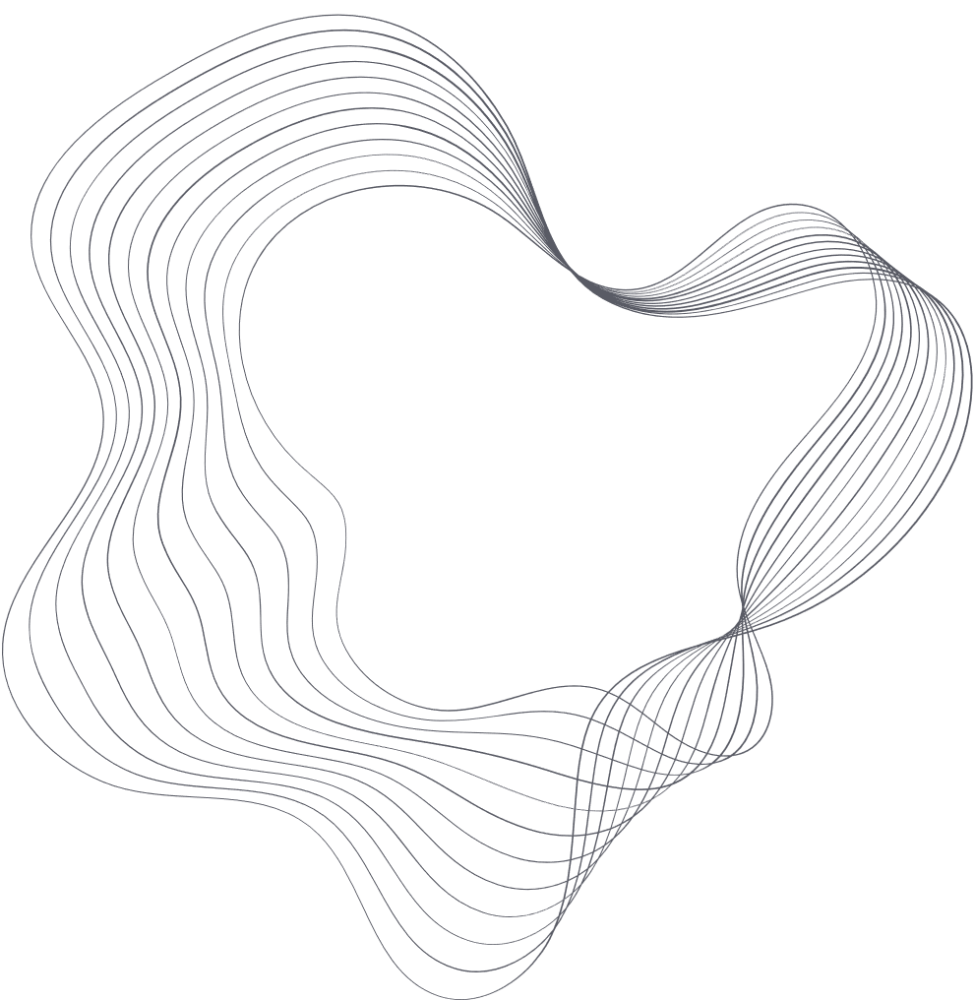
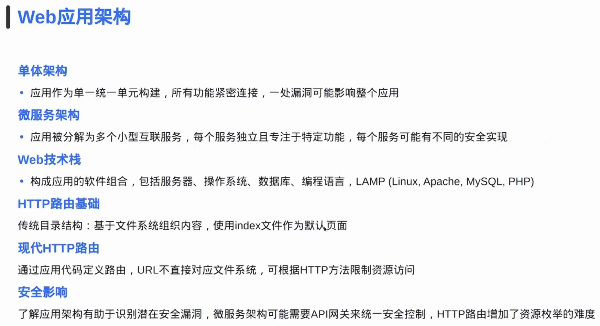
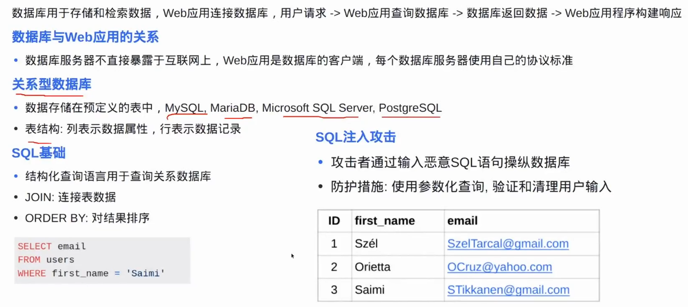
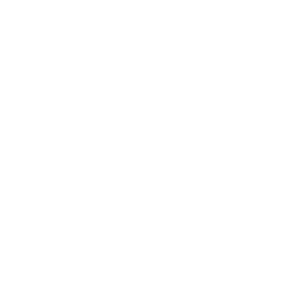
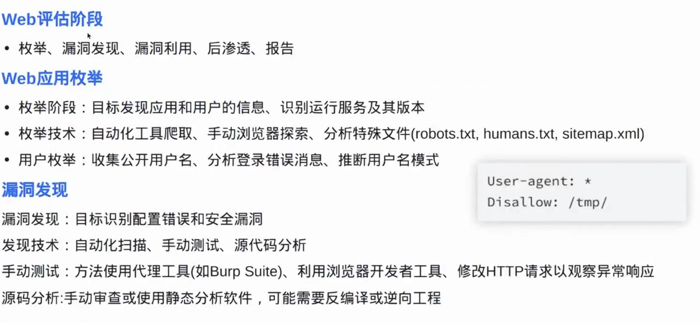
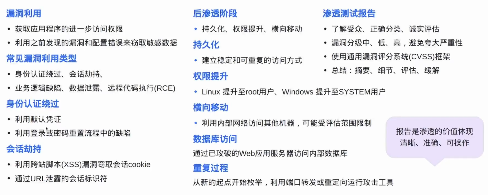
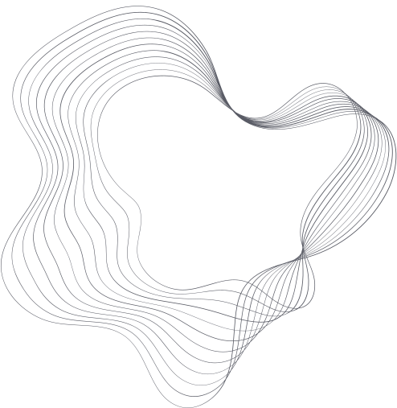
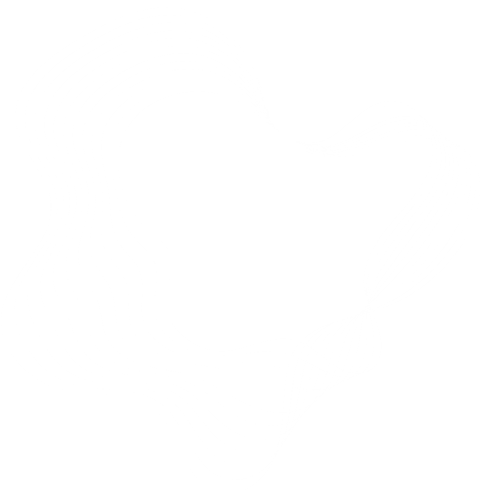
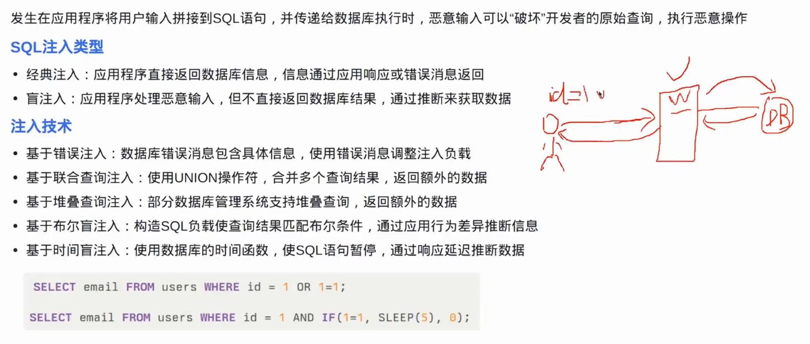
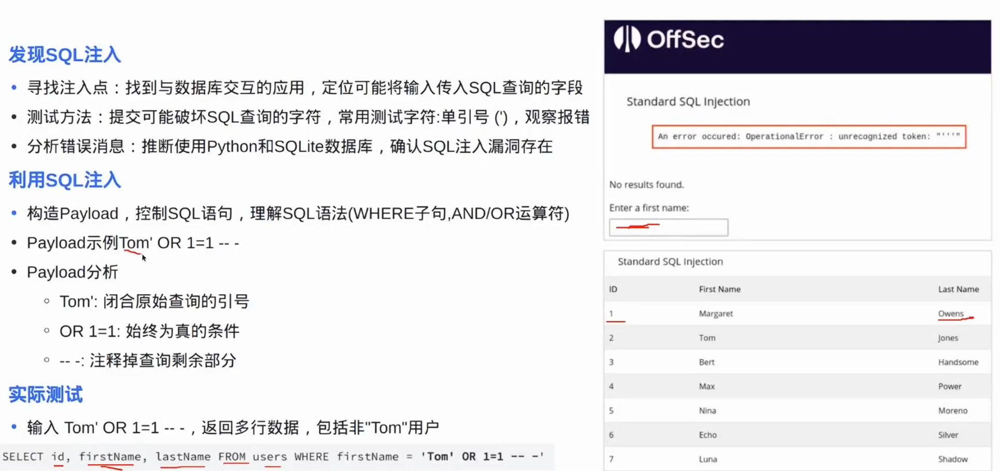

# 10 了解Web攻击

**English title:** Understanding Web Attacks

**作者 / Author:** 2023届 Simon Li / Class of 2023 Simon Li

**原 PPT 日期 / Original PPT date:** 2025-12-09

**关键词 / Keywords:** #Web-Security #SQL-Injection #XSS #Database #OWASP #Web-Defense

> 本文由社团课程 PPT 整理为阅读版讲义：保留原课件图片，并补充课堂讲解、学习目标和练习方向。
>
> This article turns the original slides into readable course notes while preserving slide images and adding presenter-style explanations.

## 导读 / Overview

Web 攻击入门课围绕数据库、SQL 注入和 XSS 展开。它的核心是理解用户输入如何进入服务器、数据库和浏览器，并在错误处理时造成安全影响。

> English overview: This web security lesson focuses on databases, SQL injection, and XSS: how input moves through server, database, and browser.

## 学习目标 / Learning Goals

- 理解 Web 应用的输入输出路径
- 认识 SQL 注入和 XSS 的基本原理
- 知道常见防御方向

## 1. Web 应用与数据库 / Web apps and databases

Web 应用通常接收用户输入，交给后端逻辑处理，再读写数据库并返回页面。攻击面就藏在这些输入、查询、渲染和权限边界里。

讲者补充：学 Web 安全时要画数据流。输入从哪里来，经过哪些组件，最终在哪里显示或执行，是判断风险的关键。

> English recap: Draw the data flow: input, backend logic, database, rendering, and permissions.

### 相关课件图片 / Related Slide Images

### 第 1 页配图 / Slide 1 Images

### 第 2 页配图 / Slide 2 Images

### 第 3 页配图 / Slide 3 Images

### 第 4 页配图 / Slide 4 Images

### 第 5 页配图 / Slide 5 Images

### 第 6 页配图 / Slide 6 Images

### 第 7 页配图 / Slide 7 Images

## 2. SQL 注入 / SQL injection

SQL 注入发生在用户输入被拼接进数据库语句时，攻击者可能改变查询逻辑。理解它时要关注参数化查询、输入校验和数据库权限。

讲者补充：不要只背 payload。更重要的是解释为什么字符串拼接会把数据变成语句的一部分。

> English recap: SQL injection turns data into query logic when input is concatenated unsafely.

### 相关课件图片 / Related Slide Images

### 第 8 页配图 / Slide 8 Images

### 第 9 页配图 / Slide 9 Images

### 第 10 页配图 / Slide 10 Images

## 3. XSS 与浏览器执行 / XSS and browser execution

XSS 的关键是恶意脚本进入页面并在用户浏览器中执行。反射型、存储型和 DOM 型的差别，在于脚本从哪里进入、在哪里保存、在哪里触发。

讲者补充：防 XSS 时要根据输出上下文做编码，HTML、属性、URL、JavaScript 字符串里的规则并不相同。

> English recap: XSS is about untrusted script reaching a browser execution context.

### 相关课件图片 / Related Slide Images

### 第 11 页配图 / Slide 11 Images

### 第 12 页配图 / Slide 12 Images

## 4. 作业与安全边界 / Homework and boundaries

练习应在靶场中完成，目标是理解漏洞成因和修复思路，而不是对真实网站尝试 payload。

讲者补充：一次完整练习应包含复现、影响说明、修复建议和验证修复。

> English recap: Practice in labs and always include remediation and verification.

### 相关课件图片 / Related Slide Images

### 第 13 页配图 / Slide 13 Images

### 第 14 页配图 / Slide 14 Images

### 第 15 页配图 / Slide 15 Images

## 课堂练习 / Practice

- 画出登录表单到数据库查询的数据流
- 说明参数化查询如何防 SQL 注入
- 比较反射型和存储型 XSS
