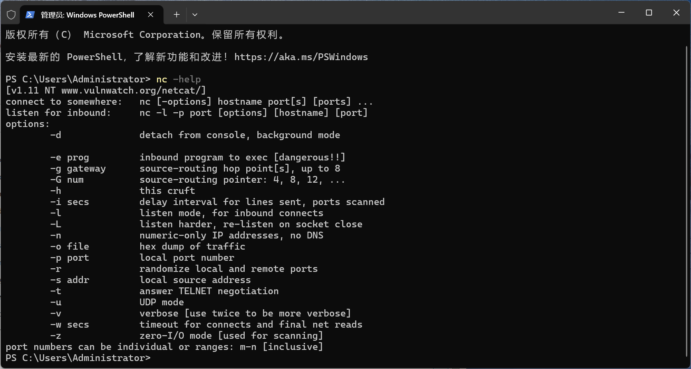
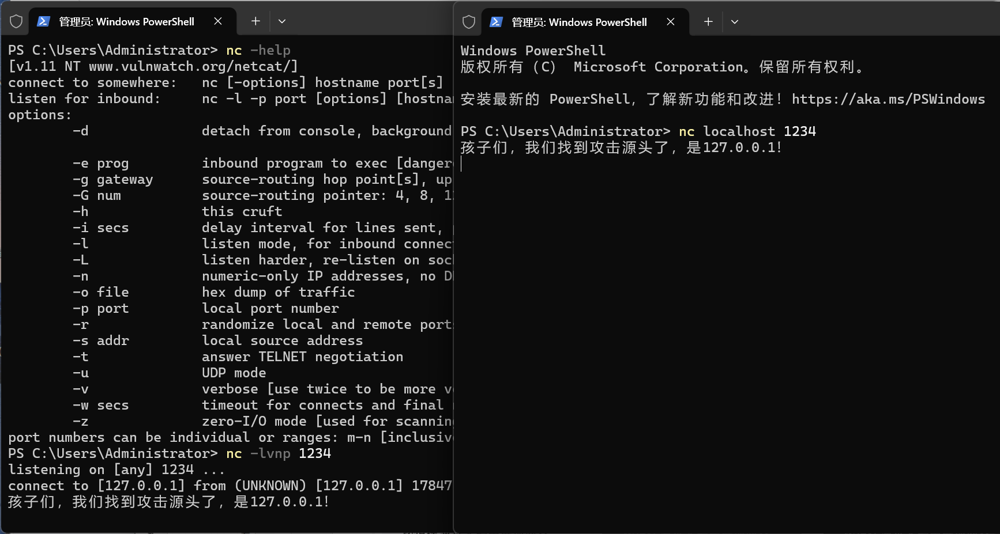
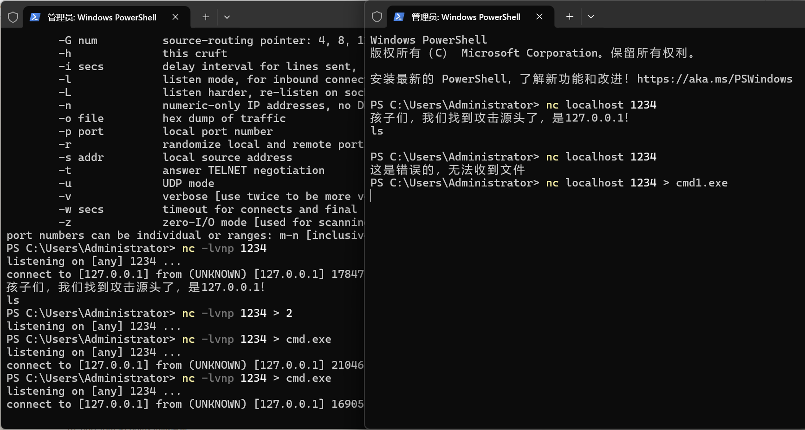
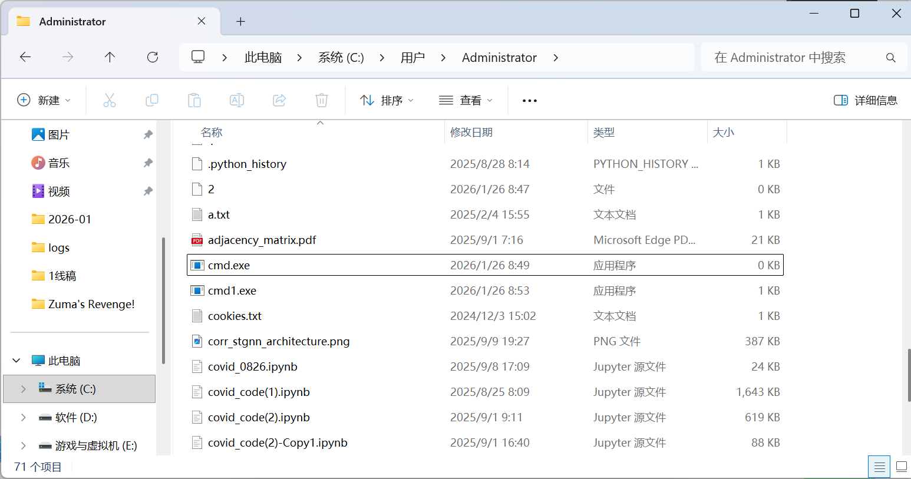
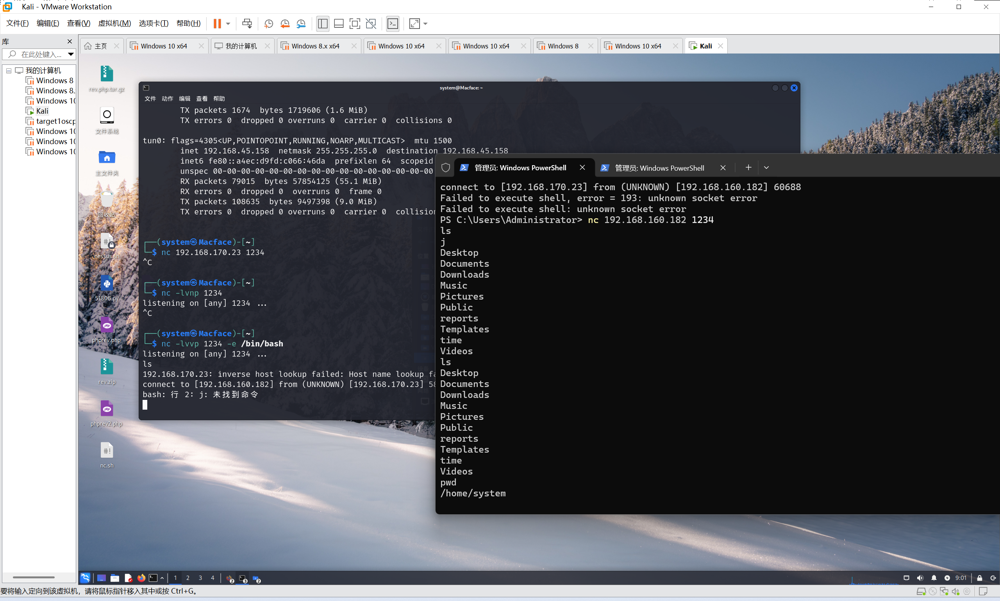
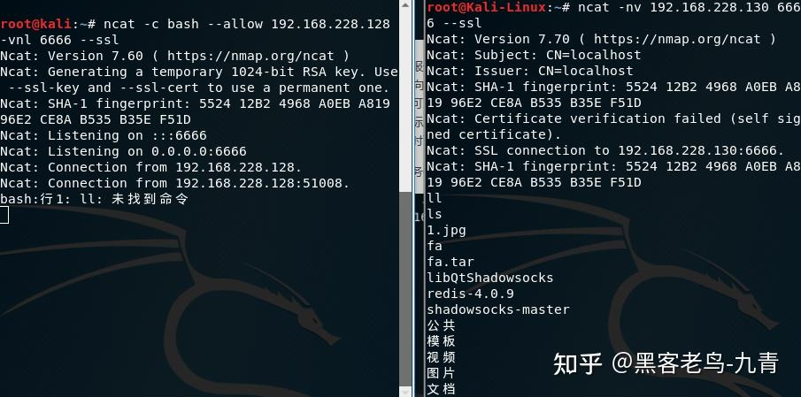

# 11 Web渗透

**English title:** Web Penetration Testing

**作者 / Author:** 2023届 Simon Li / Class of 2023 Simon Li

**原 PPT 日期 / Original PPT date:** 2026-01-26

**关键词 / Keywords:** #Web-Penetration-Testing #Netcat #Reverse-Shell #HTTP #Vulnerability-Assessment #Ethics

> 本文由社团课程 PPT 整理为阅读版讲义：保留原课件图片，并补充课堂讲解、学习目标和练习方向。
>
> This article turns the original slides into readable course notes while preserving slide images and adding presenter-style explanations.

## 导读 / Overview

Web 渗透课程以 Netcat 和考试式练习为入口，强调工具只是手段，真正要训练的是网络连接、输入输出、证据记录和边界意识。

> English overview: This lesson uses Netcat and exam-style practice to train connections, input/output, evidence, and boundaries.

## 学习目标 / Learning Goals

- 理解 Netcat 的常见用途
- 认识反弹 shell 和文件传输的风险
- 为 Web 安全综合练习做准备

## 1. 课程结构与边界 / Course structure and boundaries

这节课把工具学习、考试练习和未来方向放在一起，说明 Web 渗透不是单点技巧，而是综合能力训练。

讲者补充：任何反弹 shell、文件传输、端口监听练习都必须在授权环境中进行。

> English recap: Tool practice must stay within authorized lab environments.

### 相关课件图片 / Related Slide Images

### 第 1 页配图 / Slide 1 Images

### 第 2 页配图 / Slide 2 Images

## 2. Netcat 的用途 / What Netcat is used for

Netcat 常被称为网络瑞士军刀，可用于监听端口、连接服务、传输文本或文件、获取 banner、辅助调试网络连通性。

讲者补充：`nc` 很强，也很危险。学习时重点理解数据从哪个端口进、由哪个程序处理、输出流向哪里。

> English recap: Netcat is useful because it exposes raw network input and output.

### 相关课件图片 / Related Slide Images

### 第 3 页配图 / Slide 3 Images

### 第 4 页配图 / Slide 4 Images

### 第 5 页配图 / Slide 5 Images

### 第 6 页配图 / Slide 6 Images

### 第 7 页配图 / Slide 7 Images

### 第 8 页配图 / Slide 8 Images

## 3. 考试式练习 / Exam-style practice

考试练习通常要求在有限信息下判断连接方式、参数、目标端口和输出证据。它考查的是基本功，而不是背题。

讲者补充：解题时先写下假设，再验证假设。不要在没有记录的情况下乱试。

> English recap: Exam tasks reward clear assumptions, controlled tests, and evidence.

### 相关课件图片 / Related Slide Images

### 第 9 页配图 / Slide 9 Images

### 第 10 页配图 / Slide 10 Images

### 第 11 页配图 / Slide 11 Images

### 第 12 页配图 / Slide 12 Images

### 第 13 页配图 / Slide 13 Images

## 4. 未来的 Web 安全学习 / Future web security learning

后续可以继续学习 HTTP、身份认证、会话管理、漏洞验证、报告撰写和修复验证。工具会变，但方法论会一直使用。

讲者补充：真正的渗透测试报告要能帮助修复，而不是只证明“我进去了”。

> English recap: Good testing helps people fix systems, not merely prove access.

### 相关课件图片 / Related Slide Images

### 第 14 页配图 / Slide 14 Images

### 第 15 页配图 / Slide 15 Images

## 课堂练习 / Practice

- 用 Netcat 在本地监听并发送一段文本
- 解释反弹 shell 为什么危险
- 写一段包含证据和修复建议的小报告
