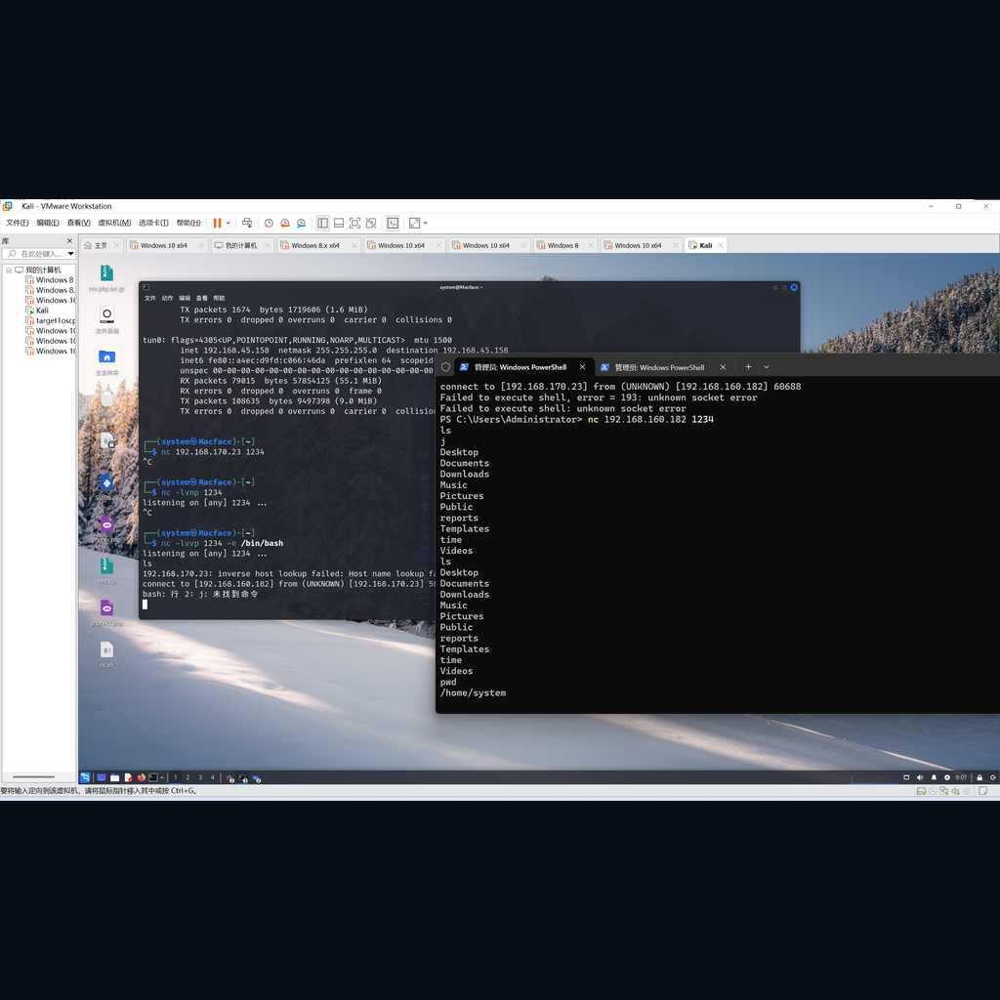

:::section{.lang-zh}

**原 PPT 日期：** 2026-01-26

> 这里不是 PPT 逐页搬运版，而是把课堂主线重新整理成阅读版讲义：能用文字讲清楚的就写成文字；图片只保留终端、结构图、代码、表格和关键截图。

## 导读

Web 渗透课程以 Netcat 和考试式练习为入口，强调工具只是手段，真正要训练的是网络连接、输入输出、证据记录和边界意识。

## 学习目标

- 理解 Netcat 的常见用途
- 认识反弹 shell 和文件传输的风险
- 为 Web 安全综合练习做准备

## 1. 课程结构与边界

这节课把工具学习、考试练习和未来方向放在一起，说明 Web 渗透不是单点技巧，而是综合能力训练。

讲者补充：任何反弹 shell、文件传输、端口监听练习都必须在授权环境中进行。

> 小旁白：这一步像看关卡小地图：确认边界、资源和出口，再开始操作会稳很多。

## 2. Netcat 的用途

Netcat 常被称为网络瑞士军刀，可用于监听端口、连接服务、传输文本或文件、获取 banner、辅助调试网络连通性。

讲者补充：`nc` 很强，也很危险。学习时重点理解数据从哪个端口进、由哪个程序处理、输出流向哪里。

> 小旁白：看到命令别只复制，顺手问一句：它读了什么、改了什么、留下了什么证据？

### PPT 文字要点

> 下面是从原 PPT 可编辑文字层整理出的内容；能写成文字的，就不强行塞截图。

#### 第 4 页：，安全界叫它瑞士军刀。

- ，安全界叫它瑞士军刀。
- 也会顺便介绍，弥补了
- 的不足，被叫做
- 世纪的瑞士军刀。
- 的基本功能如下：
- 考试中，只会使用到反弹
- shell ，传输文件等，其他的会在
- 传输文本信息

#### 第 5 页：：以数字形式表示

- ：以数字形式表示
- ：显示执行命令过程
- 不进行交互，直接显示结果
- UDP 设置超时时间
- 如果你啥都不会，无脑连接
- shell 连接机加一个参数
- 验证是否安装：

## 3. 考试式练习

考试练习通常要求在有限信息下判断连接方式、参数、目标端口和输出证据。它考查的是基本功，而不是背题。

讲者补充：解题时先写下假设，再验证假设。不要在没有记录的情况下乱试。

> 小旁白：如果结论只能靠“感觉”，那还没通关；补一条可复现的命令、截图或日志。

### PPT 文字要点

> 下面是从原 PPT 可编辑文字层整理出的内容；能写成文字的，就不强行塞截图。

#### 第 10 页：也有不足之处，首先就是明文传输，可能会被嗅探。其次对于反...

- 也有不足之处，首先就是明文传输，可能会被嗅探。其次对于反向
- shell ，如果其他人通过网络扫描发现了这个端口，也就意味着任何人都可以去监听这个端口进行连接，缺乏身份验证功能。
- 则弥补了这些缺点，
- linux 系统自带的命令，而是
- 中很多参数和
- 一样，其中可以通过
- 参数来指定允许连接的机器，通过
- 进行数据的加密，如下图（左边是服务器，右边是客户端）：

#### 第 12 页：Part1: 20 min (15 MCQ + 1FRQ...

- Part1: 20 min (15 MCQ + 1FRQ, Total: 20 Score)
- Part2: 20 min (1 Question, Total: 15 Score)
- 有两种方法渗透，如果都做出来有
- 本次渗透测试目标：拿到

### 相关图解

> 这些图是为了辅助理解结构、命令输出或表格关系；装饰图已经尽量排除。

## 4. 未来的 Web 安全学习

后续可以继续学习 HTTP、身份认证、会话管理、漏洞验证、报告撰写和修复验证。工具会变，但方法论会一直使用。

讲者补充：真正的渗透测试报告要能帮助修复，而不是只证明“我进去了”。

> 小旁白：报错不是敌人，它通常是在很诚实地告诉你哪一层没对上。

## 课堂练习

- 用 Netcat 在本地监听并发送一段文本
- 解释反弹 shell 为什么危险
- 写一段包含证据和修复建议的小报告

:::

:::section{.lang-en}

**Original PPT date:** 2026-01-26

> This is not a slide-by-slide dump. It rebuilds the lesson as readable notes: text whenever text is clearer, and visuals only when they explain terminals, diagrams, code, tables, or key evidence.

## Overview

This lesson uses Netcat and exam-style practice to train connections, input/output, evidence, and boundaries.

## Learning Goals

- Explain the main workflow behind Web Penetration Testing.
- Use Web Penetration Testing, Netcat, Reverse Shell to read commands, traffic, logs, or code with evidence.
- Stay inside authorized lab environments and document each step clearly.

## 1. Course structure and boundaries

Tool practice must stay within authorized lab environments.

Start with the problem, then trace the data, command, or protocol that proves the result. Keep the notes short enough that another club member can reproduce the step in a lab.

> Side note: Treat this like checking the minimap before a stage: scope, resources, and exits matter.

## 2. What Netcat is used for

Netcat is useful because it exposes raw network input and output.

Start with the problem, then trace the data, command, or protocol that proves the result. Keep the notes short enough that another club member can reproduce the step in a lab.

> Side note: Do not just copy the command. Ask what it reads, what it changes, and what evidence it leaves.

## 3. Exam-style practice

Exam tasks reward clear assumptions, controlled tests, and evidence.

Start with the problem, then trace the data, command, or protocol that proves the result. Keep the notes short enough that another club member can reproduce the step in a lab.

> Side note: If a conclusion only feels right, it is not cleared yet. Add reproducible evidence.

### Related Visuals

> These visuals are kept for structure, command output, or tables; decorative images are intentionally filtered out.

## 4. Future web security learning

Good testing helps people fix systems, not merely prove access.

Start with the problem, then trace the data, command, or protocol that proves the result. Keep the notes short enough that another club member can reproduce the step in a lab.

> Side note: Errors are not the villain; they usually point at the layer that does not match.

## Practice

- Summarize the main workflow of Web Penetration Testing in your own words.
- Reproduce one safe observation step and record the evidence.
- Explain one likely risk and one matching defense.

:::
