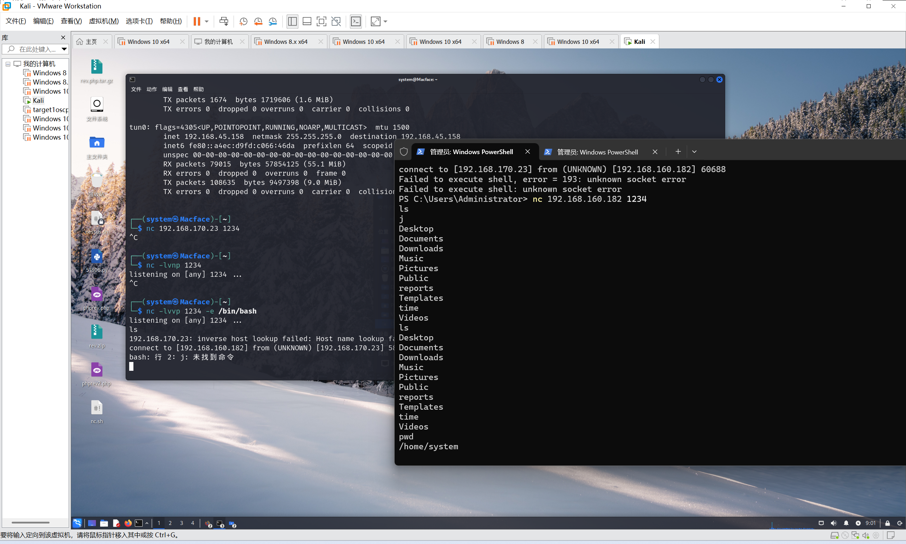

:::section{.lang-zh}

**原 PPT 日期：** 2026-01-26

> 此文为codex改编往年课件而成

## 课程简介

课程使用 Netcat 和考试式练习，训练网络连接、输入输出、证据记录和授权边界判断。

## 你会学到

- 理解 Netcat 的常见用途
- 认识反弹 shell 和文件传输的风险
- 为 Web 安全综合练习做准备

## 1. 课程结构与边界

这节课包含工具使用、考试练习和后续学习方向，覆盖从连接测试到结果记录的完整过程。

任何反弹 shell、文件传输、端口监听练习都必须在授权环境中进行。

## 2. Netcat 的用途

Netcat 常被称为网络瑞士军刀，可用于监听端口、连接服务、传输文本或文件、获取 banner、辅助调试网络连通性。

`nc` 很强，也很危险。学习时重点理解数据从哪个端口进、由哪个程序处理、输出流向哪里。

## 3. 考试式练习

考试练习通常要求在有限信息下判断连接方式、参数、目标端口和输出证据，主要考查基础操作和排错能力。

解题时先写下假设，再验证假设。不要在没有记录的情况下乱试。

## 4. 未来的 Web 安全学习

后续可以继续学习 HTTP、身份认证、会话管理、漏洞验证、报告撰写和修复验证。工具会变，但方法论会一直使用。

渗透测试报告应记录影响范围、复现条件和修复建议。

## 动手小任务

- 用 Netcat 在本地监听并发送一段文本
- 解释反弹 shell 为什么危险
- 写一段包含证据和修复建议的小报告

:::

:::section{.lang-en}

**Original PPT date:** 2026-01-26

> This article was adapted by Codex from previous course slides.

## Overview

This lesson uses Netcat and exam-style practice to train connections, input/output, evidence, and boundaries.

## 1. Course structure and boundaries

Tool practice must stay within authorized lab environments.

## 2. What Netcat is used for

Netcat is useful because it exposes raw network input and output.

## 3. Exam-style practice

Exam tasks reward clear assumptions, controlled tests, and evidence.

## 4. Future web security learning

Good testing helps people fix systems, not merely prove access.

:::
