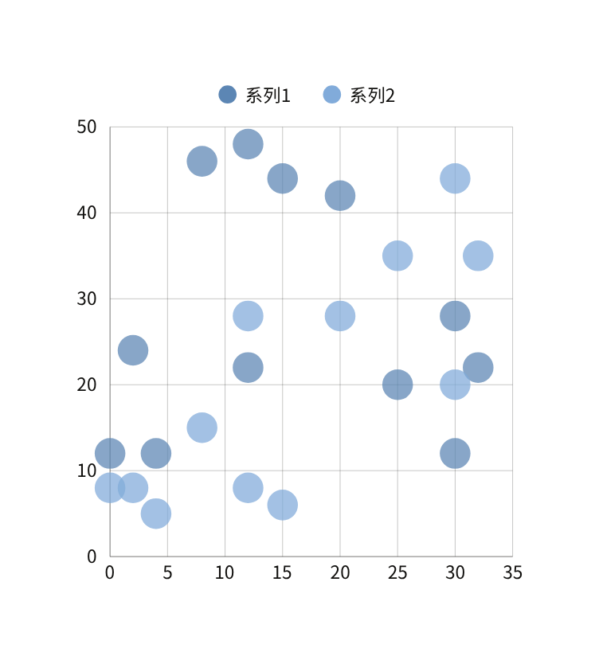

# 12-防御注入攻击

**English title:** Defending Against Injection Attacks

**作者 / Author:** 2023届 Simon Li / Class of 2023 Simon Li

**原 PPT 日期 / Original PPT date:** 2026-04-22

> 本文由社团课程 PPT 转换而来，保留原幻灯片文字与图片，便于网页阅读。
>
> This article was converted from the club course PowerPoint. Original slide text and images are preserved for web reading.

## 第 1 页 / Slide 1: Simon Li

### 原文 / Original Text

- 时间：2026.4.22
- Defense-1
- 12
- 防御
- -
- 注入攻击
- Defense

### 图片 / Images

## 第 2 页 / Slide 2: Defense

### 原文 / Original Text

- 攻击原理
- 01.
- 防御概览
- 02.
- 代码示例
- 03.
- 后期维护
- 04.
- 目录

### 图片 / Images

## 第 3 页 / Slide 3: Defense

### 原文 / Original Text

- 攻击原理
- How they attack
- 01

### 图片 / Images

## 第 4 页 / Slide 4: 攻击原理

### 原文 / Original Text

- 注入攻击是一类通过将恶意代码插入到应用程序输入中，从而改变原有指令逻辑、执行非预期操作的攻击方式。最常见的是
- SQL
- 注入，攻击者利用应用未对输入进行充分过滤或参数化处理，将恶意
- SQL
- 片段嵌入合法查询，使数据库执行未经授权的操作。
- 为什么：应用直接将用户输入拼接到查询语句中，导致输入数据被当作代码执行。例如我们之前讲过的
- SQL
- 注入：
- SELECT * FROM users WHERE username = ‘\$user’ AND password = ‘\$pass
- ’
- ;
- 若
- \$
- user
- 为
- admin' OR '1'='1，
- 条件恒为真，可绕过认证。
- 常见类型包括：
- 基于错误的注入：触发数据库错误并从错误信息中提取数据。
- 联合查询注入：利用
- UNION
- 合并额外查询结果。
- 盲注：无错误回显时，通过布尔条件或时间延迟推断数据。
- 带外注入：利用数据库外部交互（如写文件、
- HTTP
- 请求）泄露信息。

### 图片 / Images

## 第 5 页 / Slide 5: Defense

### 原文 / Original Text

- 防御概览
- How to defense
- 02

### 图片 / Images

## 第 6 页 / Slide 6: 防御概览

### 原文 / Original Text

- 演示文稿是一种实用的工具，可以是演示，演讲，报告等。大部分时间，它们都是在为观众服务。演示文稿是一种实用的工具，可以是演示，演讲，报告等。大部分时间，它们都是在为观众服务。演示文稿是一种实用的工具，可以是演示，演讲，报告等。
- 输入验证和过滤
- 对用户输入进行严格验证，只允许预期的字符（如字母、数字、特定符号），拒绝包含命令分隔符（
- ;
- 、
- |
- 、
- &
- 、
- \$()
- 等）的输入。
- 避免直接执行用户输入
- 不要将用户输入直接传递给系统命令执行函数（如
- system()
- 、
- exec()
- 、
- shell_exec
- ()
- 、
- passthru
- ()
- ）。
- 如果必须执行命令，应使用白名单机制，只允许预定义的命令。
- 使用转义参数
- 如果必须将用户输入作为命令参数，使用专门的转义函数：
- PHP
- ：
- escapeshellarg
- ()
- 或
- escapeshellcmd
- ()
- 。
- S
- 示例：
- \$
- cmd
- = "
- whoami
- ";
- \$
- arg
- =
- escapeshellarg
- (\$_GET['c']);

### 图片 / Images

## 第 7 页 / Slide 7: 防御概览

### 原文 / Original Text

- 例如，如果需要获取当前用户，应使用
- PHP
- 内置函数
- get_current_user
- ()
- 或
- posix_getpwuid
- (
- posix_geteuid
- ())，
- 而不是调用
- whoami
- 命令。
- 使用语言内置函数完成操作，减少对系统命令的依赖。
- 使用
- API
- 配置
- WAF
- 规则（如
- ModSecurity
- ）来检测和阻止包含命令注入特征的请求（如
- whoami
- 、
- ls
- 、
- cat
- 等命令）。
- 使用正则表达式过滤可疑的输入模式。
- 部署防火墙
- 运行
- Web
- 服务的用户（如
- www-data
- ）应仅具有必要的最小权限。
- 避免使用
- root
- 或高权限账户运行
- Web
- 服务，以限制命令执行的影响。
- 最小权限原则

### 图片 / Images

## 第 8 页 / Slide 8: Defense

### 原文 / Original Text

- 代码示例
- Code example
- 03

### 图片 / Images

## 第 9 页 / Slide 9: 代码示例

### 原文 / Original Text

- sudo
- tee -a /etc/
- php
- /7.4/apache2/php.ini &lt;&lt; 'EOF'
- disable_functions
- =
- system,exec,shell_exec,passthru,proc_open,popen,pcntl_exec
- open_basedir
- = /var/www/html
- EOF
- sudo
- systemctl
- restart apache2
- 修改
- PHP
- 配置
- sudo
- find /var/www -type f -name "*.
- php
- " -exec
- chmod
- 644 {} \\;
- sudo
- find /var/www -type d -exec
- chmod
- 755 {} \\;
- sudo
- chown
- -R
- www-data:www-data
- /var/www
- 设置文件权限
- sudo
- tee -a /etc/
- modsecurity
- /
- modsecurity.conf
- &lt;&lt; 'EOF'
- SecRule
- ARGS_GET:c
- "@pm
- whoami
- ls cat id
- uname
- pwd
- " \\
- "id:1001,phase:2,deny,status:403,msg:'Command Injection Attempt'"
- EOF
- sudo
- systemctl
- restart apache2
- 创建
- WAF
- 规则
- 必须
- 可选
- ModSecurity

### 图片 / Images

## 第 10 页 / Slide 10: Defense

### 原文 / Original Text

- 后期维护
- Reports
- 04

### 图片 / Images

## 第 11 页 / Slide 11: 后期维护

### 原文 / Original Text

- 假设
- IP
- 是
- 192.168.244.164
- sudo
- iptables -A INPUT -s 192.168.244.164 -j DROP
- sudo
- iptables -A OUTPUT -d 192.168.244.164 -j DROP
- sudo iptables-save &gt; /etc/iptables/rules.v4
- 阻断
- IP
- sudo
- apt-get install
- lynis
- -y
- sudo
- lynis
- audit system
- sudo
- apt-get update &&
- sudo
- apt-get upgrade –y	#
- 更新系统
- 添加扫描工具

### 图片 / Images

## 第 12 页 / Slide 12: Simon Li

### 原文 / Original Text

- 时间：2026.4.22
- 感谢您的观看
- Defense
- Thank you

### 图片 / Images

