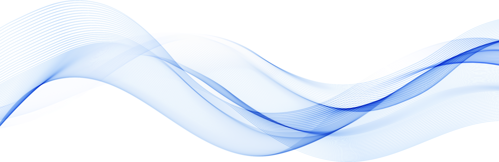

# 14 防御跨站脚本(XSS)攻击

**English title:** Defending Against Cross-Site Scripting (XSS)

**作者 / Author:** 2023届 Simon Li / Class of 2023 Simon Li

**原 PPT 日期 / Original PPT date:** 2026-04-22

**关键词 / Keywords:** #XSS #CSP #Output-Encoding #Frontend-Security #Web-Defense #Secure-Coding

> 本文由社团课程 PPT 整理为阅读版讲义：保留原课件图片，并补充课堂讲解、学习目标和练习方向。
>
> This article turns the original slides into readable course notes while preserving slide images and adding presenter-style explanations.

## 导读 / Overview

防御 XSS 课程把重点放在输出上下文、编码、CSP 和安全开发习惯上。XSS 防御不是简单删除 `<script>`，而是系统性管理不可信内容。

> English overview: Defending XSS requires output-context encoding, CSP, secure rendering, and careful handling of untrusted content.

## 学习目标 / Learning Goals

- 理解三类 XSS 的触发位置
- 掌握输出编码和 CSP 的作用
- 形成前端安全开发习惯

## 1. XSS 的攻击原理 / How XSS works

XSS 的共同点是不可信内容进入浏览器执行环境。反射型、存储型和 DOM 型的区别在于输入流向和触发位置。

讲者补充：过滤输入只能降低风险，关键仍是按输出上下文编码。

> English recap: XSS is untrusted content reaching browser execution contexts.

### 相关课件图片 / Related Slide Images

### 第 1 页配图 / Slide 1 Images

### 第 2 页配图 / Slide 2 Images

### 第 3 页配图 / Slide 3 Images

### 第 4 页配图 / Slide 4 Images

### 第 5 页配图 / Slide 5 Images

## 2. 防御概览 / Defense overview

防御包括 HTML 转义、属性编码、URL 编码、避免危险 API、模板自动转义、CSP 和 Cookie 安全属性。

讲者补充：不同上下文不能共用同一套编码函数。HTML 文本、属性、脚本和 URL 都要分开看。

> English recap: Encoding must match the output context.

### 相关课件图片 / Related Slide Images

### 第 6 页配图 / Slide 6 Images

### 第 7 页配图 / Slide 7 Images

## 3. 代码示例与复盘 / Code examples and review

通过代码示例可以看到：安全渲染应该让用户内容保持“数据”身份，而不是变成 HTML 或 JavaScript。

讲者补充：修复 XSS 后要测试正常文本、特殊符号、链接、富文本等边界输入。

> English recap: Keep user content as data, not executable markup.

### 相关课件图片 / Related Slide Images

### 第 8 页配图 / Slide 8 Images

### 第 9 页配图 / Slide 9 Images

### 第 10 页配图 / Slide 10 Images

### 第 11 页配图 / Slide 11 Images

### 第 12 页配图 / Slide 12 Images

## 课堂练习 / Practice

- 比较反射型、存储型和 DOM 型 XSS
- 为评论区设计 XSS 防御方案
- 解释 CSP 为什么不是唯一防线
