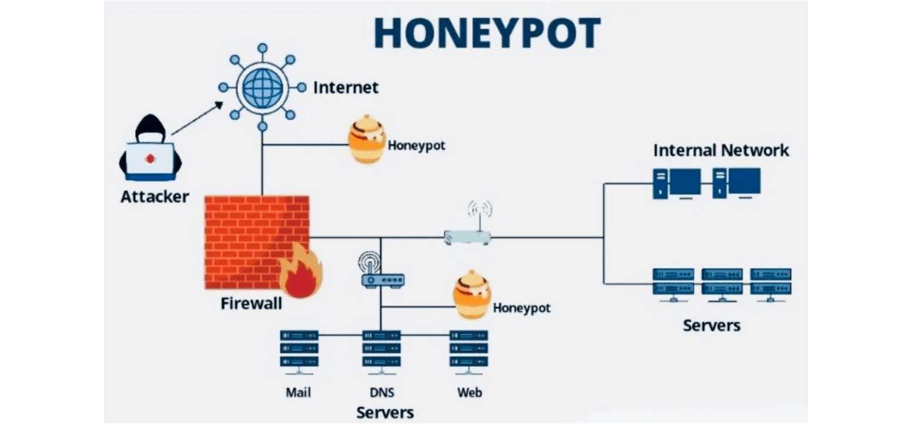
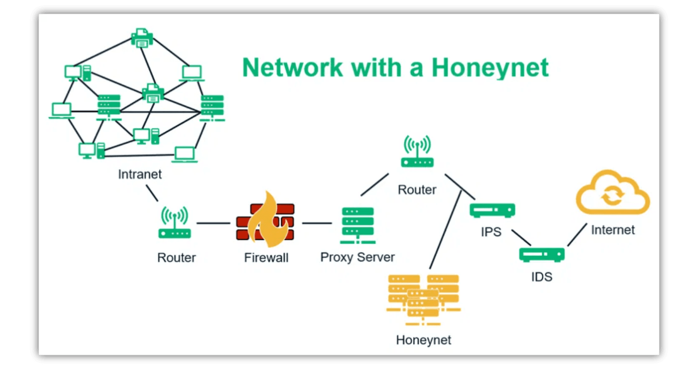
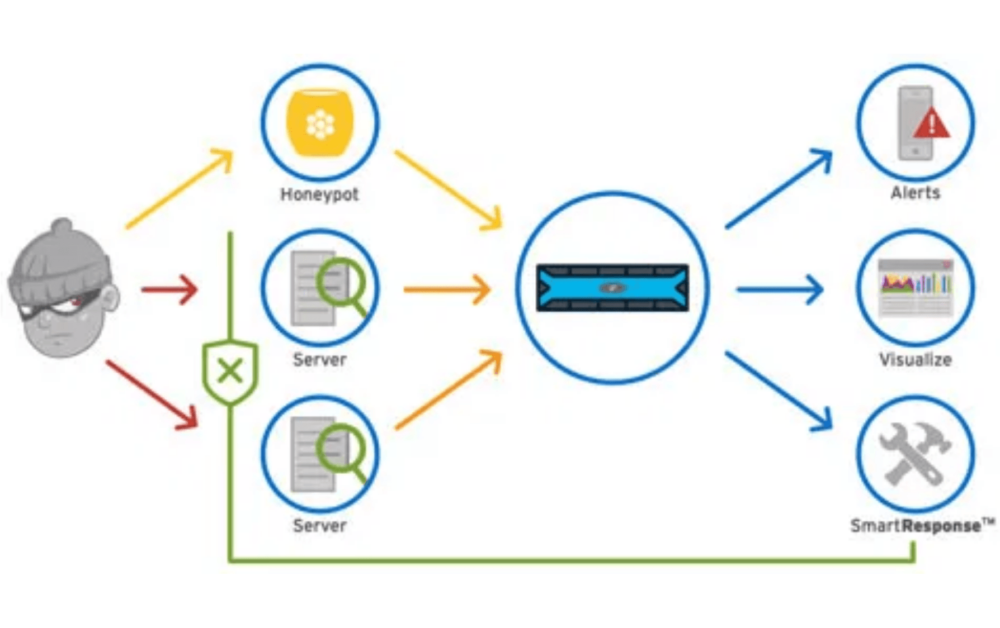

:::section{.lang-zh}

**原 PPT 日期：** 2026-01-21

> 这篇讲义按课堂主线重新梳理：先抓住概念，再看命令、结构图和练习任务。别急着开大招，先把地图点亮。

## 导读

蜜罐课程从主动防御角度介绍如何用诱饵系统收集威胁情报。它把传统蜜罐、IoT 蜜罐、云蜜罐、AI 自适应防御和未来趋势连接起来。

## 学习目标

- 理解蜜罐的定义和价值
- 区分不同交互程度和部署类型
- 认识 AI 与蜜罐结合的机会和风险

## 1. 蜜罐为什么是主动防御

蜜罐的价值来自攻击者交互。合法用户通常不会访问诱饵资源，因此蜜罐流量信噪比高，适合发现扫描、攻击工具和行为链。

讲者补充：蜜罐不是替代防火墙，而是补充威胁感知能力。

> 小旁白：报错不是敌人，它通常是在很诚实地告诉你哪一层没对上。

## 2. 分类与交互程度

物理、虚拟、生产型、研究型、低交互、高交互和混合蜜罐各有取舍。交互越深，情报越丰富，风险和维护成本也越高。

讲者补充：课堂上要特别强调隔离和监控，否则高交互蜜罐可能变成攻击跳板。

> 小旁白：工具是技能栏，不是自动胜利按钮；真正的主角仍然是你的判断链。

## 3. AI、IoT 与分布式蜜网

AI 可以帮助蜜罐识别异常、动态调整诱饵特征，IoT 和云场景则扩大了部署范围。分布式蜜网能从多个区域收集趋势。

讲者补充：AI 不是魔法，模型解释性、对抗样本和资源消耗仍是现实挑战。

> 小旁白：先别急着开大招，把输入、处理、输出连成一条线，很多问题会自己露头。

## 4. 历史、挑战与未来

从早期诱捕实践到 AI 驱动系统，蜜罐一直在攻防博弈中演进。未来方向包括自适应欺骗、量子安全和更大规模的协同情报。

讲者补充：部署蜜罐还要考虑法律、隐私和组织流程，不只是技术搭建。

> 小旁白：这一步像看关卡小地图：确认边界、资源和出口，再开始操作会稳很多。

## 课堂练习

- 比较低交互和高交互蜜罐
- 设计一个 IoT 蜜罐要模拟的协议
- 列出蜜罐部署的三个风险控制点

:::

:::section{.lang-en}

**Original PPT date:** 2026-01-21

> These notes follow the lesson path: understand the idea first, then read commands, diagrams, and practice tasks with evidence.

## Overview

This honeypot lesson explains deception-based active defense, from traditional systems to IoT, cloud, AI, and future trends.

## Learning Goals

- Explain the main workflow behind Honeypots.
- Use Honeypot, Threat Intelligence, Deception to read commands, traffic, logs, or code with evidence.
- Stay inside authorized lab environments and document each step clearly.

## 1. Why honeypots are active defense

Honeypots create high-signal interaction data for threat intelligence.

Start with the problem, then trace the data, command, or protocol that proves the result. Keep the notes short enough that another club member can reproduce the step in a lab.

> Side note: Errors are not the villain; they usually point at the layer that does not match.

## 2. Types and interaction levels

More interaction means richer intelligence but higher risk.

Start with the problem, then trace the data, command, or protocol that proves the result. Keep the notes short enough that another club member can reproduce the step in a lab.

> Side note: Tools are skill slots, not an auto-win button. The real protagonist is your reasoning chain.

## 3. AI, IoT, and distributed honeynets

AI improves adaptation but introduces explainability and adversarial risks.

Start with the problem, then trace the data, command, or protocol that proves the result. Keep the notes short enough that another club member can reproduce the step in a lab.

> Side note: Do not rush the special move: draw input, processing, and output first.

## 4. History, challenges, and future

Honeypots combine technology, law, privacy, and operations.

Start with the problem, then trace the data, command, or protocol that proves the result. Keep the notes short enough that another club member can reproduce the step in a lab.

> Side note: Treat this like checking the minimap before a stage: scope, resources, and exits matter.

## Practice

- Summarize the main workflow of Honeypots in your own words.
- Reproduce one safe observation step and record the evidence.
- Explain one likely risk and one matching defense.

:::
