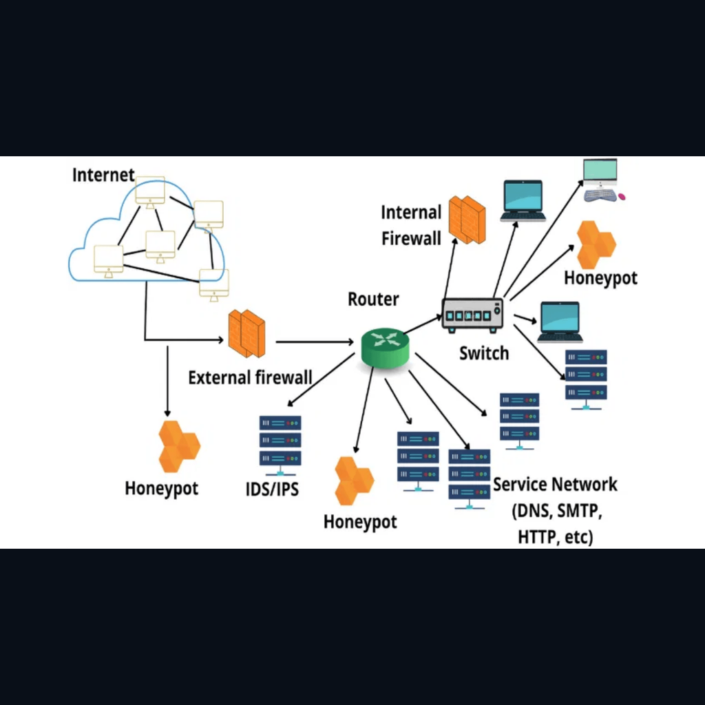

:::section{.lang-zh}

**原 PPT 日期：** 2026-01-21

> 这里不是 PPT 逐页搬运版，而是把课堂主线重新整理成阅读版讲义：能用文字讲清楚的就写成文字；图片只保留终端、结构图、代码、表格和关键截图。

## 导读

蜜罐课程从主动防御角度介绍如何用诱饵系统收集威胁情报。它把传统蜜罐、IoT 蜜罐、云蜜罐、AI 自适应防御和未来趋势连接起来。

## 学习目标

- 理解蜜罐的定义和价值
- 区分不同交互程度和部署类型
- 认识 AI 与蜜罐结合的机会和风险

## 1. 蜜罐为什么是主动防御

蜜罐的价值来自攻击者交互。合法用户通常不会访问诱饵资源，因此蜜罐流量信噪比高，适合发现扫描、攻击工具和行为链。

讲者补充：蜜罐不是替代防火墙，而是补充威胁感知能力。

> 小旁白：报错不是敌人，它通常是在很诚实地告诉你哪一层没对上。

### PPT 文字要点

> 下面是从原 PPT 可编辑文字层整理出的内容；能写成文字的，就不强行塞截图。

#### 第 1 页：蜜罐技术：

- 网络安全的主动防御机
- Honeypot Technology: Active Defense Mechanism in Cybersecurity
- 从传统诱捕到AI驱动的智能防御

#### 第 2 页：蜜罐将被动防御转变为主动威胁情报收集系统

- 是一种计算机安全机制，通
- 过部署看似合法但实际被隔离和监控的系统资
- 源，主动诱捕攻击者并分析其行为模式。
- 与传统防御技术不同，蜜罐的价值完全来源于攻击者的交互——任何访问蜜罐的行为都被视为可疑或恶意的。
- 这种技术类似于警方的"诱捕行动" (sting operation)，不仅分散攻击者注意力，更重要的是捕获攻击工具、技术和程序 (TTPs)。
- Core Characteristics
- 合法用户不会访问蜜罐，因此所有捕获的流量几乎都是恶意的，信噪比极高。
- 主动诱捕能力

## 2. 分类与交互程度

物理、虚拟、生产型、研究型、低交互、高交互和混合蜜罐各有取舍。交互越深，情报越丰富，风险和维护成本也越高。

讲者补充：课堂上要特别强调隔离和监控，否则高交互蜜罐可能变成攻击跳板。

> 小旁白：工具是技能栏，不是自动胜利按钮；真正的主角仍然是你的判断链。

### PPT 文字要点

> 下面是从原 PPT 可编辑文字层整理出的内容；能写成文字的，就不强行塞截图。

#### 第 3 页：蜜罐的多维度分类满足不同安全场景需求

- 按物理/虚拟形式分类
- 物理蜜罐 (Physical Honeypot)
- 真实机器，拥有独立IP地址和硬件资源。提供最真实的系统行为模拟，无虚拟化特征。
- 真实度极高，难以被识别。
- 硬件成本高，维护复杂，扩展性差。
- 虚拟蜜罐 (Virtual Honeypot)
- 利用虚拟化技术在单机上模拟多个OS。通过模拟TCP/IP协议栈实现欺骗。
- 成本低，部署灵活，易于管理。

#### 第 4 页：交互程度决定了蜜罐的欺骗能力与资源消耗的平衡

- 仅模拟攻击者常请求的服务（如端口、简单协议）。资源消耗极低，易于大规模部署。
- 主要用途：检测大规模扫描
- 提供完整的操作系统和应用环境。能捕获攻击者完整行为链，但维护成本高，风险较大。
- 主要用途：深度威胁分析
- 结合两者优势，通过智能路由将简单探测导向低交互，将深度攻击导向高交互。
- 主要用途：平衡资源与检测能力
- 特殊类型蜜罐 (Specialized Honeypots)
- 恶意软件蜜罐

## 3. AI、IoT 与分布式蜜网

AI 可以帮助蜜罐识别异常、动态调整诱饵特征，IoT 和云场景则扩大了部署范围。分布式蜜网能从多个区域收集趋势。

讲者补充：AI 不是魔法，模型解释性、对抗样本和资源消耗仍是现实挑战。

> 小旁白：先别急着开大招，把输入、处理、输出连成一条线，很多问题会自己露头。

### PPT 文字要点

> 下面是从原 PPT 可编辑文字层整理出的内容；能写成文字的，就不强行塞截图。

#### 第 5 页：AI技术将蜜罐检测准确率提升至96%并实现实时威胁响应

- 监督学习 (Supervised Learning)
- Random Forest, SVM
- 通过学习历史攻击数据的特征，准确分类攻击类型并识别已知模式。
- 检测准确率 (IoT Environment, Lanz et al., 2025)
- 无监督学习 (Unsupervised Learning)
- K-means, Isolation Forest
- 异常检测与聚类：
- 能够发现未知的攻击模式和零日漏洞利用。通

#### 第 6 页：IoT设备的安全脆弱性推动了专用蜜罐技术的快速发展

- IoT 蜜罐 (IoT Honeypots)
- 针对资源受限的物联网设备设计，模拟特定硬件指纹和协议。
- 模拟智能家居、工业传感器等低成本硬件环境。
- 针对 Telnet, Modbus, MQTT 等常用IoT协议。
- 云蜜罐 (Cloud Honeypots)
- 利用云平台的弹性和可扩展性，实现快速部署和高度仿真。
- 按需快速启动大量蜜罐实例。
- 轻松跨区域部署，监测地理性威胁。

#### 第 7 页：蜜罐提供零误报的高质量威胁数据，是私有威胁情报的理想来源

- 多维度情报收集 (Multi-dimensional Collection)
- 蜜罐能够捕获从网络层到应用层的完整攻击链，将原始数据转化为可操作的威胁情报 (TTPs, IoCs)。
- IP地址, 端口扫描, 协议指纹
- 键盘记录, 进程监控, 文件修
- SQL注入, XSS payload, 恶意
- 外网威胁感知：
- 监测来自互联网的大规模扫描、漏洞利用尝试和恶意软件传
- 播，了解外部威胁态势。

### 相关图解

> 这些图是为了辅助理解结构、命令输出或表格关系；装饰图已经尽量排除。

## 4. 历史、挑战与未来

从早期诱捕实践到 AI 驱动系统，蜜罐一直在攻防博弈中演进。未来方向包括自适应欺骗、量子安全和更大规模的协同情报。

讲者补充：部署蜜罐还要考虑法律、隐私和组织流程，不只是技术搭建。

> 小旁白：这一步像看关卡小地图：确认边界、资源和出口，再开始操作会稳很多。

### PPT 文字要点

> 下面是从原 PPT 可编辑文字层整理出的内容；能写成文字的，就不强行塞截图。

#### 第 9 页：从Clifford Stoll的开创性实践到AI驱动的自适应系统

- 起源与工具化
- Clifford Stoll 首次记录通过诱饵系统追踪黑客的案例，奠定概念基础。
- DTK (Deception Toolkit)
- Fred Cohen 开发首个专用欺骗工具包，蜜罐技术开始工具化。
- The Honeynet Project
- 蜜罐研究进入系统化、国际化阶段，推动标准与最佳实践。
- Honeyd & Virtualization
- 低交互蜜罐成熟，单机模拟数千主机，实现大规模部署。

#### 第 10 页：蜜罐识别、法律风险和资源消耗是当前技术应用的主要障碍

- 蜜罐识别与反制 (Identification)
- 攻击者通过检测虚拟化特征（时钟偏差、硬件指纹）或异常响应模式来识别并避开蜜罐。
- 提高真实性（高交互环境）、引入随机延迟、使用反虚拟化检测技术、定期更新指纹。
- 法律与伦理 (Legal & Ethical)
- "诱捕"与"诱导"的法律界限模糊；数据隐私(GDPR)合规风险；被用作跳板的连带责任。
- 制定明确使用政策、严格网络隔离、实施合规性审查、确保蜜罐仅作为被动诱饵。
- 部署与维护成本 (Cost)
- 高交互蜜罐消耗大量计算资源；需要专业分析师进行维护和数据解读，人力成本高。

#### 第 11 页：AI驱动的自适应欺骗、量子安全蜜罐和元宇宙防御将定义下一代蜜罐技术

- 生成式 AI 与深度学习
- 生成逼真的系统响应与对话，使用
- 模拟真实流量。蜜罐将具备自主学习能
- 力，实时演进欺骗策略。
- 量子安全蜜罐
- 抗量子密码算法
- 保护数据，利用量子传
- 感技术检测微小环境变化，应对量子计算带

## 课堂练习

- 比较低交互和高交互蜜罐
- 设计一个 IoT 蜜罐要模拟的协议
- 列出蜜罐部署的三个风险控制点

:::

:::section{.lang-en}

**Original PPT date:** 2026-01-21

> This is not a slide-by-slide dump. It rebuilds the lesson as readable notes: text whenever text is clearer, and visuals only when they explain terminals, diagrams, code, tables, or key evidence.

## Overview

This honeypot lesson explains deception-based active defense, from traditional systems to IoT, cloud, AI, and future trends.

## Learning Goals

- Explain the main workflow behind Honeypots.
- Use Honeypot, Threat Intelligence, Deception to read commands, traffic, logs, or code with evidence.
- Stay inside authorized lab environments and document each step clearly.

## 1. Why honeypots are active defense

Honeypots create high-signal interaction data for threat intelligence.

Start with the problem, then trace the data, command, or protocol that proves the result. Keep the notes short enough that another club member can reproduce the step in a lab.

> Side note: Errors are not the villain; they usually point at the layer that does not match.

## 2. Types and interaction levels

More interaction means richer intelligence but higher risk.

Start with the problem, then trace the data, command, or protocol that proves the result. Keep the notes short enough that another club member can reproduce the step in a lab.

> Side note: Tools are skill slots, not an auto-win button. The real protagonist is your reasoning chain.

## 3. AI, IoT, and distributed honeynets

AI improves adaptation but introduces explainability and adversarial risks.

Start with the problem, then trace the data, command, or protocol that proves the result. Keep the notes short enough that another club member can reproduce the step in a lab.

> Side note: Do not rush the special move: draw input, processing, and output first.

### Related Visuals

> These visuals are kept for structure, command output, or tables; decorative images are intentionally filtered out.

## 4. History, challenges, and future

Honeypots combine technology, law, privacy, and operations.

Start with the problem, then trace the data, command, or protocol that proves the result. Keep the notes short enough that another club member can reproduce the step in a lab.

> Side note: Treat this like checking the minimap before a stage: scope, resources, and exits matter.

## Practice

- Summarize the main workflow of Honeypots in your own words.
- Reproduce one safe observation step and record the evidence.
- Explain one likely risk and one matching defense.

:::
