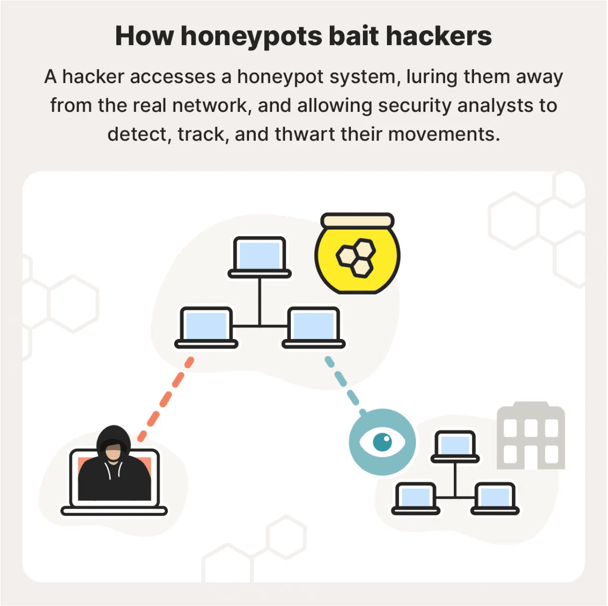
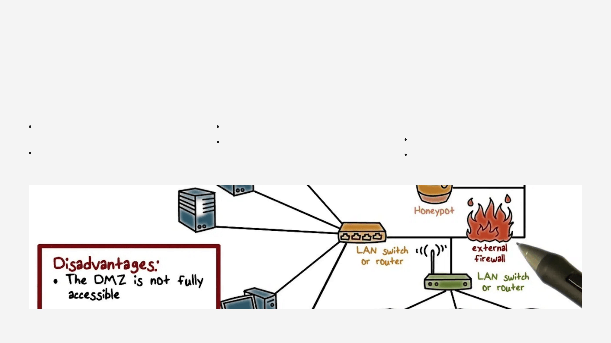
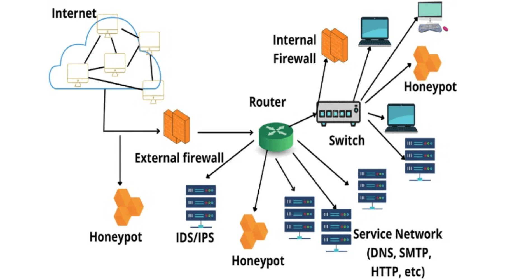
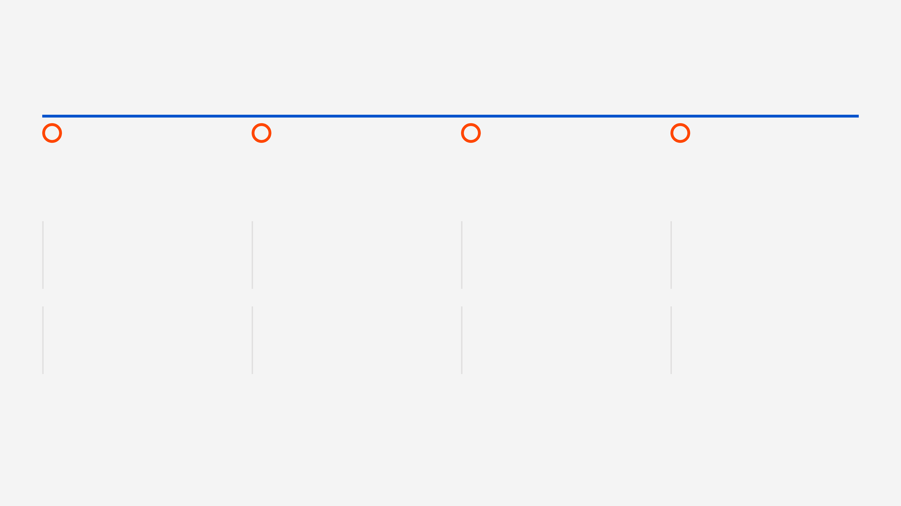
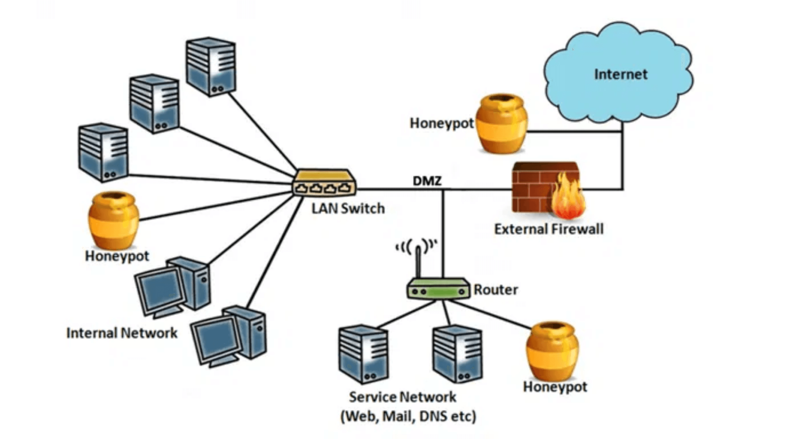

# Cynthia Li 蜜罐

**English title:** Honeypots

**作者 / Author:** 2024届 Cynthia Li / Class of 2024 Cynthia Li

**原 PPT 日期 / Original PPT date:** 2026-01-21

**关键词 / Keywords:** #Honeypot #Threat-Intelligence #Deception #IoT-Security #AI-Security #Active-Defense

> 本文由社团课程 PPT 整理为阅读版讲义：保留原课件图片，并补充课堂讲解、学习目标和练习方向。
>
> This article turns the original slides into readable course notes while preserving slide images and adding presenter-style explanations.

## 导读 / Overview

蜜罐课程从主动防御角度介绍如何用诱饵系统收集威胁情报。它把传统蜜罐、IoT 蜜罐、云蜜罐、AI 自适应防御和未来趋势连接起来。

> English overview: This honeypot lesson explains deception-based active defense, from traditional systems to IoT, cloud, AI, and future trends.

## 学习目标 / Learning Goals

- 理解蜜罐的定义和价值
- 区分不同交互程度和部署类型
- 认识 AI 与蜜罐结合的机会和风险

## 1. 蜜罐为什么是主动防御 / Why honeypots are active defense

蜜罐的价值来自攻击者交互。合法用户通常不会访问诱饵资源，因此蜜罐流量信噪比高，适合发现扫描、攻击工具和行为链。

讲者补充：蜜罐不是替代防火墙，而是补充威胁感知能力。

> English recap: Honeypots create high-signal interaction data for threat intelligence.

### 相关课件图片 / Related Slide Images

### 第 1 页配图 / Slide 1 Images

### 第 2 页配图 / Slide 2 Images

## 2. 分类与交互程度 / Types and interaction levels

物理、虚拟、生产型、研究型、低交互、高交互和混合蜜罐各有取舍。交互越深，情报越丰富，风险和维护成本也越高。

讲者补充：课堂上要特别强调隔离和监控，否则高交互蜜罐可能变成攻击跳板。

> English recap: More interaction means richer intelligence but higher risk.

### 相关课件图片 / Related Slide Images

### 第 3 页配图 / Slide 3 Images

### 第 4 页配图 / Slide 4 Images

## 3. AI、IoT 与分布式蜜网 / AI, IoT, and distributed honeynets

AI 可以帮助蜜罐识别异常、动态调整诱饵特征，IoT 和云场景则扩大了部署范围。分布式蜜网能从多个区域收集趋势。

讲者补充：AI 不是魔法，模型解释性、对抗样本和资源消耗仍是现实挑战。

> English recap: AI improves adaptation but introduces explainability and adversarial risks.

### 相关课件图片 / Related Slide Images

### 第 5 页配图 / Slide 5 Images

### 第 6 页配图 / Slide 6 Images

### 第 7 页配图 / Slide 7 Images

### 第 8 页配图 / Slide 8 Images

## 4. 历史、挑战与未来 / History, challenges, and future

从早期诱捕实践到 AI 驱动系统，蜜罐一直在攻防博弈中演进。未来方向包括自适应欺骗、量子安全和更大规模的协同情报。

讲者补充：部署蜜罐还要考虑法律、隐私和组织流程，不只是技术搭建。

> English recap: Honeypots combine technology, law, privacy, and operations.

### 相关课件图片 / Related Slide Images

### 第 9 页配图 / Slide 9 Images

### 第 10 页配图 / Slide 10 Images

### 第 11 页配图 / Slide 11 Images

### 第 12 页配图 / Slide 12 Images

## 课堂练习 / Practice

- 比较低交互和高交互蜜罐
- 设计一个 IoT 蜜罐要模拟的协议
- 列出蜜罐部署的三个风险控制点
