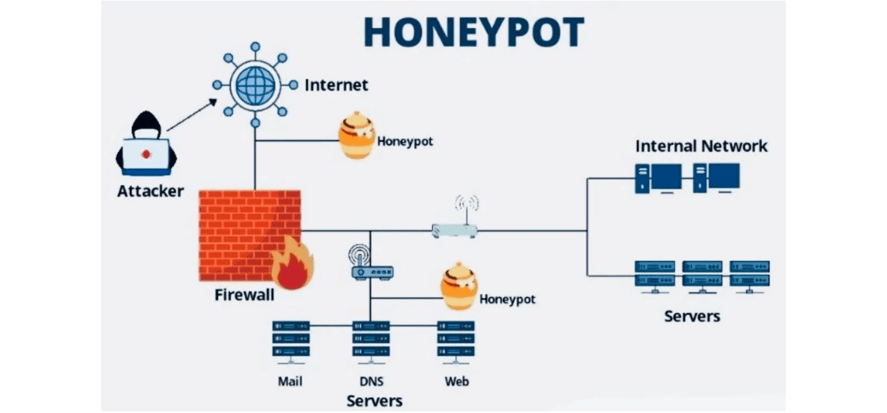
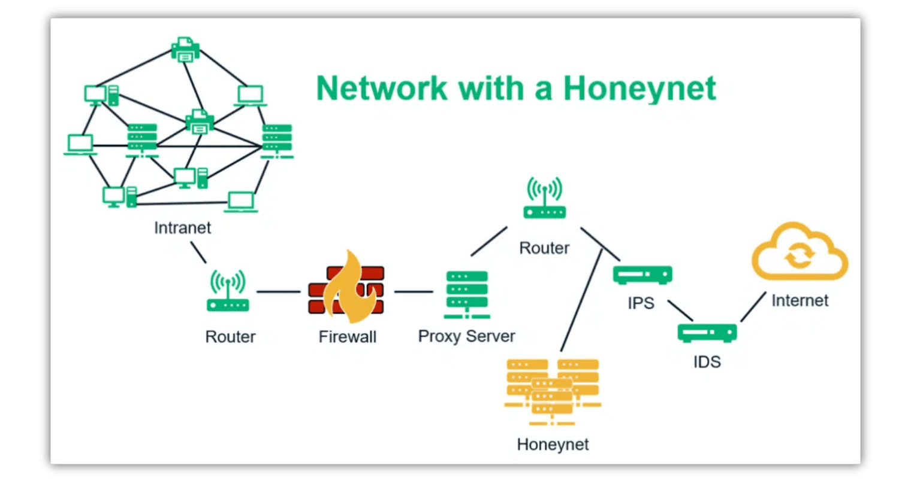
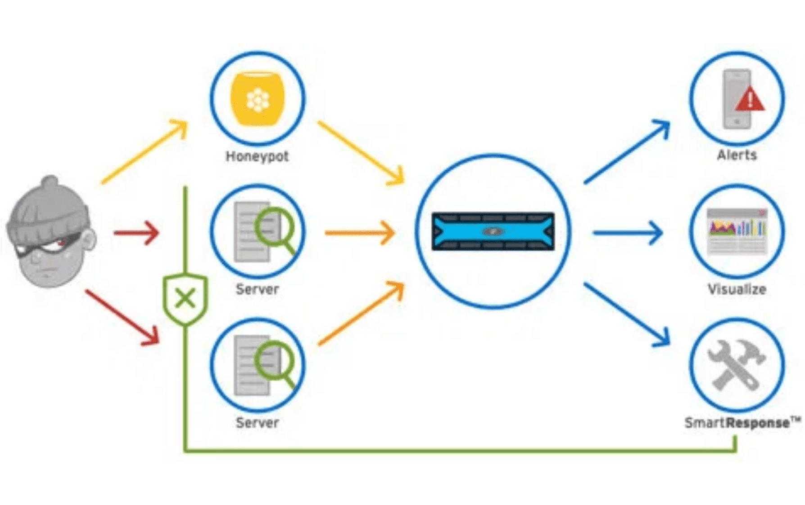

:::section{.lang-zh}

**原 PPT 日期：** 2026-01-21

> 此文为codex改编往年课件而成

## 课程简介

蜜罐课程从主动防御角度介绍如何用诱饵系统收集威胁情报。它把传统蜜罐、IoT 蜜罐、云蜜罐、AI 自适应防御和未来趋势连接起来。

## 你会学到

- 理解蜜罐的定义和价值
- 区分不同交互程度和部署类型
- 认识 AI 与蜜罐结合的机会和风险

## 1. 蜜罐为什么是主动防御

蜜罐的价值来自攻击者交互。合法用户通常不会访问诱饵资源，因此蜜罐流量信噪比高，适合发现扫描、攻击工具和行为链。

蜜罐用于补充威胁感知，部署时仍需要防火墙等防护措施。

## 2. 分类与交互程度

物理、虚拟、生产型、研究型、低交互、高交互和混合蜜罐各有取舍。交互越深，情报越丰富，风险和维护成本也越高。

这里要特别强调隔离和监控，否则高交互蜜罐可能变成攻击跳板。

## 3. AI、IoT 与分布式蜜网

AI 可以帮助蜜罐识别异常、动态调整诱饵特征，IoT 和云场景则扩大了部署范围。分布式蜜网能从多个区域收集趋势。

AI 不是魔法，模型解释性、对抗样本和资源消耗仍是现实挑战。

## 4. 历史、挑战与未来

从早期诱捕实践到 AI 驱动系统，蜜罐一直在攻防博弈中演进。未来方向包括自适应欺骗、量子安全和更大规模的协同情报。

部署蜜罐还要考虑法律、隐私和组织流程，不只是技术搭建。

## 动手小任务

- 比较低交互和高交互蜜罐
- 设计一个 IoT 蜜罐要模拟的协议
- 列出蜜罐部署的三个风险控制点

:::

:::section{.lang-en}

**Original PPT date:** 2026-01-21

> This article was adapted by Codex from previous course slides.

## Overview

This honeypot lesson explains deception-based active defense, from traditional systems to IoT, cloud, AI, and future trends.

## 1. Why honeypots are active defense

Honeypots create high-signal interaction data for threat intelligence.

## 2. Types and interaction levels

More interaction means richer intelligence but higher risk.

## 3. AI, IoT, and distributed honeynets

AI improves adaptation but introduces explainability and adversarial risks.

## 4. History, challenges, and future

Honeypots combine technology, law, privacy, and operations.

:::
