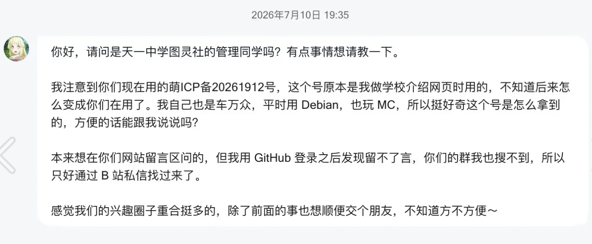
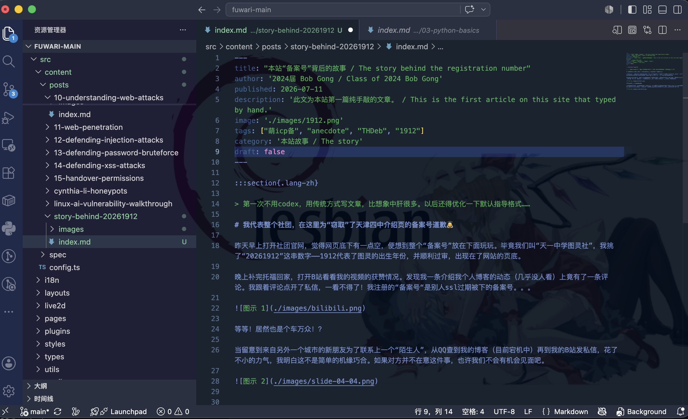

:::section{.lang-zh}

> 第一次不用codex，用传统方式写文章，比想象中肝很多。以后还得优化一下默认指导格式…… 

# 我代表整个社团，在这里为“窃取”了天津四中介绍页的备案号道歉🙇

昨天早上打开社团官网，觉得网页底下有一点空，便想到整个“备案号”放在下面玩玩。毕竟我们叫“天一中学图灵社”，我挑了“20261912”这串数字——1912代表了图灵的出生年份，并顺利过审，出现在了网站的页底。

晚上补完托福回家，打开B站看看我的视频的获赞情况。发现我一条介绍我个人博客的动态（几乎没人看）上竟有了一条评论。我跟着评论点开了私信，一看不得了！我注册的“备案号“是别人ssl过期被下的备案号。。。

> 等等！居然也是个车万众！？

当留意到来自另外一个城市的新朋友为了联系上一个“陌生人”，从QQ查到我的博客（目前宕机中）再到我的B站发私信，花了不小的力气，我明白这不是简单的机缘巧合。如果对方并不在意这件事，也许我们不会有机会见面吧。

2024届副社长  
2026年7月11日23点11分

###### 为了时效性，只能写这么多了( ´▽` )

:::

:::section{.lang-en}

> My first time writing an article the traditional way, without Codex. Althogh I used Google Translate to translate this article to English. It took much more effort than I expected. I really need to improve the default instructions later...

# On behalf of the entire club, I apologize for “stealing” the registration number from Tianjin No. 4 High School’s introduction page 🙇

Yesterday morning, I opened the club website and thought the bottom of the page looked a little empty, so I decided to put a playful “registration number” there. Since we are the Turing Club of Tianjin No. 1 High School, I chose the number “20261912”—1912 being the year Alan Turing was born. It passed the review without a hitch and appeared in the website footer.

That evening, after finishing my TOEFL study and getting home, I opened Bilibili to see how many likes my videos had received. To my surprise, someone had left a comment on a post introducing my personal blog—a post that almost nobody had seen. I followed the comment to my private messages and discovered something astonishing: the “registration number” I had claimed had previously belonged to someone else and had been released after their SSL certificate expired...

> Wait, he is a Touhou fan too?!

When I realized how much effort this new friend from another city had made to contact a “stranger”—tracing my QQ profile to my blog (currently offline), then finding me on Bilibili and sending me a private message, I understood that this was more than a simple coincidence. If they had not cared about the matter, perhaps we would never have had the chance to meet.

Vice President, Class of 2024  
11:11 p.m., July 11, 2026

###### That is all I have time to write while the story is still fresh ( ´▽` )

:::

